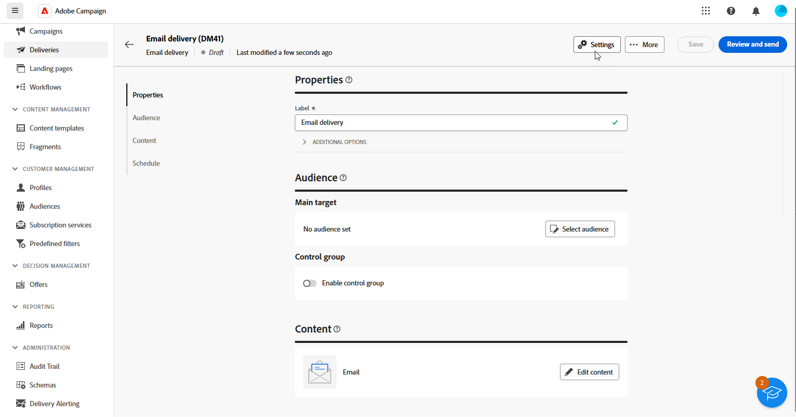

# 分配您的品牌 {#branding-assign}

## 将品牌链接到模板 {#linking-a-brand-to-a-template}

要使用为品牌定义的参数，必须将其链接到投放模板。 为此，您必须创建或编辑模板。

您的模板将链接到品牌。 在电子邮件编辑器中，**Email address of default sender**、**Default sender name** 或 **Logo** 等元素将使用配置的品牌数据。

>[!BEGINTABS]

>[!TAB Adobe Campaign Web]

要创建投放模板，您可以复制内置模板、将现有投放转换为模板或从头开始创建投放模板。 [了解详情](../../msg/delivery-template.md)

创建模板后，您可以将其链接到品牌。操作步骤：

1. 从&#x200B;**[!UICONTROL 投放]**&#x200B;左侧菜单浏览到&#x200B;**[!UICONTROL 模板]**&#x200B;选项卡，然后选择投放模板。

   

1. 单击&#x200B;**[!UICONTROL 设置]**。

   

1. 从&#x200B;**[!UICONTROL 投放]**&#x200B;选项卡中，访问&#x200B;**[!UICONTROL 品牌]**&#x200B;字段并选择要链接到模板的品牌。

   

1. 确认选择并保存模板。

您现在可以使用此模板发送投放。

>[!TAB Adobe Campaign V8]

要创建投放模板，您可以复制内置模板、将现有投放转换为模板或从头开始创建投放模板。 [了解详情](https://experienceleague.adobe.com/docs/campaign/campaign-v8/send/create-templates.html?lang=zh-Hans)

创建模板后，您可以将其链接到品牌。操作步骤：

1. 在Adobe Campaign资源管理器中浏览到&#x200B;**[!UICONTROL 资源]** `>` **[!UICONTROL 模板]** `>` **[!UICONTROL 投放模板]**。

1. 选择投放模板或复制现有模板。

   

1. 访问所选投放模板的&#x200B;**[!UICONTROL 属性]**。

   

1. 从&#x200B;**[!UICONTROL 常规]**&#x200B;选项卡，从&#x200B;**[!UICONTROL 品牌]**&#x200B;下拉列表中选择您的品牌。

   

1. 配置完毕后，选择&#x200B;**确定**。

您现在可以使用此模板发送投放。

>[!ENDTABS]

## 为投放分配品牌 {#assigning-a-brand-to-an-email}

>[!BEGINTABS]

>[!TAB Adobe Campaign Web]

要创建新的独立投放，请执行以下步骤。

1. 浏览到左边栏上的&#x200B;**[!UICONTROL 投放]**&#x200B;菜单，然后单击&#x200B;**[!UICONTROL 创建投放]**&#x200B;按钮。

   

1. 选择电子邮件或推送通知作为渠道，然后从列表中选择一个投放模板。

1. 单击&#x200B;**[!UICONTROL 创建投放]**&#x200B;按钮以进行确认。

1. 从&#x200B;**[!UICONTROL 属性]**&#x200B;页面，单击&#x200B;**[!UICONTROL 设置]**。

   

1. 从&#x200B;**[!UICONTROL 投放]**&#x200B;选项卡，访问&#x200B;**[!UICONTROL 品牌]**&#x200B;字段。

   

1. 选择要链接到模板的品牌。

   

1. 进一步个性化您的投放。 有关创建电子邮件的详细信息，请参阅[创建您的第一个电子邮件](../../email/create-email.md)部分。

>[!TAB Adobe Campaign V8]

要创建新的独立投放，请执行以下步骤。

1. 要创建新投放，请浏览到&#x200B;**[!UICONTROL 营销活动]**&#x200B;选项卡。

1. 单击&#x200B;**[!UICONTROL 投放]**，然后单击现有投放列表上方的&#x200B;**[!UICONTROL 创建]**&#x200B;按钮。

   

1. 选择投放模板。

1. 访问所选投放模板的&#x200B;**[!UICONTROL 属性]**。

   

1. 从&#x200B;**[!UICONTROL 常规]**&#x200B;选项卡，从&#x200B;**[!UICONTROL 品牌]**&#x200B;下拉列表中选择您的品牌。

   

1. 配置完毕后，选择&#x200B;**确定**。

1. 进一步个性化您的投放。 有关创建电子邮件的详细信息，请参阅[设计和发送电子邮件](../../email/create-email.md)部分。

>[!ENDTABS]

## 检查与事务型消息关联的品牌策略 {#check-branding-transactional}

>[!IMPORTANT]
>
>本节仅适用于事务型消息传递（消息中心）。
>
>虽然事务型功能在Campaign Web UI中可用，但必须在Campaign v8客户端控制台（控制实例）中执行以下验证步骤。

从实时(RT)执行实例同步到控制实例的事务性投放不会复制路由或品牌策略等属性。 每周从同一模板生成这些同步投放，以恢复控制实例中的投放指示器。

因此，控制实例显示默认品牌。 消息执行期间使用的实际品牌和路由设置是在控制实例上的事务性消息模板中定义的。

要验证事务型消息使用了哪个品牌：

1. 识别发布到实时的事务性模板的内部名称（例如，`TransactionalMessaging4768`）。

   

1. 在控制实例中，在&#x200B;**事务性消息模板**&#x200B;下搜索此内部名称。

   

1. 打开模板以查看品牌和其他相关属性。
