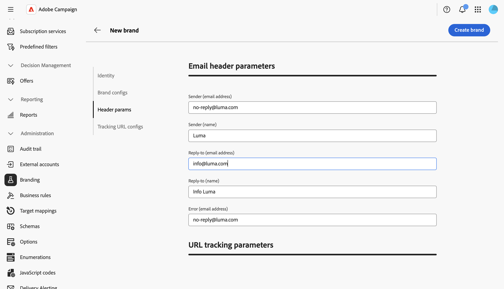

# 配置品牌 {#branding-configure}

技术管理员可以直接从Web UI创建和管理多个品牌。 这允许您定义构成品牌标识的所有元素，包括徽标甚至电子邮件跟踪设置。

>[!NOTE]
>
>此功能需要在实例上使用品牌推广软件包。 如果您看不到&#x200B;**品牌**&#x200B;菜单，请联系您的Adobe代表。

## 创建或编辑品牌 {#create-edit-brand}

>[!CONTEXTUALHELP]
>id="acw_branding_create"
>title="创建品牌"
>abstract="单击&#x200B;**创建品牌**&#x200B;以定义新的品牌标识。 在配置选项卡中填写品牌详细信息，然后单击&#x200B;**创建品牌**&#x200B;以进行保存。 该品牌将链接到投放模板和独立投放。"

要创建新品牌，请执行以下步骤：

1. 从左侧菜单浏览到&#x200B;**[!UICONTROL 管理>品牌]**，或从&#x200B;**[!UICONTROL 资源管理器]**&#x200B;浏览到&#x200B;**[!UICONTROL 管理>平台>品牌]**。

1. 单击列表上方的&#x200B;**[!UICONTROL 创建品牌]**&#x200B;按钮。

   

1. 填写不同部分中的品牌详细信息。 下面的[品牌属性](#brand-attributes)部分中介绍了每个字段。

   

1. 单击&#x200B;**[!UICONTROL 创建品牌]**&#x200B;以进行保存。 该品牌现在可以链接到投放模板和独立投放。 [了解如何分配品牌](branding-assign.md)。

要编辑现有品牌，请从列表中选择该品牌，更新字段并保存更改。

## 品牌属性 {#brand-attributes}

**[!UICONTROL Brand]**&#x200B;已配置四个部分：**[!UICONTROL 标识]**、**[!UICONTROL Brand配置]**、**[!UICONTROL 电子邮件标头参数]**&#x200B;和&#x200B;**[!UICONTROL URL跟踪参数]**。

### 标识 {#identity}

**[!UICONTROL 标识]**&#x200B;部分允许您定义和个性化您的品牌。

此部分包含以下字段：

* **[!UICONTROL 品牌名称]**：您的品牌的名称。 此字段为必填字段。
* **[!UICONTROL 标签]**：在界面中可见的标签。
* **[!UICONTROL ID]**：自动生成内部标识符。 你可以改变它。 只允许使用字母、数字和下划线。 特殊字符会被替换为下划线。
* **[!UICONTROL 徽标URL]**：品牌徽标图像的URL。
* **[!UICONTROL 网站URL]**&#x200B;和&#x200B;**[!UICONTROL 网站标签]**：与品牌关联的网站URL和标签。

### 品牌配置 {#brand-configs}

在&#x200B;**[!UICONTROL 品牌配置]**&#x200B;部分中，您定义了用于跟踪和登陆页面访问的子域和URL协议。

此部分包含以下字段：

* **[!UICONTROL Brand子域]**：此品牌的特定子域URL请求从Adobe委派。
* **[!UICONTROL 跟踪URL协议]**、**[!UICONTROL 镜像页面URL协议]**&#x200B;和&#x200B;**[!UICONTROL 应用程序URL协议]**：用于每个URL类型的协议(例如，**安全(https)**)。

>[!NOTE]
>
>跟踪、镜像和应用程序服务器的配置存储在与路由关联的单独外部帐户中。 这些设置将在配置期间应用，且不得修改。 要显示URL，请从外部帐户访问&#x200B;**[!UICONTROL 品牌前缀]**&#x200B;选项卡。

### 电子邮件标头参数 {#header-param}

利用&#x200B;**[!UICONTROL 电子邮件标头参数]**，可个性化收件人将在营销活动的标头部分中看到的内容。

此部分包含以下字段：

* **[!UICONTROL 发件人（电子邮件地址）]**：品牌的电子邮件地址。
* **[!UICONTROL 发件人（姓名）]**：品牌名称。
* **[!UICONTROL 回复（电子邮件地址）]**：客户可以回复的电子邮件地址。
* **[!UICONTROL 回复（名称）]**：回复的显示名称。
* **[!UICONTROL 错误（电子邮件地址）]**：出错时使用的电子邮件地址。

<!--
>[!IMPORTANT]
>
>After having updated the header parameters of the emails, if the name and email address of the sender have not changed in the email created from the template, check the template's advanced settings.
-->

### URL 跟踪参数 {#tracking-param}

在&#x200B;**[!UICONTROL URL跟踪参数]**&#x200B;部分中，您可以通过定义用于与Adobe Analytics和Google Analytics等网站分析工具集成的其他参数来增强URL跟踪。

此部分包含以下字段：

* **[!UICONTROL 其他URL参数]**：将参数添加为键值对及其适用条件。 每个参数名称都必须唯一且非空，并且每个参数值都必须非空。 适用性条件可以为空，但所有这些值都不能包含JST标记。

* **[!UICONTROL 域名允许列表]**：添加域名或正则表达式，以匹配将附加跟踪参数的URL。

**示例：**&#x200B;如果为该域配置了其他参数`age=21`和`deliveryName=DM101`，则诸如`https://www.luma.com`之类的跟踪URL将变为`https://www.luma.com/?age=21&deliveryName=DM101`。

## 为事务性消息配置品牌策略 {#branding-transactional-config}

>[!IMPORTANT]
>
>本节仅适用于事务型消息传递（消息中心）。
>
>虽然事务型功能在Campaign Web UI中可用，但必须在Campaign v8客户端控制台（控制实例）中执行以下步骤。

如果您将事务型消息传递（消息中心）与品牌策略结合使用，则需要额外配置。

### 实时实例的跟踪公式

在实时(RT)控制实例上激活品牌策略时，会使用特定的跟踪选项来管理跟踪公式。 这些公式在RT Control实例上集中配置，而不是在每个RT Execution实例上单独配置。

以下选项定义RT投放使用的跟踪公式：

* **`NmsTracking_RT_ClickFormula`**：指定用于对RT实例进行点击跟踪的公式

* **`NmsTracking_RT_OpenFormula`**：指定用于在RT实例上打开跟踪的公式

如果您的实施需要事务型消息的自定义跟踪公式，请使用以下选项：

* **`Branding_RT_ListXtkOptions_toPublish`**：在此处列出自定义公式的XTK选项名称（用逗号分隔）。 这可确保RT投放可以应用自定义跟踪公式。
