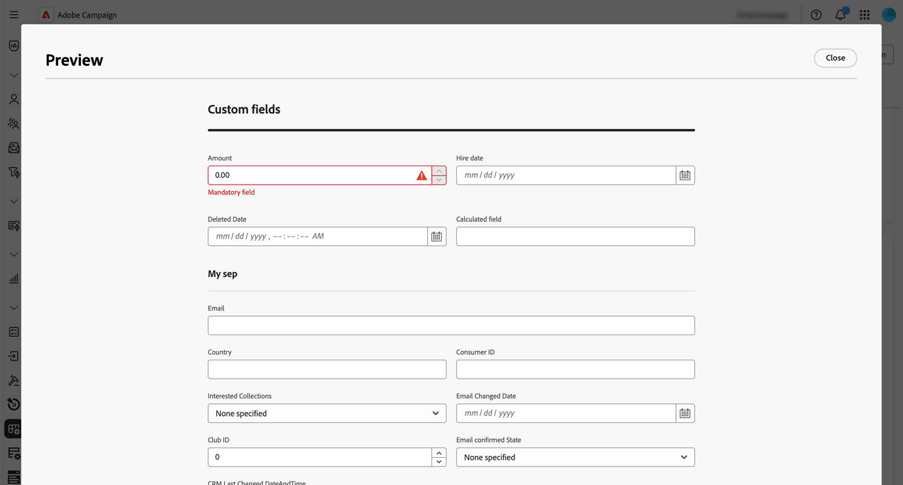
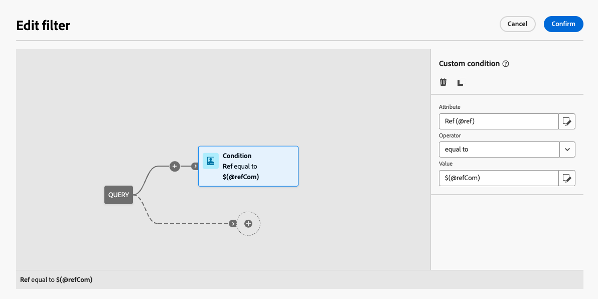
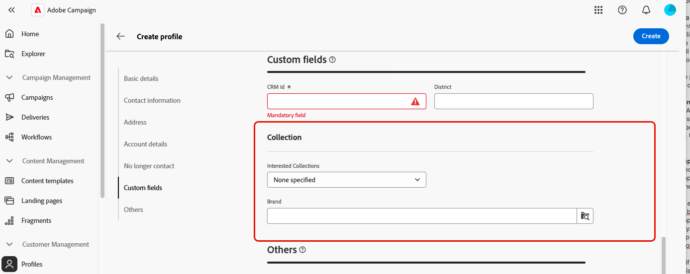

# 配置自定义字段 {#custom-fields}

>[!CONTEXTUALHELP]
>id="acw_schema_editcustomfields"
>title="屏幕版"
>abstract="界面中显示的所有自定义字段用于所选架构显示。您可以使用向上和向下箭头更改它们在界面中的显示顺序，并通过添加分隔符将字段分组为子部分。要删除自定义字段或编辑可见性条件等设置，请点击省略号按钮。"

>[!CONTEXTUALHELP]
>id="acw_schema_editcustomfields_settings_general"
>title="常规"
>abstract="定义自定义字段的一般设置。如果没有提供标签，就会显示架构中定义的标签。使用 **Visible if** 字段，通过一个控制何时显示该字段的 xtk 表达式定义一个条件。您还可以在界面中将该字段标记为必填或只读。"

>[!CONTEXTUALHELP]
>id="acw_schema_editcustomfields_settings_link"
>title="链接属性"
>abstract="使用查询建模器指定用于显示链接类型自定义字段的规则。例如，根据另一个字段的输入限制列表值。"

>[!CONTEXTUALHELP]
>id="acw_schema_editcustomfields_settings_layout"
>title="布局"
>abstract="默认情况下，自定义字段在界面中显示为两列。切换此选项可在屏幕的整个宽度上显示自定义字段，而不是两列。"

>[!CONTEXTUALHELP]
>id="acw_schema_editcustomfields_separatorproperties"
>title="分隔符属性"
>abstract="指定用于在界面中显示子部分的名称。"

<!-- NOT USED IN THE UI?-->

>[!CONTEXTUALHELP]
>id="acw_schema_editcustomfields_settings"
>title="属性设置"
>abstract="属性设置"

自定义字段是通过Adobe Campaign控制台添加到现成模式的其他属性。 它们允许您通过包含新属性来自定义架构，以满足贵组织的需求。 请参阅[Adobe Campaign v8文档](https://experienceleague.adobe.com/docs/campaign/campaign-v8/developer/shemas-forms/extend-schema.html){target="_blank"}以了解如何扩展架构。

自定义字段可显示在各种屏幕中，例如Campaign Web界面中的用户档案详细信息。 管理员可以控制哪些字段可见以及它们的显示方式。 这些更改适用于所有Campaign用户。

>[!NOTE]
>
>您需要具有管理员权限才能管理自定义字段。

自定义字段可用于以下架构：

* 营销活动(nms)
* 计划(nms)
* 程序(nms)
* 收件人(nms)
* 种子地址(nms)
* 投放(nms)

## 向界面添加自定义字段 {#add-custom}

>[!CONTEXTUALHELP]
>id="acw_schema_screen_definition"
>title="屏幕清晰度"
>abstract="定义要为架构编辑的自定义字段列表及其属性。点击&#x200B;**预览**&#x200B;按钮可在示例屏幕中显示自定义字段。"

要在界面中显示自定义字段，请执行以下步骤：

1. 在左侧导航窗格中浏览到&#x200B;**[!UICONTROL 架构]**&#x200B;菜单，并找到所需的架构。

   使用筛选器窗格中的&#x200B;**[!UICONTROL 可编辑]**&#x200B;筛选器快速识别具有自定义字段的架构。

   

1. 在列表中选择架构名称以将其打开。 将显示一个详细的架构视图。 [了解有关架构详细信息的更多信息](../administration/schemas.md)。 单击&#x200B;**[!UICONTROL 屏幕版本]**&#x200B;按钮可访问自定义字段。 在此示例中，为&#x200B;**[!UICONTROL 收件人]**&#x200B;架构添加了字段。

   

   此时将显示架构界面中显示的自定义字段列表。

1. 点击&#x200B;**[!UICONTROL 预览]**&#x200B;按钮可在示例屏幕中显示自定义字段。

   

   在此，“金额”字段已标记为必填字段。

   

1. 要向界面添加自定义字段，请单击省略号按钮，然后选择以下选项之一：

   * **[!UICONTROL 选择自定义字段]**：选择一个或多个自定义字段以在界面中显示。
   * **[!UICONTROL 自动填写自定义字段列表]**：将为该架构定义的所有自定义字段添加到该界面。

   

1. 添加自定义字段后，您可以：

   * **字段重新排序**：使用上下箭头，或使用拖放操作移动字段。
   * **将字段设为必填**：选中&#x200B;**必填**&#x200B;复选框。
   * **编辑字段设置**：单击省略号按钮并选择&#x200B;**[!UICONTROL 编辑]**。 [了解详情](#settings)
   * **删除字段**：单击省略号按钮并选择&#x200B;**[!UICONTROL 删除]**。
   * **在界面中将字段组织为子部分**：单击上下箭头旁边的省略号按钮，然后选择&#x200B;**[!UICONTROL 添加分隔符]**。 [了解详情](#separator)

## 配置自定义字段设置 {#settings}

要为每个自定义字段配置特定设置，请单击所需字段旁边的省略号按钮，然后选择&#x200B;**[!UICONTROL 编辑]**。

可用设置包括：

* **[!UICONTROL 属性]**：自定义字段的名称。
* **[!UICONTROL 标签（自定义）]**：要在界面中显示的标签。 如果未提供标签，则将显示架构中定义的标签。
* **[!UICONTROL 如果]**&#x200B;可见：使用控制字段显示时间的xtk表达式定义条件。 例如，如果其他字段为空，则隐藏此字段。
* **[!UICONTROL 必填]**：在界面中将字段设为必填。
* **[!UICONTROL 只读]**：将接口中的字段设为只读。 用户将无法编辑该字段的值。
* **[!UICONTROL 筛选器设置]**（用于链接类型字段）：使用查询建模器指定用于显示链接类型自定义字段的规则。 例如，根据另一个字段的输入限制列表值。

  您还可以使用语法`$(<field-name>)`引用在条件中其他字段输入的值。 这允许您引用在表单中输入的字段的当前值，即使它尚未保存到数据库也是如此。

  在以下示例中，条件会检查@ref字段的值是否与在@refCom字段中输入的值匹配。 相反，使用`@refCom`而不是`$(@refCom)`将引用数据库中存在的@ref字段的值。

  +++查看示例

  

+++

* **[!UICONTROL 跨两列]**：默认情况下，自定义字段在界面中以两列显示。 切换此选项可在屏幕的整个宽度上显示自定义字段，而不是两列。

## 组织子部分中的自定义字段 {#separator}

Campaign Web用户界面允许您添加分隔符，以便对界面中的自定义字段进行分组，从而提高可读性。 为此，请执行以下步骤：

1. 单击上下箭头旁边的省略号按钮，然后选择&#x200B;**[!UICONTROL 添加分隔符]**。

1. 代表分隔符的新行将添加到列表中。 单击省略号按钮，然后选择&#x200B;**[!UICONTROL 编辑]**&#x200B;以命名子部分。

1. 使用向上和向下箭头将分隔符移动到所需位置。 分隔符下方列出的字段将分组到该分隔符下方。

   在此示例中，“感兴趣的收藏集”和“品牌”字段将分组到“收藏集”子部分。

   | 自定义字段配置 | 在界面中渲染 |
   |  ---  |  ---  |
   | {zoomable="yes"} | {zoomable="yes"} |