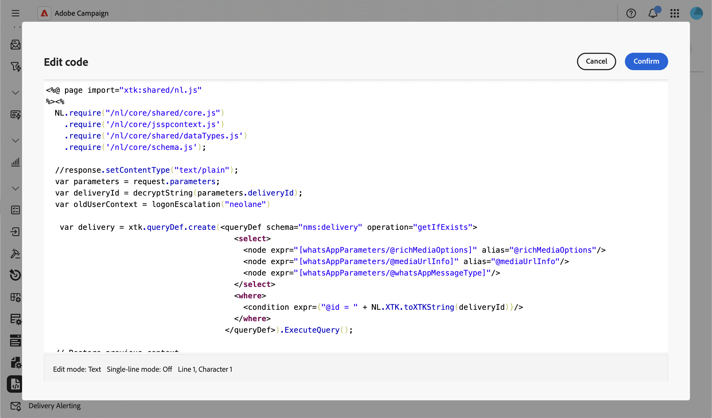

# 使用动态 JavaScript 页面 {#dynamic-javascript-pages}

>[!CONTEXTUALHELP]
>id="acw_dynamic_javascript_pages_list"
>title="动态 JavaScript 页面"
>abstract="动态 JavaScript 页面 (JSSP) 可用于构建服务器端页面，当通过 URL 访问时生成动态内容，例如自定义 API、导出功能或 Web 应用程序逻辑。 您可以在此列表中创建、修改、复制或删除动态 JavaScript 页面。"

>[!CONTEXTUALHELP]
>id="acw_dynamic_javascript_pages_create"
>title="创建动态 JavaScript 页面"
>abstract="为动态 JavaScript 页面定义命名空间、名称和标签，然后使用 JavaScript 代码编写其内容。 创建后，命名空间和名称将无法修改。"

## 关于动态JavaScript页面 {#about}

动态 JavaScript 页面 (JSSP) 可用于构建服务器端页面，当通过 URL 访问时生成动态内容，例如自定义 API、导出功能或 Web 应用程序逻辑。 这些页面存储在左侧导航窗格中的&#x200B;**[!UICONTROL 管理]** > **[!UICONTROL 动态JavaScript页面]**&#x200B;菜单中。

从动态JavaScript页面列表中，您可以：

* **复制或删除页面**：单击省略号按钮，然后选择所需的操作。
* **修改页面**：单击页面的名称以打开其属性，进行更改并保存。
* **创建新的动态JavaScript页面**：单击&#x200B;**[!UICONTROL 创建动态JavaScript页面]**&#x200B;按钮。

<!--
>[!NOTE]
>
>In the Campaign console, dynamic JavaScript pages are available under **[!UICONTROL Administration]** > **[!UICONTROL Configuration]** > **[!UICONTROL Dynamic JavaScript pages]**. Although the menu location differs from the Web user interface, the list is identical and operates like a mirror.
-->

## 创建动态JavaScript页面 {#create}

要创建动态JavaScript页面，请执行以下步骤：

1. 导航到&#x200B;**[!UICONTROL 动态JavaScript页面]**&#x200B;菜单，然后单击&#x200B;**[!UICONTROL 创建动态JavaScript页面]**&#x200B;按钮。

1. 定义页面的属性：

   * **[!UICONTROL 命名空间]**：指定与自定义资源相关的命名空间。 默认情况下，命名空间为“cus”，但它可能会因您的实施而异。
   * **[!UICONTROL 名称]**：用于引用页面的唯一标识符。
   * **[!UICONTROL 标签]**：动态JavaScript页面列表中显示的描述性标签。

   

   >[!NOTE]
   >
   >创建后，无法修改&#x200B;**[!UICONTROL 命名空间]**&#x200B;和&#x200B;**[!UICONTROL 名称]**&#x200B;字段。 要进行更改，请复制页面并根据需要进行更新。

1. 单击&#x200B;**[!UICONTROL 创建代码]**&#x200B;按钮以定义页面的内容，然后使用`<%@ page %>`指令和`NL.require()`调用编写JSSP代码以加载核心库。

   

1. 单击&#x200B;**[!UICONTROL 确认]**&#x200B;以保存您的代码。

1. 在动态JavaScript页面准备就绪后，单击&#x200B;**[!UICONTROL 创建]**。 现在可以通过从其命名空间和名称构建的URL访问页面，格式为`https://<your-instance>/<namespace>/<name>`。 例如，`cus`命名空间中名为`recipientAPI.jssp`的页面可在`https://<your-instance>/cus/recipientAPI.jssp`中访问。

有关可重用JavaScript函数的更多信息，请参阅[使用JavaScript代码](javascript-codes.md)。
