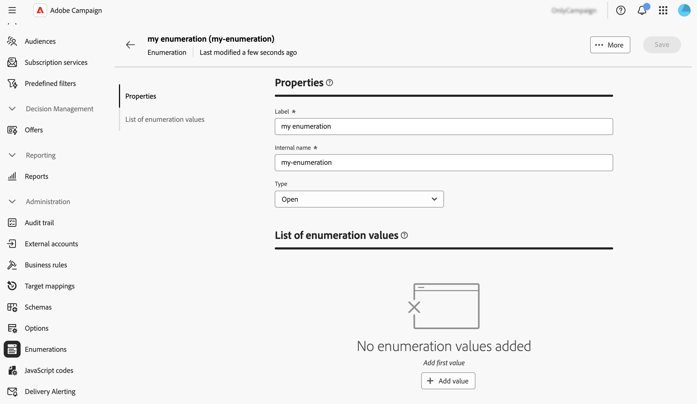
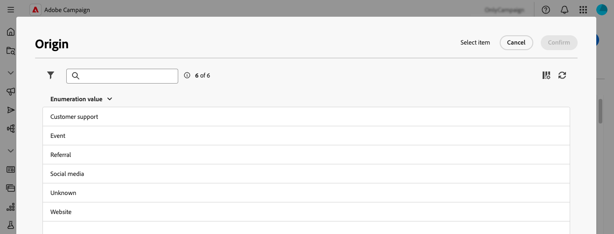

# 管理枚举 {#enumerations}

>[!CONTEXTUALHELP]
>id="acw_homepage_welcome_rn4"
>title="创建明细列表"
>abstract="您现在可以直接通过 Adobe Campaign 网络用户界面创建枚举。枚举是系统建议用于填充字段的值列表。"
>additional-url="https://experienceleague.adobe.com/docs/campaign-web/v8/release-notes/release-notes.html?lang=zh-hans" text="请参阅发行说明"

>[!CONTEXTUALHELP]
>id="acw_enumerations_list"
>title="明细列表"
>abstract="枚举是系统建议填充字段的值列表。使用枚举来标准化这些字段的值，有助于数据输入或在查询中使用。"

>[!CONTEXTUALHELP]
>id="acw_enumerations_properties"
>title="属性"
>abstract="定义枚举的属性，例如其名称、内部名称和类型。**[!UICONTROL 封闭的]** 枚举有一个固定的值列表，只能从 **[!UICONTROL 枚举]** 菜单中更改该列表。**[!UICONTROL 开放的]** 枚举中，用户可以直接在基于此枚举的字段中添加新值。**[!UICONTROL 系统]** 枚举与系统字段相关。**[!UICONTROL 表情符号]** 枚举用于更新表情符号列表。"

>[!CONTEXTUALHELP]
>id="acw_enumerations_values"
>title="明细列表值列表"
>abstract="要在枚举中添加值，请点击&#x200B;**[!UICONTROL 添加值]**&#x200B;按钮，然后根据需要进行配置。"

## 什么是明细列表？ {#about}

枚举是系统建议填充字段的值列表。使用枚举来标准化这些字段的值，帮助在查询中输入或使用数据。 值列表将显示为一个下拉列表，您可以从中选择要在字段中输入的值。 下拉列表还支持预测输入：输入第一个字母，应用程序填充其余字母。

此类字段的值通过左侧导航窗格中的&#x200B;**[!UICONTROL 管理]** / **[!UICONTROL 枚举]**&#x200B;菜单定义。

## 创建明细列表 {#create}

要创建明细列表，请执行以下步骤：

1. 导航到&#x200B;**[!UICONTROL 枚举]**&#x200B;菜单，然后单击&#x200B;**[!UICONTROL 创建枚举]**&#x200B;按钮。

1. 为枚举输入&#x200B;**[!UICONTROL 标签]**&#x200B;和&#x200B;**[!UICONTROL 内部名称]**。

   

1. 选择枚举&#x200B;**[!UICONTROL 类型]**：

   * **[!UICONTROL 已关闭的]**&#x200B;枚举具有只能从&#x200B;**[!UICONTROL 枚举]**&#x200B;菜单修改的固定值列表。
   * **[!UICONTROL 打开]**&#x200B;枚举允许用户直接基于此枚举在字段中添加新值。
   * **[!UICONTROL 系统]**&#x200B;枚举与系统字段相关联。
   * **[!UICONTROL 表情符号]** 枚举用于更新表情符号列表。

1. 单击&#x200B;**[!UICONTROL 创建]**。此时将显示枚举详细信息，允许您向列表添加值。

   

1. 要添加值，请单击&#x200B;**[!UICONTROL 添加值]**&#x200B;按钮，然后根据需要对其进行配置：

   * **[!UICONTROL 标签]**：要在枚举中显示的标签。
   * **[!UICONTROL 内部名称]**：值的内部名称（用于系统枚举）。
   * **[!UICONTROL U+ （内部名称）]** （表情符号枚举）：表情符号的Unicode代码（用于表情符号枚举）。

   

1. 保存您的更改。现在，该枚举将在使用它的屏幕中更新。

## 用例：将预定义值添加到明细列表 {#uc}

默认情况下，用户档案详细信息屏幕中的“来源”字段允许用户自由输入任何值。

每次用户输入字段值时，该值都会自动添加到“原始”枚举中，这可能会导致随着时间的推移，值列表中出现冗余、不一致或错误的值。

为了确保数据一致性并在填写字段时指导用户，您可以定义一组预定义值。 执行以下步骤：

1. 转到&#x200B;**[!UICONTROL 枚举]**&#x200B;菜单并打开“原始”枚举。

2. 查看用户输入值的列表并对其进行清理。 单击值旁边的省略号按钮可将其删除。 如果列表包含太多不一致，请删除整个枚举，然后从头开始重新创建。

   

3. 添加预定义的值。 为此，请单击&#x200B;**[!UICONTROL 添加值]**&#x200B;按钮，然后输入用户应从中选择的预定义值。

   

4. 要强制一致性，请将枚举类型切换为&#x200B;**[!UICONTROL Closed]**，这会将用户限制为预定义值。
如果需要灵活性，请保持其**[!UICONTROL 打开]**&#x200B;以允许新的用户条目。

5. 返回到配置文件详细信息屏幕。 “原点”字段现在显示用于选择的预定义值。

   
