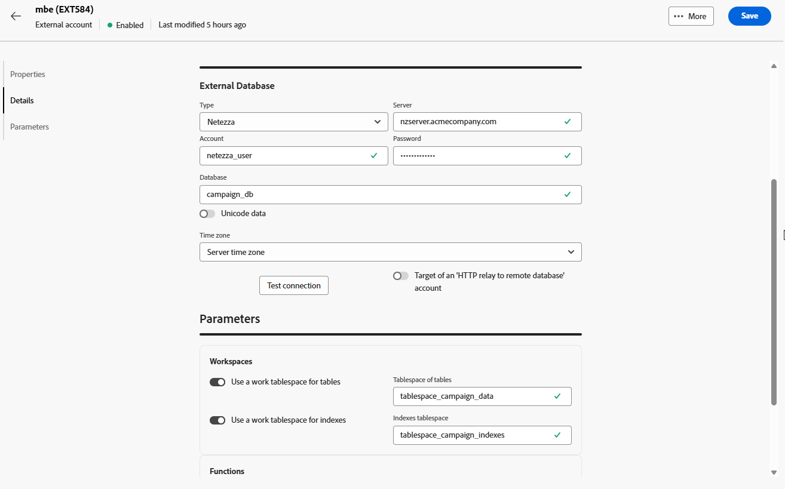
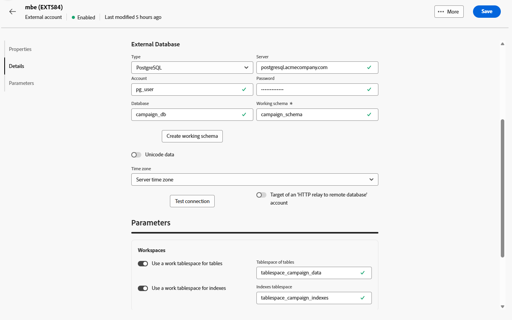
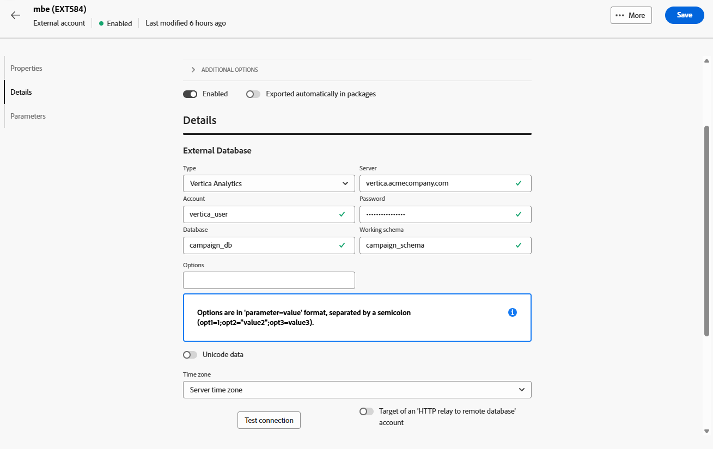

# 外部数据库帐户 {#external-accounts}

使用外部数据库类型外部帐户将Adobe Campaign连接到第三方数据库。

外部帐户的配置设置因您连接的数据库引擎而异。 有关每个受支持数据库的详细说明，请参见以下部分。

## Amazon Redshift

Amazon Redshift外部帐户允许您将Campaign实例连接到Amazon Redshift外部数据库。

在Adobe Campaign Web用户界面中，配置Amazon Redshift外部帐户。

1. [创建外部帐户](external-account.md)并选择&#x200B;**[!UICONTROL 外部数据库]**&#x200B;作为外部帐户的&#x200B;**[!UICONTROL 类型]**，选择Amazon Redshift作为&#x200B;**[!UICONTROL 提供程序类型]**。

1. 单击&#x200B;**[!UICONTROL 创建]**。

1. 要配置&#x200B;**[!UICONTROL Amazon Redshift]**&#x200B;外部帐户，请填写以下字段：

   * **[!UICONTROL 类型]**： Amazon Redshift

   * **[!UICONTROL 服务器]**：输入Redshift服务器的DNS名称。

   * **[!UICONTROL 帐户]**：提供用于身份验证的Redshift用户名。

   * **[!UICONTROL 密码]**：输入与用户帐户关联的密码。

   * **[!UICONTROL 数据库]**：如果尚未在DSN中定义该数据库名称，请指定该数据库名称。 如果DSN包含数据库，则将此字段留空。

   * **[!UICONTROL 工作架构]**：输入Adobe Campaign将操作的架构名称。

   * **[!UICONTROL 选项]**：添加您的环境可能需要的任何高级配置选项。

   * **[!UICONTROL 时区]**：选择或输入服务器的时区，以确保基于时间的操作准确无误。

   

1. 设置连接后，在远程Redshift数据库中创建Adobe Campaign SQL函数。 这些函数可用后，单击&#x200B;**[!UICONTROL 部署函数]**&#x200B;以激活它们。

1. 链接您的&#x200B;**[!UICONTROL 存储帐户]**&#x200B;以优化性能，并在Adobe Campaign和Amazon Redshift之间实现更快的数据加载流程。

1. 输入您的&#x200B;**[!UICONTROL 帐户角色]**，该角色可确定Adobe Campaign在与Redshift环境交互时将使用的权限。

## Amazon Redshift（旧版）

Amazon Redshift（旧版）外部帐户允许您将Campaign实例连接到Amazon Redshift外部数据库。

在Adobe Campaign Web用户界面中，配置Amazon Redshift（旧版）外部帐户。

1. [创建外部帐户](external-account.md)并选择&#x200B;**[!UICONTROL 外部数据库]**&#x200B;作为外部帐户的&#x200B;**[!UICONTROL 类型]**，选择Amazon Redshift （旧版）作为&#x200B;**[!UICONTROL 提供程序类型]**。

1. 单击&#x200B;**[!UICONTROL 创建]**。

1. 要配置&#x200B;**[!UICONTROL Amazon Redshift（旧版）]**&#x200B;外部帐户，请填写以下字段：

   * **[!UICONTROL 类型]**： Amazon Redshift（旧版）

   * **[!UICONTROL 服务器]**：输入Redshift服务器的DNS名称。

   * **[!UICONTROL 帐户]**：提供用于身份验证的Redshift用户名。

   * **[!UICONTROL 密码]**：输入与用户帐户关联的密码。

   * **[!UICONTROL 数据库]**：如果尚未在DSN中定义该数据库名称，请指定该数据库名称。 如果DSN包含数据库，则将此字段留空。

   * **[!UICONTROL 工作架构]**：输入Adobe Campaign将操作的架构名称。

   * **[!UICONTROL 时区]**：选择或输入服务器的时区，以确保基于时间的操作准确无误。

   

1. 设置连接后，在远程Redshift数据库中创建Adobe Campaign SQL函数。 这些函数可用后，单击&#x200B;**[!UICONTROL 部署函数]**&#x200B;以激活它们。

## Azure Synapse Analytics

Azure Synapse Analytics外部帐户允许您将Campaign实例连接到Azure Synapse外部数据库。

在Adobe Campaign Web用户界面中，配置Azure Synapse Analytics外部帐户。

1. [创建外部帐户](external-account.md)并选择&#x200B;**[!UICONTROL 外部数据库]**&#x200B;作为外部帐户的&#x200B;**[!UICONTROL 类型]**，选择Amazon Redshift作为&#x200B;**[!UICONTROL 提供程序类型]**。

1. 单击&#x200B;**[!UICONTROL 创建]**。

1. 要配置&#x200B;**[!UICONTROL Azure Synapse Analytics]**&#x200B;外部帐户，请填写以下字段：

   * **[!UICONTROL 类型]**： Azure Synapse Analytics

   * **[!UICONTROL 服务器]**：输入Azure Synapse服务器的URL。

   * **[!UICONTROL 帐户]**：提供将通过Synapse数据库进行身份验证的用户名。

   * **[!UICONTROL 密码]**：输入与帐户关联的密码。

   * **[!UICONTROL 数据库]**：指定您希望Adobe Campaign连接到的目标数据库。

   * **[!UICONTROL 表和函数前缀]**：默认情况下，设置为帐户名。 如果您希望使用其他前缀来标识与Campaign相关的对象，则可以对其进行调整。

   * **[!UICONTROL 选项]**：添加您的环境可能需要的任何高级配置选项。

   * **[!UICONTROL 时区]**：选择或输入服务器的时区，以确保基于时间的操作准确无误。

   

1. 您可以选择启用&#x200B;**[!UICONTROL 为表使用工作表空间]**&#x200B;选项，然后指定将存储工作表的表空间&#x200B;**[!UICONTROL 表]**。

1. 如果需要，请启用&#x200B;**[!UICONTROL 为索引使用工作表空间]**&#x200B;选项，然后提供&#x200B;**[!UICONTROL 索引表空间]**。

   

1. 设置连接后，在远程Adobe Campaign Analytics数据库中创建Azure Synapse SQL函数。 这些函数可用后，单击&#x200B;**[!UICONTROL 部署函数]**&#x200B;以激活它们。

## Databricks

Databriks外部帐户允许您将Campaign实例连接到Databriks外部数据库。

在Adobe Campaign Web用户界面中，配置Databricks外部帐户。

1. [创建外部帐户](external-account.md)并选择&#x200B;**[!UICONTROL 外部数据库]**&#x200B;作为外部帐户的&#x200B;**[!UICONTROL 类型]**，选择Databricks作为&#x200B;**[!UICONTROL 提供程序类型]**。

1. 单击&#x200B;**[!UICONTROL 创建]**。

1. 要配置&#x200B;**[!UICONTROL 数据库]**&#x200B;外部帐户，请填写以下字段：

   * **[!UICONTROL 类型]**：数据库

   * **[!UICONTROL 服务器]**：输入数据库服务器的DNS名称。

   * **[!UICONTROL 帐户]**：提供用于身份验证的Databricks用户名。

   * **[!UICONTROL 密码]**：输入与用户帐户关联的密码。

   * **[!UICONTROL 目录]**：指定要使用的目录。

   * **[!UICONTROL 工作架构]**：输入Adobe Campaign将在其中创建和管理工作对象的架构的名称。

   * **[!UICONTROL 选项]**：添加您的环境可能需要的任何高级配置选项。

   

1. 设置连接后，在远程Databricks数据库中创建Adobe Campaign SQL函数。 这些函数可用后，单击&#x200B;**[!UICONTROL 部署函数]**&#x200B;以激活它们。

1. 链接您的&#x200B;**[!UICONTROL Storage帐户]**&#x200B;以优化性能并在Adobe Campaign和Databricks之间实现更快的数据加载过程。

## Google BigQuery

Google BigQuery外部帐户允许您将Campaign实例连接到Google BigQuery外部数据库。

在Adobe Campaign Web用户界面中，配置Google BigQuery外部帐户。

1. [创建外部帐户](external-account.md)并选择&#x200B;**[!UICONTROL 外部数据库]**&#x200B;作为外部帐户的&#x200B;**[!UICONTROL 类型]**，选择Google BigQuery作为&#x200B;**[!UICONTROL 提供程序类型]**。

1. 单击&#x200B;**[!UICONTROL 创建]**。

1. 要配置&#x200B;**[!UICONTROL Google BigQuery]**&#x200B;外部帐户，请填写以下字段：

   * **[!UICONTROL 类型]**： Google BigQuery

   * **[!UICONTROL 帐户]**：输入Adobe Campaign将用于连接到BigQuery的用户名或服务帐户。

   * **[!UICONTROL 登录文件上载方法]**：通过手动输入密钥文件路径或直接将密钥文件上载到服务器，选择如何提供服务帐户密钥。

   * **[!UICONTROL 服务器]**：如果选择手动输入选项，请提供服务器URL。

   * **[!UICONTROL 项目]**：指定与您的BigQuery实例关联的Google Cloud项目ID。

   * **[!UICONTROL 数据集]**：输入Adobe Campaign将存储和查询数据的数据集的名称。

   * **[!UICONTROL 选项]**：添加您的环境可能需要的任何高级配置选项。

   

1. 在&#x200B;**[!UICONTROL 参数]**&#x200B;下，粘贴服务帐户密钥JSON文件的内容以通过Google BigQuery验证Adobe Campaign。

1. 设置连接后，在远程Google BigQuery数据库中创建Adobe Campaign SQL函数。 这些函数可用后，单击&#x200B;**[!UICONTROL 部署函数]**&#x200B;以激活它们。

1. 如果您的环境需要代理访问权限才能连接到BigQuery服务器，请配置代理设置。

   首先，选择您的代理类型：http、http_no_tunnel、socks4或socks5。

1. 填写以下代理配置字段以建立安全访问：

   * **[!UICONTROL 代理主机]**：代理服务器的地址。
   * **[!UICONTROL 代理端口]**：代理服务器使用的端口。
   * **[!UICONTROL 代理UID]**：用于向代理服务器进行身份验证的用户ID（如果需要）。
   * **[!UICONTROL 代理主机]**：与代理UID对应的密码（如果适用）。

   

## Microsoft SQL Server

Microsoft SQL Server外部帐户允许您将Campaign实例连接到Microsoft SQL Server外部数据库。

在Adobe Campaign Web用户界面中，配置Microsoft SQL Server外部帐户。

1. [创建外部帐户](external-account.md)并选择&#x200B;**[!UICONTROL 外部数据库]**&#x200B;作为外部帐户的&#x200B;**[!UICONTROL 类型]**，选择Microsoft SQL Server作为&#x200B;**[!UICONTROL 提供程序类型]**。

1. 单击&#x200B;**[!UICONTROL 创建]**。

1. 要配置&#x200B;**[!UICONTROL Microsoft SQL Server]**&#x200B;外部帐户，请填写以下字段：

   * **[!UICONTROL 类型]**： Microsoft SQL Server

   * **[!UICONTROL 服务器]**：输入Microsoft SQL Server的DNS名称。

   * **[!UICONTROL 帐户]**：提供将用于身份验证的Microsoft SQL Server用户名。

   * **[!UICONTROL 密码]**：输入与用户帐户关联的密码。

   * **[!UICONTROL 数据库]**：如果尚未在DSN中定义该数据库名称，请指定该数据库名称。 如果DSN包含数据库，则将此字段留空。

   * **[!UICONTROL 选项]**：添加您的环境可能需要的任何高级配置选项。

   * **[!UICONTROL 表和函数前缀]**：默认情况下，设置为帐户名。 如果您希望使用其他前缀来标识与Campaign相关的对象，则可以对其进行调整。

   * **[!UICONTROL 时区]**：选择或输入服务器的时区，以确保基于时间的操作准确无误。

   

1. 您可以选择启用&#x200B;**[!UICONTROL 为表使用工作表空间]**&#x200B;选项，然后指定将存储工作表的表空间&#x200B;**[!UICONTROL 表]**。

1. 如果需要，请启用&#x200B;**[!UICONTROL 为索引使用工作表空间]**&#x200B;选项，然后提供&#x200B;**[!UICONTROL 索引表空间]**。

1. 设置连接后，在远程Microsoft SQL Server数据库中创建Adobe Campaign SQL函数。 这些函数可用后，单击&#x200B;**[!UICONTROL 部署函数]**&#x200B;以激活它们。

## MySQL

MySQL外部帐户允许您将Campaign实例连接到MySQL外部数据库。
在Adobe Campaign Web用户界面中，配置您的MySQL外部帐户。

1. [创建外部帐户](external-account.md)并选择&#x200B;**[!UICONTROL 外部数据库]**&#x200B;作为外部帐户的&#x200B;**[!UICONTROL 类型]**，MySQL作为&#x200B;**[!UICONTROL 提供程序类型]**。

1. 单击&#x200B;**[!UICONTROL 创建]**。

1. 要配置&#x200B;**[!UICONTROL MySQL]**&#x200B;外部帐户，请填写以下字段：

   * **[!UICONTROL 类型]**： MySQL

   * **[!UICONTROL 服务器]**：输入MySQL服务器的DNS名称。

   * **[!UICONTROL 帐户]**：提供将用于身份验证的MySQL用户名。

   * **[!UICONTROL 密码]**：输入与用户帐户关联的密码。

   * **[!UICONTROL 数据库]**：如果尚未在DSN中定义该数据库名称，请指定该数据库名称。 如果DSN包含数据库，则将此字段留空。

   * **[!UICONTROL 时区]**：选择或输入服务器的时区，以确保基于时间的操作准确无误。

   

1. 您可以选择启用&#x200B;**[!UICONTROL 为表使用工作表空间]**&#x200B;选项，然后指定将存储工作表的表空间&#x200B;**[!UICONTROL 表]**。

1. 如果需要，请启用&#x200B;**[!UICONTROL 为索引使用工作表空间]**&#x200B;选项，然后提供&#x200B;**[!UICONTROL 索引表空间]**。

1. 设置连接后，在远程MySQL数据库中创建Adobe Campaign SQL函数。 这些函数可用后，单击&#x200B;**[!UICONTROL 部署函数]**&#x200B;以激活它们。

## Netezza

Netezza外部帐户允许您将Campaign实例连接到Netezza外部数据库。

在Adobe Campaign Web用户界面中，配置Netezza外部帐户。

1. [创建外部帐户](external-account.md)并选择&#x200B;**[!UICONTROL 外部数据库]**&#x200B;作为外部帐户的&#x200B;**[!UICONTROL 类型]**，选择Netezza作为&#x200B;**[!UICONTROL 提供程序类型]**。

1. 单击&#x200B;**[!UICONTROL 创建]**。

1. 要配置&#x200B;**[!UICONTROL Netezza]**&#x200B;外部帐户，请填写以下字段：

   * **[!UICONTROL 类型]**： Netezza

   * **[!UICONTROL 服务器]**：输入Netezza服务器的DNS名称。

   * **[!UICONTROL 帐户]**：提供将用于身份验证的Netezza用户名。

   * **[!UICONTROL 密码]**：输入与用户帐户关联的密码。

   * **[!UICONTROL 数据库]**：如果尚未在DSN中定义该数据库名称，请指定该数据库名称。 如果DSN包含数据库，则将此字段留空。

   * **[!UICONTROL 时区]**：选择或输入服务器的时区，以确保基于时间的操作准确无误。

   

1. 您可以选择启用&#x200B;**[!UICONTROL 为表使用工作表空间]**&#x200B;选项，然后指定将存储工作表的表空间&#x200B;**[!UICONTROL 表]**。

1. 如果需要，请启用&#x200B;**[!UICONTROL 为索引使用工作表空间]**&#x200B;选项，然后提供&#x200B;**[!UICONTROL 索引表空间]**。

1. 设置连接后，在远程Netezza数据库中创建Adobe Campaign SQL函数。 这些函数可用后，单击&#x200B;**[!UICONTROL 部署函数]**&#x200B;以激活它们。

## ODBC（Sybase ASE、Sybase IQ）

ODBC (Sybase ASE， Sybase IQ)外部帐户允许您将Campaign实例连接到ODBC (Sybase ASE， Sybase IQ)外部数据库。
在Adobe Campaign Web用户界面中，配置ODBC (Sybase ASE、Sybase IQ)外部帐户。

1. [创建外部帐户](external-account.md)并选择&#x200B;**[!UICONTROL 外部数据库]**&#x200B;作为外部帐户的&#x200B;**[!UICONTROL 类型]**，选择ODBC (Sybase ASE、Sybase IQ)作为&#x200B;**[!UICONTROL 提供程序类型]**。

1. 单击&#x200B;**[!UICONTROL 创建]**。

1. 要配置&#x200B;**[!UICONTROL ODBC (Sybase ASE， Sybase IQ)]**&#x200B;外部帐户，请填写以下字段：

   * **[!UICONTROL 类型]**： ODBC (Sybase ASE， Sybase IQ)

   * **[!UICONTROL 服务器]**：输入ODBC (Sybase ASE， Sybase IQ)服务器的DNS名称。

   * **[!UICONTROL 帐户]**：提供将用于身份验证的ODBC (Sybase ASE、Sybase IQ)服务器用户名。

   * **[!UICONTROL 密码]**：输入与用户帐户关联的密码。

   * **[!UICONTROL 数据库]**：如果尚未在DSN中定义该数据库名称，请指定该数据库名称。 如果DSN包含数据库，则将此字段留空。

   * **[!UICONTROL 选项]**：添加您的环境可能需要的任何高级配置选项。

   * **[!UICONTROL 批量插入工具]**：指定批量插入工具可执行文件的完整路径。

   * **[!UICONTROL 时区]**：选择或输入服务器的时区，以确保基于时间的操作准确无误。

   

1. 您可以选择启用&#x200B;**[!UICONTROL 为表使用工作表空间]**&#x200B;选项，然后指定将存储工作表的表空间&#x200B;**[!UICONTROL 表]**。

1. 如果需要，请启用&#x200B;**[!UICONTROL 为索引使用工作表空间]**&#x200B;选项，然后提供&#x200B;**[!UICONTROL 索引表空间]**。

1. 设置连接后，在远程ODBC数据库中创建Adobe Campaign SQL函数。 这些函数可用后，单击&#x200B;**[!UICONTROL 部署函数]**&#x200B;以激活它们。

## 到远程数据库的 HTTP 中继

HTTP中继到远程数据库外部帐户允许您将Campaign实例连接到HTTP中继到远程数据库外部数据库。

在Adobe Campaign Web用户界面中，配置到远程数据库外部帐户的HTTP中继。

1. [创建外部帐户](external-account.md)并选择&#x200B;**[!UICONTROL 外部数据库]**&#x200B;作为外部帐户的&#x200B;**[!UICONTROL 类型]**，选择Amazon Redshift作为&#x200B;**[!UICONTROL 提供程序类型]**。

1. 单击&#x200B;**[!UICONTROL 创建]**。

1. 要配置到远程数据库&#x200B;**[!UICONTROL 外部帐户的]** HTTP中继，请填写以下字段：

   * **[!UICONTROL 类型]**： HTTP中继到远程数据库

   * **[!UICONTROL 服务器]**：输入连接到远程数据库的HTTP中继服务器的完整URL。

   * **[!UICONTROL 帐户]**：提供用于向HTTP中继服务器进行身份验证的用户名。

   * **[!UICONTROL 密码]**：输入与此帐户关联的密码。

   * **[!UICONTROL 数据源]**：指定Adobe Campaign应通过中继连接到的目标数据库。

   * **[!UICONTROL 选项]**：添加您的环境可能需要的任何高级配置选项。

   

1. 您可以选择启用&#x200B;**[!UICONTROL 为表使用工作表空间]**&#x200B;选项，然后指定将存储工作表的表空间&#x200B;**[!UICONTROL 表]**。

1. 如果需要，请启用&#x200B;**[!UICONTROL 为索引使用工作表空间]**&#x200B;选项，然后提供&#x200B;**[!UICONTROL 索引表空间]**。

1. 设置连接后，在到远程数据库数据库的远程HTTP中继中创建Adobe Campaign SQL函数。 这些函数可用后，单击&#x200B;**[!UICONTROL 部署函数]**&#x200B;以激活它们。

## Oracle

Oracle外部帐户允许您将Campaign实例连接到Oracle外部数据库。
在Adobe Campaign Web用户界面中，配置Oracle外部帐户。

1. [创建外部帐户](external-account.md)并选择&#x200B;**[!UICONTROL 外部数据库]**&#x200B;作为外部帐户的&#x200B;**[!UICONTROL 类型]**，选择Oracle作为&#x200B;**[!UICONTROL 提供程序类型]**。

1. 单击&#x200B;**[!UICONTROL 创建]**。

1. 要配置&#x200B;**[!UICONTROL Oracle]**&#x200B;外部帐户，请填写以下字段：

   * **[!UICONTROL 类型]**： Oracle

   * **[!UICONTROL 服务器]**：输入Oracle服务器的DNS名称。

   * **[!UICONTROL 帐户]**：提供将用于身份验证的Oracle用户名。

   * **[!UICONTROL 密码]**：输入与用户帐户关联的密码。

   * **[!UICONTROL 时区]**：选择或输入服务器的时区，以确保基于时间的操作准确无误。

   

1. 您可以选择启用&#x200B;**[!UICONTROL 为表使用工作表空间]**&#x200B;选项，然后指定将存储工作表的表空间&#x200B;**[!UICONTROL 表]**。

1. 如果需要，请启用&#x200B;**[!UICONTROL 为索引使用工作表空间]**&#x200B;选项，然后提供&#x200B;**[!UICONTROL 索引表空间]**。

1. 设置连接后，在远程Oracle数据库中创建Adobe Campaign SQL函数。 这些函数可用后，单击&#x200B;**[!UICONTROL 部署函数]**&#x200B;以激活它们。

## PostgreSQL

PostgreSQL外部帐户允许您将Campaign实例连接到PostgreSQL外部数据库。
在Adobe Campaign Web用户界面中，配置PostgreSQL外部帐户。

1. [创建外部帐户](external-account.md)并选择&#x200B;**[!UICONTROL 外部数据库]**&#x200B;作为外部帐户的&#x200B;**[!UICONTROL 类型]**，PostgreSQL作为&#x200B;**[!UICONTROL 提供程序类型]**。

1. 单击&#x200B;**[!UICONTROL 创建]**。

1. 要配置&#x200B;**[!UICONTROL PostgreSQL]**&#x200B;外部帐户，请填写以下字段：

   * **[!UICONTROL 类型]**： PostgreSQL

   * **[!UICONTROL 服务器]**：输入PostgreSQL服务器的DNS名称。

   * **[!UICONTROL 帐户]**：提供将用于身份验证的PostgreSQL用户名。

   * **[!UICONTROL 密码]**：输入与用户帐户关联的密码。

   * **[!UICONTROL 数据库]**：如果尚未在DSN中定义该数据库名称，请指定该数据库名称。 如果DSN包含数据库，则将此字段留空。

   * **[!UICONTROL 工作架构]**：输入Adobe Campaign将在其中创建和管理工作对象的架构的名称。

   * **[!UICONTROL 时区]**：选择或输入服务器的时区，以确保基于时间的操作准确无误。

   

1. 您可以选择启用&#x200B;**[!UICONTROL 为表使用工作表空间]**&#x200B;选项，然后指定将存储工作表的表空间&#x200B;**[!UICONTROL 表]**。

1. 如果需要，请启用&#x200B;**[!UICONTROL 为索引使用工作表空间]**&#x200B;选项，然后提供&#x200B;**[!UICONTROL 索引表空间]**。

1. 设置连接后，在远程PostgreSQL数据库中创建Adobe Campaign SQL函数。 这些函数可用后，单击&#x200B;**[!UICONTROL 部署函数]**&#x200B;以激活它们。

## SAP HANA

SAP HANA外部帐户允许您将Campaign实例连接到SAP HANA外部数据库。

在Adobe Campaign Web用户界面中，配置SAP HANA外部帐户。

1. [创建外部帐户](external-account.md)并选择&#x200B;**[!UICONTROL 外部数据库]**&#x200B;作为外部帐户的&#x200B;**[!UICONTROL 类型]**，选择SAP HANA作为&#x200B;**[!UICONTROL 提供程序类型]**。

1. 单击&#x200B;**[!UICONTROL 创建]**。

1. 要配置&#x200B;**[!UICONTROL SAP HANA]**&#x200B;外部帐户，请填写以下字段：

   * **[!UICONTROL 类型]**： SAP HANA

   * **[!UICONTROL 服务器]**：输入SAP HANA服务器的DNS名称。

   * **[!UICONTROL 帐户]**：提供将用于身份验证的SAP HANA用户名。

   * **[!UICONTROL 密码]**：输入与用户帐户关联的密码。

   * **[!UICONTROL 选项]**：添加您的环境可能需要的任何高级配置选项。

   * **[!UICONTROL 工作架构]**：输入Adobe Campaign将在其中创建和管理工作对象的架构的名称。

   * **[!UICONTROL 时区]**：选择或输入服务器的时区，以确保基于时间的操作准确无误。

   

1. 您可以选择启用&#x200B;**[!UICONTROL 为表使用工作表空间]**&#x200B;选项，然后指定将存储工作表的表空间&#x200B;**[!UICONTROL 表]**。

1. 如果需要，请启用&#x200B;**[!UICONTROL 为索引使用工作表空间]**&#x200B;选项，然后提供&#x200B;**[!UICONTROL 索引表空间]**。

1. 设置连接后，在远程SAP HANA数据库中创建Adobe Campaign SQL函数。 这些函数可用后，单击&#x200B;**[!UICONTROL 部署函数]**&#x200B;以激活它们。

## Snowflake

Snowflake外部帐户允许您将Campaign实例连接到Snowflake外部数据库。

在Adobe Campaign Web用户界面中，配置Snowflake外部帐户。

1. [创建外部帐户](external-account.md)并选择&#x200B;**[!UICONTROL 外部数据库]**&#x200B;作为外部帐户的&#x200B;**[!UICONTROL 类型]**，选择Snowflake作为&#x200B;**[!UICONTROL 提供程序类型]**。

1. 单击&#x200B;**[!UICONTROL 创建]**。

1. 要配置&#x200B;**[!UICONTROL Snowflake]**&#x200B;外部帐户，请填写以下字段：

   * **[!UICONTROL 类型]**： Snowflake

   * **[!UICONTROL 服务器]**：输入Snowflake服务器的DNS名称。

   * **[!UICONTROL 帐户]**：提供将用于身份验证的Snowflake用户名。

   * **[!UICONTROL 密码]**：输入与用户帐户关联的密码。

   * **[!UICONTROL 数据库]**：如果尚未在DSN中定义该数据库名称，请指定该数据库名称。 如果DSN包含数据库，则将此字段留空。

   * **[!UICONTROL 工作架构]**：输入Adobe Campaign将在其中创建和管理工作对象的架构的名称。

   * **[!UICONTROL 选项]**：添加您的环境可能需要的任何高级配置选项。

   * **[!UICONTROL 时区]**：选择或输入服务器的时区，以确保基于时间的操作准确无误。

   

1. 设置连接后，在远程Snowflake数据库中创建Adobe Campaign SQL函数。 这些函数可用后，单击&#x200B;**[!UICONTROL 部署函数]**&#x200B;以激活它们。

1. 如果您使用密钥对身份验证，请在&#x200B;**[!UICONTROL keypair.auth]**&#x200B;菜单中，输入以下所需的值：

   * **[!UICONTROL 密码]**：保护私钥的密码（如果适用）。

   * **[!UICONTROL 私钥]**：用于验证Snowflake帐户的私钥。

## Teradata

Teradata外部帐户允许您将Campaign实例连接到Teradata外部数据库。

在Adobe Campaign Web用户界面中，配置Teradata外部帐户。

1. [创建外部帐户](external-account.md)并选择&#x200B;**[!UICONTROL 外部数据库]**&#x200B;作为外部帐户的&#x200B;**[!UICONTROL 类型]**，选择Teradata作为&#x200B;**[!UICONTROL 提供程序类型]**。

1. 单击&#x200B;**[!UICONTROL 创建]**。

1. 要配置&#x200B;**[!UICONTROL Teradata]**&#x200B;外部帐户，请填写以下字段：

   * **[!UICONTROL 类型]**： Teradata

   * **[!UICONTROL 服务器]**：输入Teradata服务器的DNS名称。

   * **[!UICONTROL 帐户]**：提供将用于身份验证的Teradata用户名。

   * **[!UICONTROL 密码]**：输入与用户帐户关联的密码。

   * **[!UICONTROL 数据库]**：如果尚未在DSN中定义该数据库名称，请指定该数据库名称。 如果DSN包含数据库，则将此字段留空。

   * **[!UICONTROL 选项]**：添加您的环境可能需要的任何高级配置选项。

   * **[!UICONTROL 时区]**：选择或输入服务器的时区，以确保基于时间的操作准确无误。

   

1. 您可以选择启用&#x200B;**[!UICONTROL 为表使用工作表空间]**&#x200B;选项，然后指定将存储工作表的表空间&#x200B;**[!UICONTROL 表]**。

1. 如果需要，请启用&#x200B;**[!UICONTROL 为索引使用工作表空间]**&#x200B;选项，然后提供&#x200B;**[!UICONTROL 索引表空间]**。

1. 设置连接后，在远程Teradata数据库中创建Adobe Campaign SQL函数。 这些函数可用后，单击&#x200B;**[!UICONTROL 部署函数]**&#x200B;以激活它们。

1. 如果需要，如果您希望脚本在建立每个连接后自动执行，请输入您的&#x200B;**[!UICONTROL PostConnect脚本]**。 如果希望每次运行脚本，请启用&#x200B;**[!UICONTROL 每次运行]**&#x200B;选项。

## Vertica Analytics

在Adobe Campaign Web用户界面中，配置Vertica Analytics外部帐户。

1. [创建外部帐户](external-account.md)并选择&#x200B;**[!UICONTROL 外部数据库]**&#x200B;作为外部帐户的&#x200B;**[!UICONTROL 类型]**，选择Vertica Analytics作为&#x200B;**[!UICONTROL 提供程序类型]**。

1. 单击&#x200B;**[!UICONTROL 创建]**。

1. 要配置&#x200B;**[!UICONTROL Vertica Analytics]**&#x200B;外部帐户，请填写以下字段：

   * **[!UICONTROL 类型]**： Vertica Analytics

   * **[!UICONTROL 服务器]**：输入Vertica Analytics服务器的DNS名称。

   * **[!UICONTROL 帐户]**：提供将用于身份验证的Vertica Analytics用户名。

   * **[!UICONTROL 密码]**：输入与用户帐户关联的密码。

   * **[!UICONTROL 数据库]**：如果尚未在DSN中定义该数据库名称，请指定该数据库名称。 如果DSN包含数据库，则将此字段留空。

   * **[!UICONTROL 工作架构]**：输入Adobe Campaign将在其中创建和管理工作对象的架构的名称。

   * **[!UICONTROL 选项]**：添加您的环境可能需要的任何高级配置选项。

   * **[!UICONTROL 时区]**：选择或输入服务器的时区，以确保基于时间的操作准确无误。

   

1. 设置连接后，在远程Vertica Analytics数据库中创建Adobe Campaign SQL函数。 这些函数可用后，单击&#x200B;**[!UICONTROL 部署函数]**&#x200B;以激活它们。

## Microsoft Fabric {#fabric}

Microsoft Fabric外部帐户允许您将Campaign实例连接到Microsoft Fabric外部数据库。

在Adobe Campaign Web用户界面中，配置Microsoft Fabric外部帐户。

1. [创建外部帐户](external-account.md)并选择&#x200B;**[!UICONTROL 外部数据库]**&#x200B;作为外部帐户的&#x200B;**[!UICONTROL 类型]**，选择Microsoft Fabric作为&#x200B;**[!UICONTROL 提供程序类型]**。

1. 单击&#x200B;**[!UICONTROL 创建]**。

1. 要配置&#x200B;**[!UICONTROL Microsoft Fabric]**&#x200B;外部帐户，请填写以下字段：

   * **[!UICONTROL 类型]**： Microsoft Fabric

   * **[!UICONTROL 服务器]**：输入Microsoft Fabric服务器的DNS名称。

   * **[!UICONTROL 帐户]**：提供将用于身份验证的Microsoft Fabric用户名（或服务主体）。

   * **[!UICONTROL 密码]**：输入与帐户关联的密码或密码。

   * **[!UICONTROL 选项]**：添加您的环境可能需要的任何高级配置选项。

   

1. 设置连接后，在远程Redshift数据库中创建Adobe Campaign SQL函数。 这些函数可用后，单击&#x200B;**[!UICONTROL 部署函数]**&#x200B;以激活它们。

1. 链接您的&#x200B;**[!UICONTROL 存储帐户]**，以优化性能并在Adobe Campaign和Microsoft Fabric之间实现更快的数据加载过程。

1. 输入您的&#x200B;**[!UICONTROL 帐户角色]**，该角色可确定Adobe Campaign在与Redshift环境交互时将使用的权限。
