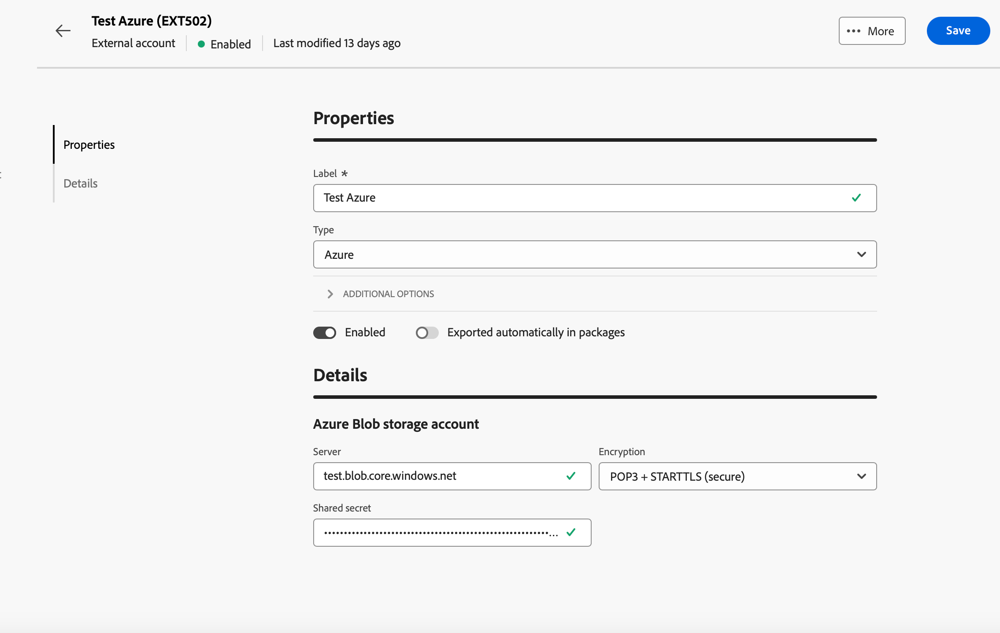

# 管理外部帐户 {#external-accounts}

>[!CONTEXTUALHELP]
>id="acw_homepage_welcome_rn3"
>title="外部帐户创作"
>abstract="作为Campaign管理员，您现在可以从Campaign Web用户界面设置与外部系统的新连接。 您还可以查看、更新和管理现有的外部帐户。"
>additional-url="https://experienceleague.adobe.com/docs/campaign-web/v8/release-notes/release-notes.html?lang=zh-hans" text="请参阅发行说明"

Adobe Campaign包括预配置的外部帐户，可轻松与各种系统集成。 要连接到其他平台或自定义连接以适合您的工作流，请使用Web用户界面创建新的外部帐户。 这可确保无缝的数据传输。

## 创建外部帐户 {#create-ext-account}

要创建新的外部帐户，请执行以下步骤。 详细设置取决于外部帐户的类型。 [了解详情](#campaign-specific)

1. 从左窗格菜单中选择&#x200B;**[!UICONTROL 管理]**&#x200B;下的&#x200B;**[!UICONTROL 外部帐户]**。

1. 单击&#x200B;**[!UICONTROL 创建外部帐户]**。

   

1. 输入您的&#x200B;**[!UICONTROL 标签]**&#x200B;并选择外部帐户&#x200B;**[!UICONTROL 类型]**。

   >[!NOTE]
   >
   >[此部分](#campaign-specific)中详细介绍了Campaign特定类型的设置。

   

1. 单击&#x200B;**[!UICONTROL 创建]**。

1. 从&#x200B;**[!UICONTROL 其他选项]**&#x200B;下拉列表中，根据需要更改&#x200B;**[!UICONTROL 内部名称]**&#x200B;或&#x200B;**[!UICONTROL 文件夹]**&#x200B;路径。

   

1. 启用&#x200B;**[!UICONTROL 自动导出包]**&#x200B;选项，以自动导出由此外部帐户管理的数据。<!--Exported where??-->

   

1. 在&#x200B;**[!UICONTROL 详细信息]**&#x200B;部分中，通过基于所选外部帐户类型指定凭据来配置对帐户的访问权限。 [了解详情](#bounce)

1. 单击&#x200B;**[!UICONTROL 测试连接]**&#x200B;以验证配置是否正确。

1. 从&#x200B;**[!UICONTROL 更多……]**&#x200B;菜单，复制或删除您的外部帐户。

   

1. 配置完成后，单击&#x200B;**[!UICONTROL 保存]**。

## Campaign特定的外部帐户 {#campaign-specific}

根据您选择的外部帐户类型，执行以下步骤以配置帐户设置。

### 退回电子邮件 (POP3) {#bounce}

退回邮件外部帐户指定用于连接到电子邮件服务的外部POP3帐户。 所有配置为POP3访问的服务器都可以接收回邮。

要配置&#x200B;**[!UICONTROL 退回邮件(POP3)]**&#x200B;外部帐户，请填写以下字段：

* **[!UICONTROL 服务器]** - POP3服务器的URL。

* **[!UICONTROL 端口]** - POP3连接端口号（默认端口为110）。

* **[!UICONTROL 帐户]** — 用户的名称。

* **[!UICONTROL 密码]** — 用户帐户密码。

* **[!UICONTROL 加密]** — 选择的加密类型，包括：
   * 默认情况下（如果端口110，则为POP3；如果端口995，则为POP3）。
   * 发送STARTTLS后切换到SSL的POP3。
   * POP3不安全（默认使用端口110）。
   * POP3在SSL上安全（默认使用端口995）。

* **[!UICONTROL 功能]** — 选择&#x200B;**[!UICONTROL 入站电子邮件]**&#x200B;配置接收入站电子邮件的帐户或选择&#x200B;**[!UICONTROL SOAP路由器]**&#x200B;处理SOAP请求。

>[!IMPORTANT]
>
>在使用Microsoft OAuth 2.0配置POP3外部帐户之前，您首先需要在Azure门户中注册应用程序。 有关详细信息，请参见[此页面](https://learn.microsoft.com/en-us/entra/identity-platform/quickstart-register-app){target=_blank}。

要使用Microsoft OAuth 2.0配置POP3外部连接，请选中Microsoft OAuth 2.0选项并填写以下字段：

* **[!UICONTROL Azure租户]**

  Azure ID(或目录（租户） ID)可以在Azure门户的应用程序概述的Essentials下拉菜单中找到。

* **[!UICONTROL Azure客户端ID]**

  可以在Azure门户中应用程序概述的Essentials下拉菜单中找到客户端ID(或应用程序（客户端）ID)。

* **[!UICONTROL Azure客户端密钥]**

  可以在Azure门户中应用程序的证书和密码菜单的“客户端密码”列中找到客户端密码ID。

* **[!UICONTROL Azure重定向URL]**

  可在Azure门户中应用程序的身份验证菜单中找到重定向URL。 它应以下列语法nl/jsp/oauth.jsp结尾，如`https://redirect.adobe.net/nl/jsp/oauth.jsp`。

安装和使用客户端控制台中的“测试连接”按钮需要Internet访问。 设置完成后，inMail进程可以与Microsoft服务器通信，而无需互联网。

输入不同的凭据后，可以单击“设置”连接以完成外部帐户配置。

### 路由 {#routing}

要为外部投放配置特定的外部帐户，请执行以下步骤。

1. 创建外部帐户。 [了解详情](../administration/external-account.md#create-ext-account)

1. 选择&#x200B;**[!UICONTROL 路由]**&#x200B;类型。

   {zoomable="yes"}

1. 选择所需的渠道并单击&#x200B;**[!UICONTROL 创建]**。

1. 在外部帐户&#x200B;**[!UICONTROL 详细信息]**&#x200B;部分中，**[!UICONTROL 外部]**&#x200B;默认被选为&#x200B;**[!UICONTROL 传递模式]**。

   {zoomable="yes"}

   >[!NOTE]
   >
   >当前，**[!UICONTROL External]**&#x200B;是唯一可用的模式。

1. 要在投放执行后处理该流程，请将其外部化到后处理工作流。 创建具有[外部信号](../workflows/activities/external-signal.md)活动的工作流，并从&#x200B;**[!UICONTROL 后处理]**&#x200B;字段中选择它。

   {zoomable="yes"}

1. 在&#x200B;**[!UICONTROL 活动]**&#x200B;字段中，编辑日志中显示的后处理工作流活动的名称。<!--you can edit the name of the activity that will be created if you add an external or bulk delivery to a workflow-->

### 执行实例 {#instance-exec}

如果您具有分段体系结构，请确定与控制实例相关联的执行实例，并在它们之间建立连接。 事务性消息模板部署在执行实例上。

要配置&#x200B;**[!UICONTROL 执行实例]**&#x200B;外部帐户：

* **[!UICONTROL URL]** — 安装执行实例的服务器的URL。

* **[!UICONTROL 帐户]** — 帐户的名称，与operator文件夹中定义的消息中心代理匹配。

* **[!UICONTROL 密码]** — 操作员文件夹中定义的帐户密码。

* **[!UICONTROL 方法]** — 在Web服务或联合数据访问(FDA)之间进行选择。

  对于FDA，选择您的FDA帐户。 请注意，与外部系统的Campaign连接仅限于高级用户，并且只能从客户端控制台中使用。 [了解详情](https://experienceleague.adobe.com/zh-hans/docs/campaign/campaign-v8/connect/fda#_blank)

* **[!UICONTROL 创建存档工作流]** — 对于在消息中心中注册的每个执行实例，无论您拥有一个还是多个实例，请为与该执行实例关联的每个外部帐户创建单独的存档工作流。

## Adobe解决方案集成外部帐户

### Adobe Experience Cloud

要使用Adobe ID连接到Adobe Campaign控制台，您必须配置Adobe Experience Cloud (MAC)外部帐户。

* **[!UICONTROL IMS服务器]**

  IMS服务器的URL。 确保暂存实例和生产实例都指向同一个IMS生产端点。

* **[!UICONTROL IMS范围]**

  此处定义的范围必须是IMS设置的范围的子集。

* **[!UICONTROL IMS客户端标识符]**

  IMS客户端的ID。

* **[!UICONTROL IMS客户端密码]**

  IMS客户端密钥的凭据。

* **[!UICONTROL 回调服务器]**

  访问Adobe Campaign实例的URL。

* **[!UICONTROL IMS组织ID]**

  您组织的ID。 要查找您的组织ID，请参阅[此页面](https://experienceleague.adobe.com/docs/core-services/interface/administration/organizations.html?lang=zh-hans){target=_blank}。

* **[!UICONTROL 关联掩码]**

  语法允许Enterprise Dashboard中的配置名称与Adobe Campaign中的组同步。

* **[!UICONTROL 服务器]**

  Adobe Experience Cloud实例的URL。

* **[!UICONTROL 租户]**

  您的Adobe Experience Cloud租户的名称。

## 传输数据外部帐户

### Amazon Simple Storage Service (S3) {#amazon-simple-storage-service--s3--external-account}

Amazon Simple Storage Service (S3)连接器可用于将数据导入或导出Adobe Campaign。 它可以在工作流活动中设置。 有关详细信息，请参见[此页面](https://experienceleague.adobe.com/zh-hans/docs/campaign-web/v8/wf/design-workflows/transfer-file){target=_blank}。

在设置此新外部帐户时，您需要提供以下详细信息：

* **[!UICONTROL AWS S3帐户服务器]**

  服务器的URL，应按如下方式填写：

  `  <S3bucket name>.s3.amazonaws.com/<s3object path>`

* **[!UICONTROL AWS访问密钥ID]**

  要了解在何处查找您的AWS访问密钥ID，请参阅此[页面](https://docs.aws.amazon.com/general/latest/gr/aws-sec-cred-types.html#access-keys-and-secret-access-keys)。

* **[!UICONTROL 访问AWS的密钥]**

  要了解在何处查找您的AWS访问密钥，请参阅此[页面](https://aws.amazon.com/fr/blogs/security/wheres-my-secret-access-key/)。

* **[!UICONTROL AWS地区]**

  要了解有关AWS地区的更多信息，请参阅此[页面](https://aws.amazon.com/about-aws/global-infrastructure/regions_az/)。

* 通过&#x200B;**[!UICONTROL 使用服务器端加密]**&#x200B;复选框，您可以以S3加密模式存储文件。

要了解在何处查找访问密钥ID和访问密钥，请参阅Amazon Web服务[文档](https://docs.aws.amazon.com/general/latest/gr/aws-sec-cred-types.html#access-keys-and-secret-access-keys)。

### Azure Blob Storage {#azure-blob-external-account}

**[!UICONTROL Azure Blob Storage]**&#x200B;外部帐户可用于通过&#x200B;**[!UICONTROL 传输文件]**&#x200B;工作流活动将数据导入或导出到Adobe Campaign。 如需详细信息，请参阅[此小节](https://experienceleague.adobe.com/zh-hans/docs/campaign-web/v8/wf/design-workflows/transfer-file){target=_blank}。

要将&#x200B;**[!UICONTROL Azure外部帐户]**&#x200B;配置为与Adobe Campaign配合使用，您需要提供以下详细信息：

* **[!UICONTROL 服务器]**

  Azure Blob Storage服务器的URL。

* **[!UICONTROL 加密]**

  在&#x200B;**[!UICONTROL 无]**&#x200B;或&#x200B;**[!UICONTROL SSL]**&#x200B;之间选择的加密类型。

* **[!UICONTROL 访问密钥]**

  若要了解在何处查找您的&#x200B;**[!UICONTROL 访问密钥]**，请参阅此[页面](https://docs.microsoft.com/en-us/azure/storage/common/storage-account-keys-manage?tabs=azure-portal)。

## Hadoop

Hadoop外部帐户允许您将Campaign实例连接到Hadoop外部数据库。 您可以在[Campaign V7控制台文档](https://experienceleague.adobe.com/zh-hans/docs/campaign-classic/using/installing-campaign-classic/accessing-external-database/configure-fda/config-databases/configure-fda-hadoop){target=_blank}中了解有关Hadoop的更多信息。

* **[!UICONTROL 服务器]**

  Hadoop storage server的URL。

* **[!UICONTROL 帐户]**

  您的Hadoop服务器帐户的名称。
