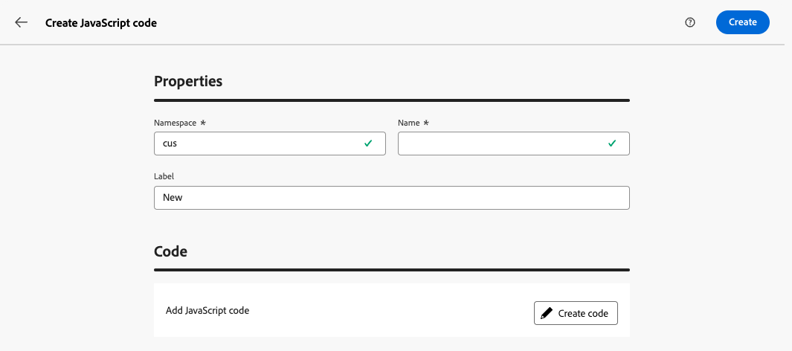
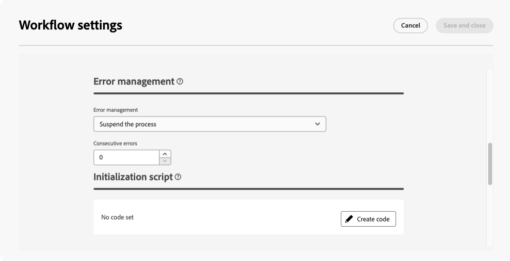

# 使用 JavaScript 代码工作 {#javascript-codes}

>[!CONTEXTUALHELP]
>id="acw_javascript_codes_list"
>title="JavaScript 代码"
>abstract="JavaScript 代码"

>[!CONTEXTUALHELP]
>id="acw_javascript_codes_create"
>title="创建 JavaScript 代码"
>abstract="创建 JavaScript 代码"

## 关于JavaScript代码 {#about}

JavaScript代码允许您创建可跨工作流使用的可重用函数，类似于库。 这些函数存储在左侧导航窗格中的&#x200B;**[!UICONTROL 管理]** > **[!UICONTROL JavaScript代码]**&#x200B;菜单中。


从JavaScript代码列表中，您可以：

* **复制或删除代码**：单击省略号按钮，然后选择所需的操作。
* **修改代码**：单击代码名称以打开其属性，进行更改并保存。
* **创建新的JavaScript代码**：单击&#x200B;**[!UICONTROL 创建JavaScript代码]**&#x200B;按钮。

>[!NOTE]
>
>尽管JavaScript代码菜单在Adobe Campaign控制台和Web用户界面中的位置不同，但该列表是相同的，其操作方式与镜像类似。

## 创建JavaScript代码 {#create}

要创建JavaScript代码，请执行以下步骤：

1. 导航到&#x200B;**[!UICONTROL JavaScript代码]**&#x200B;菜单，然后单击&#x200B;**[!UICONTROL 创建JavaScript代码]**&#x200B;按钮。

1. 定义代码的属性：

   * **[!UICONTROL 命名空间]**：指定与自定义资源相关的命名空间。 默认情况下，命名空间为“cus”，但它可能会因您的实施而异。
   * **[!UICONTROL 名称]**：用于引用代码的唯一标识符。
   * **[!UICONTROL 标签]**： JavaScript代码列表中显示的描述性标签。

   

   >[!NOTE]
   >
   >创建后，无法修改&#x200B;**[!UICONTROL 命名空间]**&#x200B;和&#x200B;**[!UICONTROL 名称]**&#x200B;字段。 要进行更改，请复制代码并根据需要进行更新。
   >
   >在Campaign控制台中，JavaScript代码名称显示为这两个字段的串联。

1. 单击&#x200B;**[!UICONTROL 创建代码]**&#x200B;按钮以定义JavaScript代码。 左窗格提供两个菜单，允许您使用与条件和日期格式相关的预定义函数。

   

1. 单击&#x200B;**[!UICONTROL 确认]**&#x200B;以保存您的代码。

1. 当您的JavaScript代码就绪时，单击&#x200B;**[!UICONTROL 创建]**。 JavaScript代码现在可以跨工作流使用。

## 使用工作流中的JavaScript代码 {#workflow}

### 加载JavaScript代码库 {#library}

您可以在工作流中引用JavaScript代码，以避免为重复任务重写代码。 要使用这些代码，请在工作流的初始化脚本中加载相应的库。 这样，您只需在工作流中加载一次包含要使用的函数的所有库。

要加载库，请执行以下步骤：

1. 打开工作流，然后单击&#x200B;**[!UICONTROL 设置]**&#x200B;按钮。
1. 导航到&#x200B;**[!UICONTROL 初始化脚本]**&#x200B;部分，然后单击&#x200B;**[!UICONTROL 创建代码]**。

   

1. 在代码中使用以下语法加载库：

   ```
   loadLibrary("/<namespace>/<name>")
   ```

   * 将`<namespace>`替换为在JavaScript代码创建期间指定的命名空间。
   * 将`<name>`替换为JavaScript代码的名称。

1. 单击&#x200B;**[!UICONTROL 确认]**，然后保存设置。

### 工作流中的引用函数 {#reference}

加载JavaScript库后，您可以在工作流中直接引用JavaScript代码中定义的函数，通常使用&#x200B;**[!UICONTROL JavaScript代码]**&#x200B;活动。

