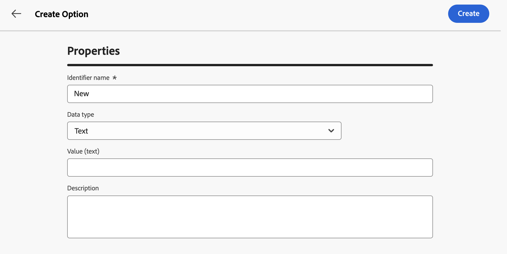

# 配置[!DNL Campaign]选项 {#options}

>[!CONTEXTUALHELP]
>id="acw_options_list"
>title="选项"
>abstract="选项"

>[!CONTEXTUALHELP]
>id="acw_options_create"
>title="创建选项"
>abstract="创建选项"

Adobe Campaign Web附带技术选项，可让您更具体地配置应用程序。 其中有些选项是内置的，而其他选项可以根据需要手动添加。

>[!IMPORTANT]
>
>内置选项已预配置，只应由高级用户修改。 如果您有任何问题或请求，请联系您的Adobe代表。

## 访问Campaign选项 {#access}

选项可从&#x200B;**[!UICONTROL 管理]** / **[!UICONTROL 选项]**&#x200B;菜单使用。 使用筛选器窗格缩小列表范围并快速找到所需的选项。

>[!NOTE]
>
>尽管选项菜单在Adobe Campaign控制台和Web用户界面中的位置不同，但该列表是相同的，其操作方式与镜像类似。 有关可用选项的更多信息，请参阅[Campaign v7文档](https://experienceleague.adobe.com/en/docs/campaign-classic/using/installing-campaign-classic/appendices/configuring-campaign-options){target="_blank"}中的选项列表

从选项列表中，您可以：

* **复制或删除选项**：单击省略号按钮并选择所需的操作。
* **修改选项**：单击该选项名称以打开其属性。 进行更改并保存。
* **创建自定义选项**：单击&#x200B;**[!UICONTROL 创建选项]**&#x200B;按钮。

## 创建选项 {#create}

Adobe Campaign Web用户界面允许您根据自己的需求创建自定义选项。 在使用&#x200B;**[!UICONTROL JavaScript代码]**&#x200B;工作流活动存储中间数据时，此功能特别有用。

要创建选项，请执行以下操作：

1. 访问选项列表，然后单击&#x200B;**[!UICONTROL 创建选项]**。
1. 输入选项的名称，选择其类型并设置所需值。
1. 单击&#x200B;**[!UICONTROL 创建]**&#x200B;以创建该选项。

   

选项可以充当数据的临时存储空间，提供以下好处：

* 键入的值：选项支持特定数据类型，例如日期、整数、字符串……
* 灵活性：利用选项，用户可以高效地存储和检索数据，而不会产生管理数据库表的开销。

在以下示例中，我们创建了一个名为`sampleOption`的自定义选项，其初始值为“a”。 工作流中的&#x200B;**[!UICONTROL JavaScript代码]**&#x200B;活动修改此选项的值并将其存储到变量中。 更新的值将显示在工作流日志中，并反映在&#x200B;**[!UICONTROL 选项]**&#x200B;菜单中。

1. 创建选项。

   

1. 配置&#x200B;**[!UICONTROL JavaScript代码]**&#x200B;活动并启动工作流。

   

1. 运行工作流以在工作流日志中查看更新的值。

   

1. 更新后的值现在显示在&#x200B;**[!UICONTROL 选项]**&#x200B;菜单中。

   
