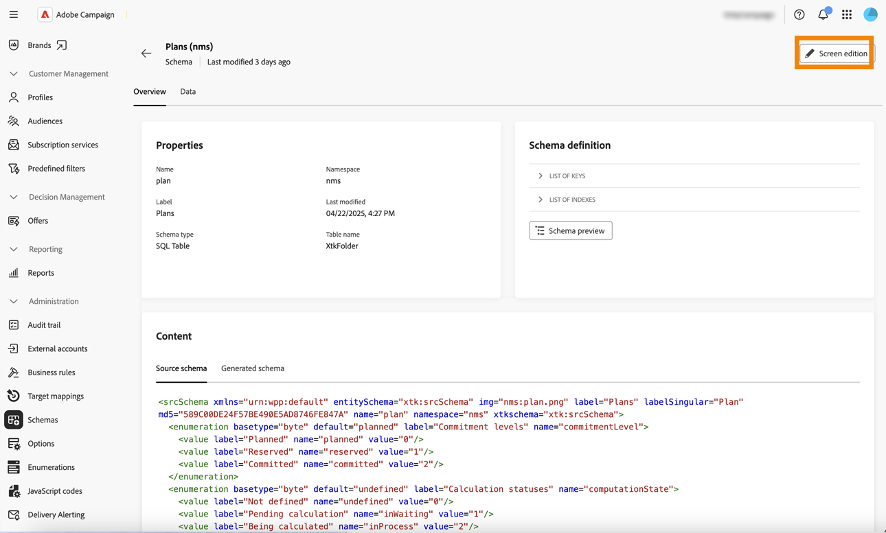

# 计划和项目 {#plan-and-programs}

使用 Adobe Campaign 可以为营销计划和项目配置文件夹层次结构。

为了更好地组织这些组件，Adobe建议采用以下层次结构：计划`>`项目`>`营销活动。

* **计划**&#x200B;可能包含多个计划。 它定义了特定期间的战略目标。
* **项目**&#x200B;可能包含其他项目以及营销策划、工作流和登陆页面。
* **营销活动**&#x200B;可能包含投放、工作流和登陆页面。

## 创建和配置计划 {#create-plan}

要创建计划，请创建文件夹类型为&#x200B;**[!UICONTROL 计划]**&#x200B;的文件夹。 [了解有关创建文件夹的更多信息](../get-started/work-with-folders.md)

{zoomable="yes"}

转到计划的&#x200B;**[!UICONTROL 文件夹设置]**&#x200B;对其进行管理。

{zoomable="yes"}的文件夹设置的屏幕截图

定义&#x200B;**[!UICONTROL 自定义选项]**，并设置计划的计划日期。

{zoomable="yes"}

要管理&#x200B;**[!UICONTROL 自定义选项]**：

1. 浏览到&#x200B;**[!UICONTROL 架构]**。
1. 在筛选器中选择&#x200B;**[!UICONTROL 可编辑的]**&#x200B;架构。
1. 单击架构。

{zoomable="yes"}

1. 单击&#x200B;**[!UICONTROL 屏幕版本]**&#x200B;按钮。

   {zoomable="yes"}

配置自定义选项：

{zoomable="yes"}

## 创建和配置程序

要在计划中创建计划（[了解有关创建计划的详细信息](#create-plan)），请导航到您的计划并创建文件夹类型为&#x200B;**[!UICONTROL 计划]**&#x200B;的文件夹。 [了解有关创建文件夹的更多信息](../get-started/work-with-folders.md)。

{zoomable="yes"}

转到程序的&#x200B;**[!UICONTROL 文件夹设置]**&#x200B;对其进行管理。

{zoomable="yes"}

定义&#x200B;**[!UICONTROL 自定义选项]**，并设置程序的计划日期。

{zoomable="yes"}

要管理&#x200B;**[!UICONTROL 自定义选项]**：

1. 浏览到&#x200B;**[!UICONTROL 架构]**。
1. 在筛选器中选择&#x200B;**[!UICONTROL 可编辑的]**&#x200B;架构。
1. 单击架构。

{zoomable="yes"}

1. 单击&#x200B;**[!UICONTROL 屏幕版本]**&#x200B;按钮。

   {zoomable="yes"}

配置自定义选项：

{zoomable="yes"}

## 如何将营销活动链接到项目

您可以通过两种方式将营销活动链接到项目：

### 方#1：您已经有一个项目，并想要创建与其关联的营销策划

要将新营销策划链接到项目，请直接在项目中创建营销策划。

{zoomable="yes"}

**[!UICONTROL 文件夹]**&#x200B;设置将自动填充程序路径。

{zoomable="yes"}

### 方式#2：您已经有一个现有营销策划，并想要将其链接到现有项目

转到要链接到项目的营销活动的&#x200B;**[!UICONTROL 设置]**&#x200B;按钮。

{zoomable="yes"}

在其&#x200B;**[!UICONTROL 属性]**&#x200B;中，单击&#x200B;**[!UICONTROL 文件夹]**&#x200B;设置中的&#x200B;**[!UICONTROL 文件夹]**&#x200B;图标以选择您的&#x200B;**[!UICONTROL 程序]**&#x200B;文件夹。

{zoomable="yes"}

选择您的&#x200B;**[!UICONTROL 程序]**&#x200B;文件夹，单击&#x200B;**[!UICONTROL 确认]**&#x200B;按钮，然后单击&#x200B;**[!UICONTROL 保存并关闭]**&#x200B;按钮。

{zoomable="yes"}

您的营销策划现已列于您的项目中。

{zoomable="yes"}