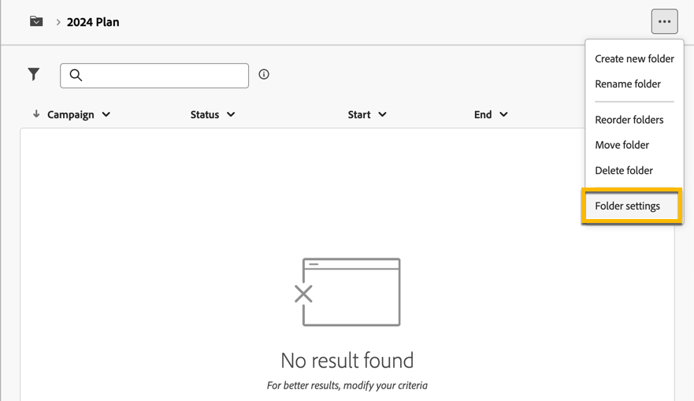

# 计划和计划 {#plan-and-programs}

>[!CONTEXTUALHELP]
>id="acw_homepage_welcome_rn2"
>title="计划和计划"
>abstract="您现在可以在Campaign Web用户界面中为营销计划和项目配置文件夹层次结构。"
>additional-url="https://experienceleague.adobe.com/docs/campaign-web/v8/release-notes/release-notes.html?lang=zh-Hans" text="请参阅发行说明"

Adobe Campaign允许您为营销计划和项目配置文件夹层次结构。

为了更好地组织这些活动，Adobe建议采用以下层次结构：计划 `>` 程序 `>` 营销活动

* A **计划** 可能包含多个程序。 它定义了一个时期的战略目标。
* A **项目** 可能包含其他项目以及营销策划、工作流和登陆页面。
* A **营销活动** 可能包含投放、工作流和登陆页面。

## 创建和配置计划 {#create-plan}

要创建计划，您需要创建具有文件夹类型的文件夹 **[!UICONTROL 计划]** [了解有关创建文件夹的更多信息](create-manage-folder.md).

{zoomable="yes"}

转到 **[!UICONTROL 文件夹设置]** 管理它的计划。

{zoomable="yes"}

您可以定义 **[!UICONTROL 自定义选项]**，并设置计划的计划日期。

{zoomable="yes"}

要管理  **[!UICONTROL 自定义选项]**：

1. 浏览至 **[!UICONTROL 架构]**
1. 选择 **[!UICONTROL 可编辑]** 筛选器中的架构
1. 单击图标 **[!UICONTROL 编辑自定义详细信息]**

{zoomable="yes"}

您可以对其进行配置：

{zoomable="yes"}

## 创建和配置程序

要在您的计划中创建项目，请执行以下操作([了解有关创建计划的更多信息](#create-plan))，您需要加入您的计划并创建具有文件夹类型的文件夹 **[!UICONTROL 项目]** [了解有关创建文件夹的更多信息](create-manage-folder.md).

{zoomable="yes"}

转到 **[!UICONTROL 文件夹设置]** 以管理它。

{zoomable="yes"}

您可以定义 **[!UICONTROL 自定义选项]**，并设置项目的计划日期。

{zoomable="yes"}

要管理  **[!UICONTROL 自定义选项]**：

1. 浏览至 **[!UICONTROL 架构]**
1. 选择 **[!UICONTROL 可编辑]** 筛选器中的架构
1. 单击图标 **[!UICONTROL 编辑自定义详细信息]**

{zoomable="yes"}

您可以配置它们：

{zoomable="yes"}

## 如何将营销活动链接到项目

您可以通过两种方式将营销活动链接到项目：

### 方#1：您已经有一个项目，并想要创建与其关联的活动

要将新营销活动链接到项目，请直接在项目中创建您的营销活动：

{zoomable="yes"}

此 **[!UICONTROL 文件夹]** 设置将自动与程序的路径一起归档。

{zoomable="yes"}

### 方#2：您已经有一个现有营销活动，并希望将其链接到现有项目

转到 **[!UICONTROL 设置]** 链接至项目的营销策划的按钮：

{zoomable="yes"}

在 **[!UICONTROL 属性]**，单击 **[!UICONTROL 文件夹]** 图标 **[!UICONTROL 文件夹]** 设置，以便选择您的 **[!UICONTROL 项目]** 文件夹。

{zoomable="yes"}

选择您的 **[!UICONTROL 项目]** 文件夹，然后单击 **[!UICONTROL 确认]** 按钮，然后打开 **[!UICONTROL 保存并关闭]** 按钮。

{zoomable="yes"}

您的营销活动现已列于您的项目中：

{zoomable="yes"}
