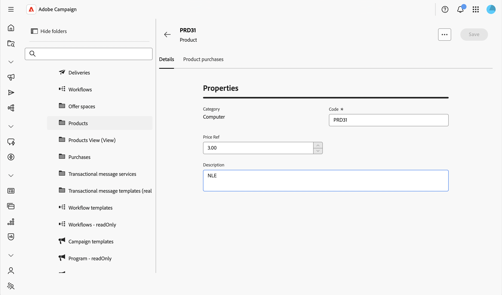

# 针对数据的控制操作 {#action-data}

>[!CONTEXTUALHELP]
>id="acw_schema_action_data"
>title="操作数据"
>abstract="配置架构详细信息屏幕和列表屏幕中可用的操作。 启用&#x200B;**[!UICONTROL 只读]**&#x200B;后，可将详细信息屏幕设置为只读，并移除列表中的操作。 启用&#x200B;**[!UICONTROL 不允许删除]**&#x200B;后，可从详细信息屏幕和列表屏幕中移除删除操作。"

**[!UICONTROL 操作数据]**&#x200B;部分允许您限制自定义架构记录上的可用操作，而不管单个文件夹上配置了[安全规则](../get-started/work-with-folders.md)。 此限制适用于每个用户（包括管理员）在每个文件夹的架构级别。

>[!NOTE]
>
>此部分仅适用于自定义架构。

有关屏幕定义屏幕以及如何对其进行访问的更多信息，请参阅[访问屏幕定义](schemas-browse-access.md#screen-def)部分。

要配置操作数据，请执行以下步骤：

1. 浏览到&#x200B;**[!UICONTROL 架构]**&#x200B;菜单，并使用筛选器找到可编辑的架构。

1. 选择列表中的架构名称以将其打开，然后单击架构详细信息视图中的&#x200B;**[!UICONTROL 屏幕版本]**&#x200B;按钮以访问屏幕定义。

1. 向下滚动到屏幕定义底部的&#x200B;**[!UICONTROL 操作数据]**&#x200B;部分。

   屏幕定义中的

1. 选择一个或多个可用选项：

   * **[!UICONTROL 只读]**：对于所有用户，详细信息屏幕变为只读。 列表中没有创建、复制、更新或删除操作，并且删除和复制操作在详细信息屏幕中处于隐藏状态。 选择此选项与配置视图类似：用户仍然可以打开记录并重用它们，例如在定位投放时，但无法修改它们。

   * **[!UICONTROL 不允许删除]**：删除操作将从每个文件夹的详细信息屏幕和列表中删除。 其他操作（如创建、复制和更新）仍可用。

   * **[!UICONTROL 不允许重复]**：将从详细信息屏幕和列表中删除每个文件夹中的重复操作。 其他操作（如创建、删除和更新）仍可用。

     >[!NOTE]
     >
     >启用&#x200B;**[!UICONTROL 只读]**&#x200B;也会自动覆盖删除和复制，因此&#x200B;**[!UICONTROL 不允许删除]**&#x200B;和&#x200B;**[!UICONTROL 不允许重复]**&#x200B;选项在选择&#x200B;**[!UICONTROL 只读]**&#x200B;时已禁用。

1. 单击&#x200B;**[!UICONTROL 保存]**。

1. 浏览到此架构的记录列表以检查结果。

   在此示例中，**[!UICONTROL 只读]**&#x200B;已启用：列表不再显示复制和删除操作。

   

1. 打开记录以检查详细信息屏幕。 显示其字段时不允许进行任何编辑。

   
