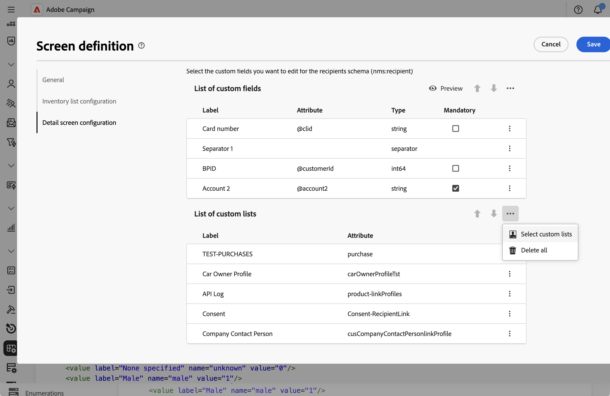
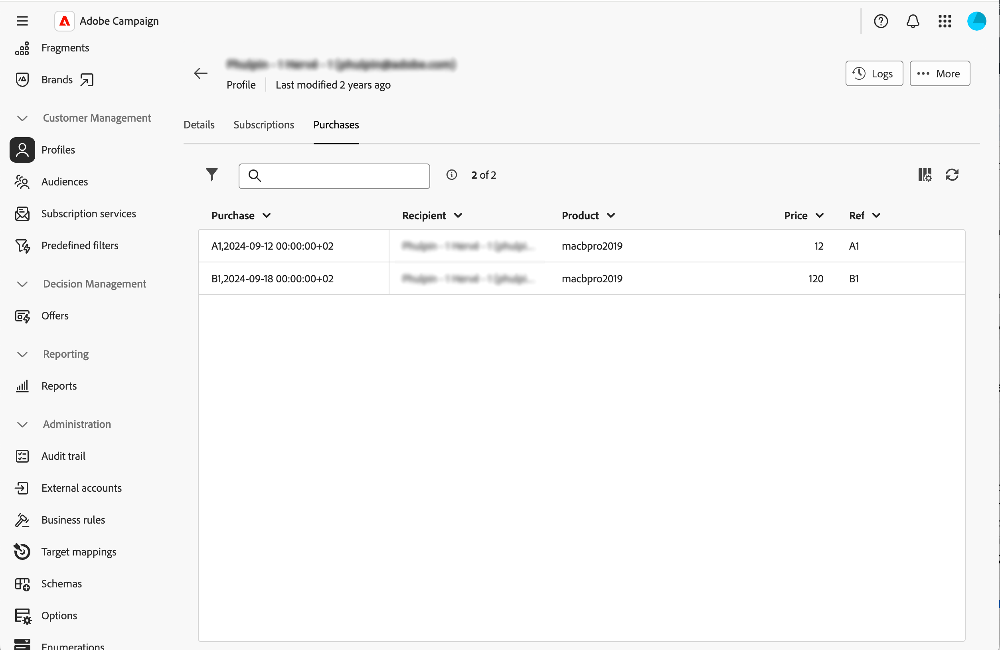

# 添加收藏集列表 {#collection-lists}

**自定义列表列表**&#x200B;部分允许您定义收藏集链接，如购买。 然后，相关数据通过专用选项卡显示在用户档案屏幕中。

有关屏幕定义屏幕以及如何对其进行访问的更多信息，请参阅[访问屏幕定义](schemas-browse-access.md#screen-def)部分。

>[!NOTE]
>
>目前，此功能仅适用于收件人架构。

要添加收藏集列表，请执行以下操作：

1. 浏览到&#x200B;**[!UICONTROL 架构]**&#x200B;菜单，并使用筛选器找到可编辑的架构。

1. 选择列表中的架构名称以将其打开，然后单击架构详细信息视图中的&#x200B;**[!UICONTROL 屏幕版本]**&#x200B;按钮以访问屏幕定义。

1. 单击省略号图标，然后选择&#x200B;**[!UICONTROL 选择自定义列表]**。

   

1. 选择一个可用的自定义列表，例如购买，然后单击&#x200B;**[!UICONTROL 确认]**。

   

1. 浏览到&#x200B;**用户档案**&#x200B;菜单并筛选已购买的用户档案。

   

1. 单击配置文件。 您会注意到新选项卡已显示。 如果需要，您可以添加更多列。

   
