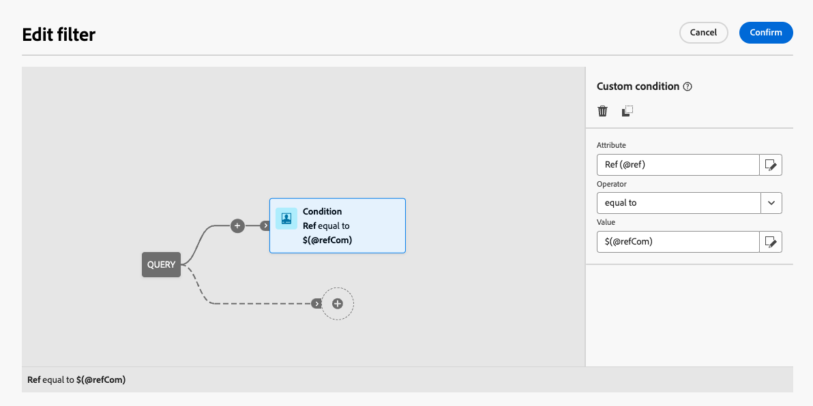

# 编辑自定义字段 {#fields}

自定义字段是通过Adobe Campaign控制台添加到现成模式的其他属性。 它们允许您通过包含新属性来自定义架构，以满足贵组织的需求。

自定义字段可以显示在各种屏幕中，例如界面中的用户档案详细信息。 您可以控制哪些字段可见以及它们在界面中的显示方式。

有关屏幕定义屏幕以及如何对其进行访问的更多信息，请参阅[访问屏幕定义](schemas-browse-access.md#screen-def)部分。

要将自定义字段添加到列表，请执行以下操作：

1. 浏览到&#x200B;**[!UICONTROL 架构]**&#x200B;菜单，并使用筛选器找到可编辑的架构。

1. 选择列表中的架构名称以将其打开，然后单击架构详细信息视图中的&#x200B;**[!UICONTROL 屏幕版本]**&#x200B;按钮以访问屏幕定义。

1. 单击&#x200B;**[!UICONTROL 自定义字段列表]**&#x200B;表上方的省略号图标，然后选择&#x200B;**[!UICONTROL 选择属性]**以选择要在界面中显示的一个或多个自定义字段。
   
1. 选择要添加的自定义字段并进行确认。

   

   >[!NOTE]
   >
   > 您还可以选择&#x200B;**[!UICONTROL 自动填写自定义字段列表]**&#x200B;以将为该架构定义的所有自定义字段添加到该界面。

添加自定义字段后，您可以预览它们、重新排列它们、使它们成为必填项、编辑其设置或将其整理到子部分中。

## 配置字段设置 {#field-settings}

要为每个自定义字段配置特定设置，请单击列表中字段行上的省略号图标，然后选择&#x200B;**[!UICONTROL 编辑]**。

可用设置包括：

* **[!UICONTROL 属性]**：自定义字段的名称（只读）。
* **[!UICONTROL 标签（自定义）]**：要在界面中显示的标签。 如果未提供标签，则将显示架构中定义的标签。
* **[!UICONTROL 如果]**&#x200B;可见：使用控制字段显示时间的xtk表达式定义条件。 例如，如果其他字段为空，则隐藏此字段。
* **[!UICONTROL 必填]**：在界面中将字段设为必填。
* **[!UICONTROL 只读]**：将接口中的字段设为只读。 用户将无法编辑该字段的值。
* **[!UICONTROL 筛选器设置]**（用于链接类型字段）：使用查询建模器指定用于显示链接类型自定义字段的规则。 例如，根据另一个字段的输入限制列表值。

  +++查看示例

  您还可以使用语法`$(<field-name>)`引用在条件中其他字段输入的值。 这允许您引用在表单中输入的字段的当前值，即使它尚未保存到数据库也是如此。

  在以下示例中，条件会检查@ref字段的值是否与在@refCom字段中输入的值匹配。 相反，使用`@refCom`而不是`$(@refCom)`将引用数据库中存在的@ref字段的值。

  

  +++

* **[!UICONTROL 跨两列]**：默认情况下，自定义字段在界面中以两列显示。 切换此选项可在屏幕的整个宽度上显示自定义字段，而不是两列。

## 预览自定义字段 {#preview}

单击&#x200B;**[!UICONTROL 预览]**&#x200B;可在示例屏幕中显示自定义字段。 这样，您就可以查看这些字段在界面中的显示方式，包括哪些字段标记为必填字段。

## 组织子部分中的字段 {#separator}

您可以添加分隔符以将界面中的自定义字段分组，以提高可读性。 为此，请执行以下步骤：

1. 单击&#x200B;**[!UICONTROL 自定义字段列表]**&#x200B;表上方的省略号图标，然后选择&#x200B;**[!UICONTROL 添加分隔符]**。

1. 代表分隔符的新行将添加到列表中。 单击分隔符行上的省略号图标，然后选择&#x200B;**[!UICONTROL 编辑]**。

1. 为分隔符输入&#x200B;**[!UICONTROL 标签]**&#x200B;并（可选）设置&#x200B;**[!UICONTROL Visible if]**&#x200B;条件以控制分隔符显示时间。

   

1. 使用向上和向下箭头将分隔符移动到所需位置。 分隔符下方列出的字段将分组到该分隔符下方。

   在此示例中，“感兴趣的收藏集”和“品牌”字段将分组到“收藏集”子部分。

   | 自定义字段配置 | 在界面中渲染 |
   |  ---  |  ---  |
   | {zoomable="yes"} | {zoomable="yes"} |
