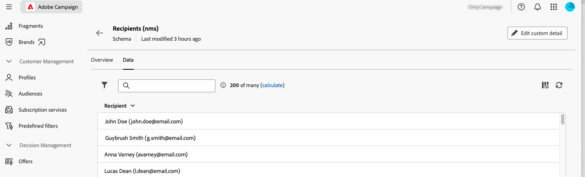

# 使用架构 {#schemas}

>[!CONTEXTUALHELP]
>id="acw_schema"
>title="架构"
>abstract="**[!DNL Adobe Campaign]** 使用基于 XML 的架构定义应用程序内数据的物理和逻辑结构。在这个屏幕上您可以查看所有现有架构，并通过在列表中选择一个架构的名称访问该架构的详细信息。过滤器可用于帮助细化列表，例如仅显示可编辑的架构。"

## 关于架构 {#about}

**[!DNL Adobe Campaign]** 使用基于 XML 的架构定义应用程序内数据的物理和逻辑结构。架构是链接到数据库表的XML文档，该数据库表定义：

* SQL表结构，包括表名、字段和关系。
* XML数据结构，包括元素、属性、层次结构、类型、默认值和标签。

架构在以下方面发挥着关键作用：

* 将应用程序数据映射到数据库表。
* 定义数据对象之间的关系。
* 指定每个字段的结构和属性。

Adobe Campaign中的每个实体都有一个专用架构，确保数据一致性和组织性。

有关架构的详细信息，请参阅[Campaign控制台文档](https://experienceleague.adobe.com/en/docs/campaign/campaign-v8/developer/shemas-forms/schemas){target="_blank"}。

## 在Web用户界面中访问架构 {#access}

可从&#x200B;**[!UICONTROL 管理]** > **[!UICONTROL 架构]**&#x200B;菜单访问架构。

在此屏幕中，可以查看所有现有架构。 过滤器可用于帮助细化列表，例如仅显示可编辑的架构。

要打开架构，请选择其名称。 将显示一个详细的架构视图。

### 架构概述 {#overview}

**[!UICONTROL 概述]**&#x200B;选项卡提供了架构的一般视图：

* **[!UICONTROL 属性]**&#x200B;部分显示关键信息，如架构名称、命名空间和相关联的表名。

* **[!UICONTROL 架构定义]**&#x200B;部分显示有关架构定义的详细信息，包括用于数据协调的主键及其与其他表的链接。

  单击&#x200B;**[!UICONTROL 架构预览]**&#x200B;按钮可查看构成架构的不同字段和链接。 这允许您检查架构的完整结构。 如果架构已使用自定义字段进行扩展，则可以可视化其所有扩展。

* **[!UICONTROL Content]**&#x200B;部分显示架构的XML内容，允许您在源和生成的语法之间进行切换。

### 架构数据 {#data}

**[!UICONTROL 数据]**&#x200B;选项卡提供有关架构数据的信息。

## 编辑自定义字段 {#fields}

自定义字段是通过Adobe Campaign控制台添加到现成模式的其他属性。 它们允许您通过包含新属性来自定义架构，以满足贵组织的需求。

自定义字段可显示在各种屏幕中，例如Campaign Web界面中的用户档案详细信息。 您可以控制哪些字段可见以及它们在界面中的显示方式。 为此，请单击&#x200B;**[!UICONTROL 架构]**&#x200B;菜单中的&#x200B;**[!UICONTROL 屏幕版本]**&#x200B;按钮。

单击&#x200B;**[!UICONTROL 预览]**&#x200B;可在示例屏幕中显示自定义字段。

有关如何编辑架构中自定义字段的详细信息，请参阅以下部分：[配置自定义字段](../administration/custom-fields.md)。