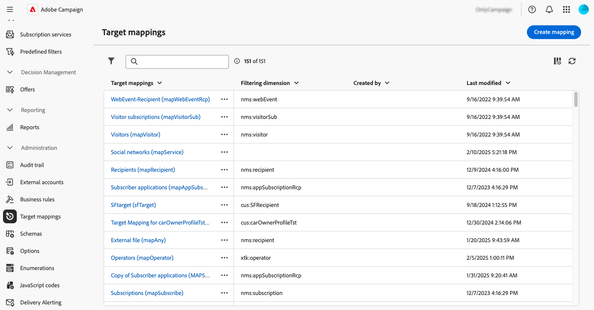
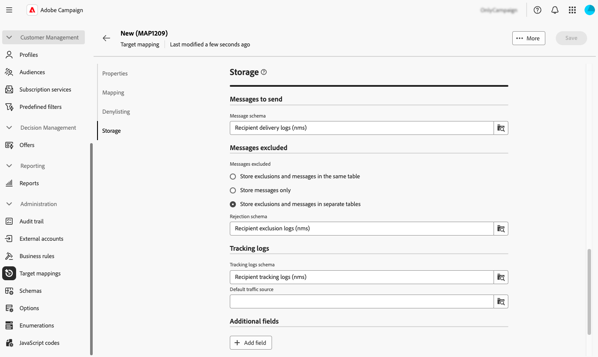

# 管理目标映射 {#target-mappings}

>[!CONTEXTUALHELP]
>id="acw_homepage_welcome_rn5"
>title="目标映射"
>abstract="您现在可以在 Campaign Web 用户界面中创建目标映射。目标映射定义了不同的投放渠道（电子邮件、SMS、推送）如何链接到一个架构的数据字段。"
>additional-url="https://experienceleague.adobe.com/docs/campaign-web/v8/release-notes/release-notes.html?lang=zh-hans" text="请参阅发行说明"

>[!CONTEXTUALHELP]
>id="acw_targetmapping_list"
>title="目标映射 "
>abstract="目标映射"

## 关于目标映射 {#about}

每个通信渠道使用默认目标映射来定位其收件人。 例如，默认情况下，电子邮件和短信投放模板以&#x200B;**[!UICONTROL 收件人]**&#x200B;为目标。 因此，它们的目标映射使用&#x200B;**nms：recipient**&#x200B;表的字段。 对于推送通知，默认目标映射为链接到收件人表的&#x200B;**订阅者应用程序(nms：appSubscriptionRcp)**。

可以从&#x200B;**[!UICONTROL 管理]** > **[!UICONTROL 目标映射]**&#x200B;菜单访问目标映射。 从该屏幕中，您可以访问每个目标映射的详细信息，或创建新目标映射以满足您的需求。

有关Adobe Campaign提供的内置目标映射的详细信息，请参阅[Campaign v8客户端控制台文档](https://experienceleague.adobe.com/docs/campaign/campaign-v8/audience/add-profiles/target-mappings.html){target="_blank"}。

## 创建一个目标映射 {#create-mapping}

>[!CONTEXTUALHELP]
>id="acw_targetmapping_properties"
>title="目标映射属性"
>abstract="您可以在&#x200B;**[!UICONTROL 属性]**&#x200B;部分定义目标映射和目标群体的通用设置。"

>[!CONTEXTUALHELP]
>id="acw_targetmapping_mapping"
>title="目标映射映射"
>abstract="您可以在&#x200B;**[!UICONTROL 映射]**&#x200B;部分识别目标映射模式中的哪些属性用于不同的投放地址字段。"

>[!CONTEXTUALHELP]
>id="acw_targetmapping_denylist"
>title="目标映射阻止列表"
>abstract="目标映射阻止列表"

>[!CONTEXTUALHELP]
>id="acw_targetmapping_storage"
>title="目标映射存储"
>abstract="您可以在&#x200B;**[!UICONTROL 存储]**&#x200B;部分识别日志必须存储在哪里。"

要创建新的目标映射，请访问&#x200B;**[!UICONTROL 管理]** > **[!UICONTROL 目标映射]**&#x200B;菜单。 单击&#x200B;**[!UICONTROL 创建映射]**&#x200B;按钮，然后按照以下部分中详述的步骤操作。

1. 在&#x200B;**[!UICONTROL 属性]**&#x200B;部分中，为目标映射输入&#x200B;**[!UICONTROL 标签]**。

1. 展开&#x200B;**[!UICONTROL 其他选项]**&#x200B;部分以定义高级设置，例如目标映射的内部名称、存储文件夹和描述。

1. 选择目标群体。 您可以：

   * **[!UICONTROL 直接使用定向维度]**：从可用维度列表中选择直接定向的维度。
   * **[!UICONTROL 使用链接的数据]**：从定向维度（例如订阅）开始，然后切换到要定向的定向维度（例如收件人）。

   

1. 如果所选维度尚未由现有目标映射使用，则需要创建用于存储日志的架构。 **[!UICONTROL 存储]**&#x200B;部分中有其他选项可用。 展开下面的部分以了解更多详细信息。

   +++新定向维度的存储选项

   1. **[!UICONTROL 命名空间]**：标识将用于创建日志的命名空间。
   1. **[!UICONTROL 扩展架构的后缀]**：为新架构提供一个后缀。

      在下面的示例中，broadlog名称将为“cusbroadlogSupplier”。

      

   1. **[!UICONTROL 投放日志]**：激活此部分中的选项以使用段代码字段或包含投放IP地址的字段扩充发送日志。 例如，将工作流期间计算的区段代码保存到发送日志中，以便稍后优化目标。 这允许使用此特定段代码定位用户档案。

   1. **[!UICONTROL 排除项]**：指定如何存储排除项日志。

   1. **[!UICONTROL 跟踪日志]**：激活&#x200B;**[!UICONTROL 生成跟踪的架构]**&#x200B;选项以生成跟踪日志的存储架构。

+++

1. 使用&#x200B;**[!UICONTROL 映射]**&#x200B;部分确定目标映射的架构中要用于每个投放地址字段的属性。 对于每个字段，选择要映射的所需属性。 您还可以构建用于标识该字段的表达式。 例如，对地址属性应用较低的函数。

   显示投放地址字段属性选择的

1. 目标映射就绪后，单击&#x200B;**[!UICONTROL 创建]**&#x200B;按钮。 系统会自动为日志创建目标映射和所有相关架构。

创建目标映射后，屏幕上会显示两个其他部分：

* **[!UICONTROL 列入阻止列表 列入阻止列表]**：此部分允许您识别目标映射架构中要用于的属性。

  显示属性选择的

* **[!UICONTROL 存储]**：此部分允许您标识用于存储日志的表。

  显示日志表选项的

   * **[!UICONTROL 消息架构]**：标识用于存储发送日志的架构。
   * **[!UICONTROL 排除的邮件]**：指定如何管理投放和排除日志存储。

      * **[!UICONTROL 将排除项和消息存储在同一个表中]**
      * **[!UICONTROL 仅存储邮件]**：不存储排除项。
      * **[!UICONTROL 将排除项和消息存储在单独的表中]**：选择要在&#x200B;**[!UICONTROL 拒绝架构]**&#x200B;字段中存储排除日志的架构。

   * **[!UICONTROL 跟踪日志]**：选择存储跟踪日志和默认流量源的位置。
   * **[!UICONTROL 附加字段]**：指定要存储在投放日志中的附加字段列表。 这些字段可以永久存储有关目标的单个成员（例如`recipient/@firstName`）的信息或存储工作流期间计算的附加数据（例如`[targetData/@offeCode]`）。

     为此，请选择&#x200B;**[!UICONTROL 添加字段]**。 确定要保存在&#x200B;**[!UICONTROL Source]**&#x200B;字段中的信息，以及发送日志中用于将此信息保存在&#x200B;**[!UICONTROL 目标]**&#x200B;字段中的属性。

     {width="50%" zoomable="yes"}