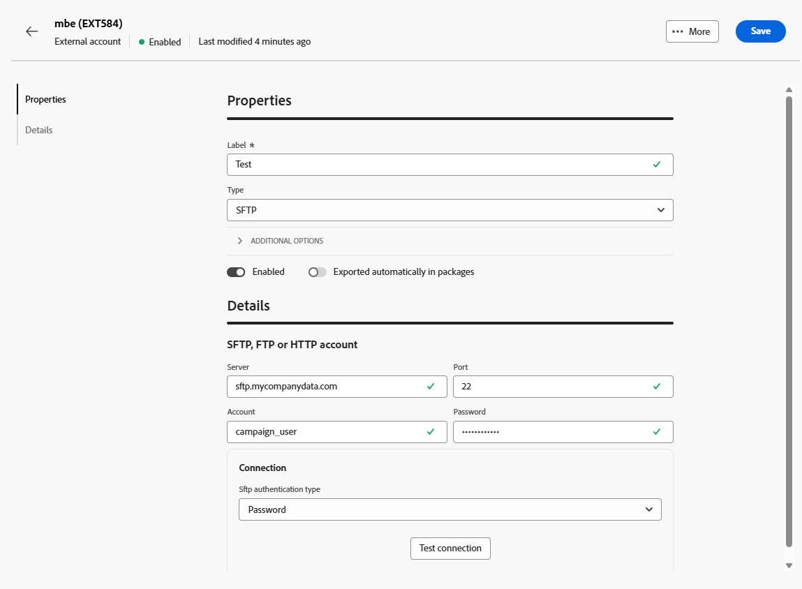

# 传输数据外部帐户 {#transfer-external-account}

## Amazon Simple Storage Service (S3) {#amazon-simple-storage-service--s3--external-account}

Amazon Simple Storage Service (S3)连接器可用于将数据导入或导出Adobe Campaign。 它可以在工作流活动中设置。 有关详细信息，请参见[此页面](https://experienceleague.adobe.com/en/docs/campaign-web/v8/wf/design-workflows/transfer-file){target=_blank}。

在设置此新外部帐户时，您需要提供以下详细信息：

* **[!UICONTROL AWS S3帐户服务器]**

  服务器的URL，应按如下方式填写：

  `  <S3bucket name>.s3.amazonaws.com/<s3object path>`

* **[!UICONTROL AWS访问密钥ID]**

  要了解在何处查找您的AWS访问密钥ID，请参阅此[页面](https://docs.aws.amazon.com/general/latest/gr/aws-sec-cred-types.html#access-keys-and-secret-access-keys)。

* **[!UICONTROL 访问AWS的密钥]**

  要了解在何处查找您的AWS访问密钥，请参阅此[页面](https://aws.amazon.com/fr/blogs/security/wheres-my-secret-access-key/)。

* **[!UICONTROL AWS地区]**

  要了解有关AWS地区的更多信息，请参阅此[页面](https://aws.amazon.com/about-aws/global-infrastructure/regions_az/)。

* 通过&#x200B;**[!UICONTROL 使用服务器端加密]**&#x200B;复选框，您可以以S3加密模式存储文件。

要了解在何处查找访问密钥ID和访问密钥，请参阅Amazon Web服务[文档](https://docs.aws.amazon.com/general/latest/gr/aws-sec-cred-types.html#access-keys-and-secret-access-keys)。

## Azure Blob Storage {#azure-blob-external-account}

**[!UICONTROL Azure Blob Storage]**&#x200B;外部帐户可用于通过&#x200B;**[!UICONTROL 传输文件]**&#x200B;工作流活动将数据导入或导出到Adobe Campaign。 如需详细信息，请参阅[此小节](https://experienceleague.adobe.com/en/docs/campaign-web/v8/wf/design-workflows/transfer-file){target=_blank}。

要将&#x200B;**[!UICONTROL Azure外部帐户]**&#x200B;配置为与Adobe Campaign配合使用，您需要提供以下详细信息：

* **[!UICONTROL 服务器]**

  Azure Blob Storage服务器的URL。

* **[!UICONTROL 加密]**

  在&#x200B;**[!UICONTROL 无]**&#x200B;或&#x200B;**[!UICONTROL SSL]**&#x200B;之间选择的加密类型。

* **[!UICONTROL 访问密钥]**

  若要了解在何处查找您的&#x200B;**[!UICONTROL 访问密钥]**，请参阅此[页面](https://docs.microsoft.com/en-us/azure/storage/common/storage-account-keys-manage?tabs=azure-portal)。

## SFTP

SFTP外部帐户允许您配置和测试对Adobe Campaign外部服务器的访问。

要配置&#x200B;**[!UICONTROL SFTP]**&#x200B;外部帐户，请填写以下字段：

* **[!UICONTROL 服务器]**

  输入SFTP服务器的名称或地址。

* **[!UICONTROL 端口]**

  指定SFTP连接端口号。 默认端口为22。

* **[!UICONTROL 帐户]**

  输入用于连接到SFTP服务器的用户名。

* **[!UICONTROL 密码]**

  输入SFTP帐户的密码。

* **[!UICONTROL SFTP身份验证类型]**

  选择要通过SFTP服务器进行身份验证的方法。 选项包括：

   * **[!UICONTROL 密码]**：使用帐户的密码进行身份验证。

   * **[!UICONTROL 公钥]**：使用SSH密钥对（私钥和公钥）进行身份验证。

如果选择&#x200B;**[!UICONTROL 公钥]**&#x200B;身份验证，则需要填写以下字段：

* **[!UICONTROL 私钥文件]**

  指定用于身份验证的私有SSH密钥文件。

* **[!UICONTROL 公钥文件]**

  指定在SFTP服务器上注册的相应公共SSH密钥。

* **[!UICONTROL SSH密钥密码]**

  如果私钥受保护，请输入密码以将其解密。

## HTTP

HTTP外部帐户允许您配置和测试对Adobe Campaign外部服务器的访问。

要配置&#x200B;**[!UICONTROL HTTP]**&#x200B;外部帐户，请填写以下字段：

* **[!UICONTROL 服务器]**

  输入HTTP服务器的名称或地址。

* **[!UICONTROL 端口]**

  指定HTTP连接端口号。 默认端口为80。

* **[!UICONTROL 帐户]**

  输入用于身份验证的用户名。

* **[!UICONTROL 密码]**

  输入与用户帐户关联的密码。

* **[!UICONTROL SFTP身份验证类型]**

  选择连接的身份验证类型。 选项包括：

   * 密码
   * 公钥

如果您正在使用&#x200B;**[!UICONTROL 公钥]**&#x200B;身份验证，请在&#x200B;**[!UICONTROL 公钥身份验证]**&#x200B;菜单中，输入以下所需的值：

* **[!UICONTROL 密码]**：保护私钥的密码（如果适用）。

* **[!UICONTROL 私钥]**：用于验证Snowflake帐户的私钥。

## FTP

FTP外部帐户允许您配置和测试对Adobe Campaign外部服务器的访问。

要配置&#x200B;**[!UICONTROL FTP]**&#x200B;外部帐户，请填写以下字段：

* **[!UICONTROL 服务器]**

  输入FTP服务器的名称或地址。

* **[!UICONTROL 端口]**

  指定FTP连接端口号。 默认端口为21。

* **[!UICONTROL 帐户]**

  输入用于身份验证的用户名。

* **[!UICONTROL 密码]**

  输入与用户帐户关联的密码。

* **[!UICONTROL 加密]**

  选择连接的加密类型。 选项包括：

   * 默认情况下
   * POP3 + STARTTLS
   * POP3不安全
   * POP3安全