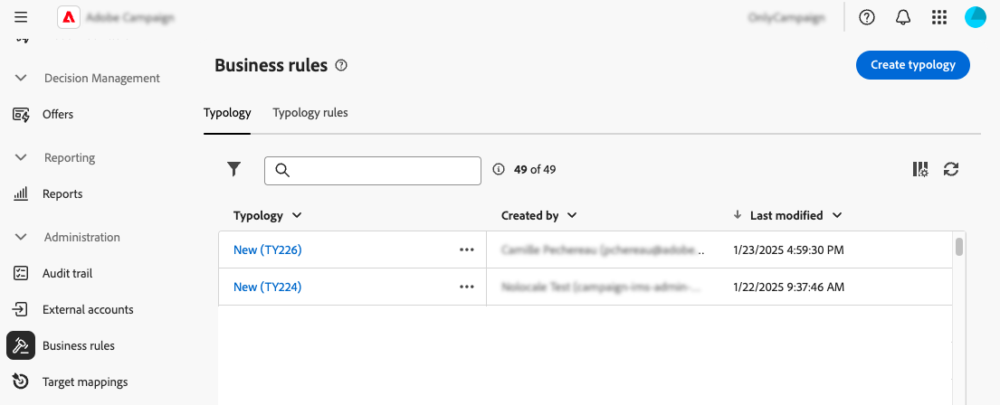
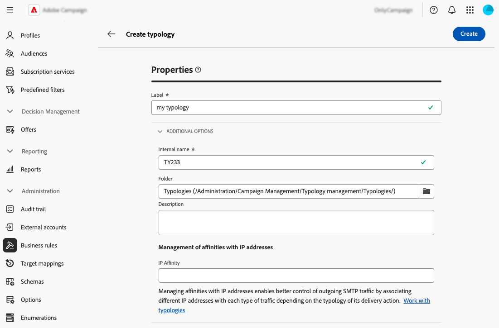

# 使用业务规则（类型） {#typologies}

>[!CONTEXTUALHELP]
>id="acw_homepage_welcome_rn4"
>title="业务规则"
>abstract="您现在可以在 Adobe Campaign Web 用户界面中创建类型和类型规则。使用类型，您可以控制和筛选投放的发送并确定其优先顺序。"
>additional-url="https://experienceleague.adobe.com/docs/campaign-web/v8/release-notes/release-notes.html?lang=zh-hans" text="请参阅发行说明"

>[!CONTEXTUALHELP]
>id="acw_business_rules"
>title="类型和类型规则"
>abstract="使用类型，您可以将所有投放中的业务实践标准化。类型是类型规则集合，可让您控制和筛选投放内容的发送并确定其优先级。在准备阶段，符合类型规则中的条件的轮廓将从投放受众中被排除。"

>[!CONTEXTUALHELP]
>id="acw_business_rules_typology_rules_type"
>title="筛选"
>abstract=" 有两种类型的类型规则可用：  **控制**&#x200B;规则，确保发送前的消息质量和有效性，例如字符显示、SMS 长度、地址格式或 URL 缩短。  **筛选**&#x200B;规则，根据特定标准（例如年龄、地区、国家、电话号码）排除某些目标受众区段。"

## 关于分类

使用类型，您可以将所有投放中的业务实践标准化。**分类**&#x200B;是&#x200B;**分类规则**&#x200B;的集合，可让您控制、筛选投放并为其设置优先级。 在准备阶段，符合类型规则中的条件的轮廓将从投放受众中被排除。

分类可确保投放始终包含某些元素，例如退订链接或主题行，或者用于从预期目标中排除分组（如未订阅者、竞争对手或不忠诚客户）的筛选规则。

可通过&#x200B;**[!UICONTROL 管理]** > **[!UICONTROL 业务规则]**&#x200B;菜单访问分类。 从该屏幕中，访问所有现有的分类和分类规则，或根据需要创建新分类和分类规则。

>[!NOTE]
>
>**[!UICONTROL 类型规则]**&#x200B;列表显示了迄今为止在Web用户界面或客户端控制台中创建的所有现有规则。 但是，在Web用户界面中只能创建&#x200B;**控件**&#x200B;和&#x200B;**筛选**&#x200B;规则。 要创建其他类型的分类规则，如压力或容量规则，请使用Campaign v8客户端控制台。 [了解如何在客户端控制台中创建类型规则](https://experienceleague.adobe.com/en/docs/campaign/automation/campaign-optimization/campaign-typologies){target="_blank"}

将分类应用于消息的主要步骤如下：

1. [创建分类](#typology)。
1. [创建类型规则](#typology-rule)。
1. [在分类](#add-rules)中引用分类规则。
1. [将分类应用于消息](#message)。

## 创建一个类型 {#typology}

>[!CONTEXTUALHELP]
>id="acw_business_rules_typology_properties"
>title="类型属性"
>abstract="定义类型的属性，并展开&#x200B;**[!UICONTROL 附加选项]**&#x200B;部分以访问高级设置。使用 **[!UICONTROL IP 关联]**&#x200B;字段将 IP 关联与类型关联起来。通过定义可以为每个关联使用哪些特定的 IP 地址，您可以更好地控制出站 SMTP 流量。"

>[!CONTEXTUALHELP]
>id="acw_business_rules_typology_ip_affinity"
>title="IP 关联"
>abstract="通过管理与 IP 地址的关联，可以根据投放操作的类型将不同的 IP 地址与每种类型的流量关联起来，从而更好地控制传出的 SMTP 流量"

要创建分类，请执行以下步骤：

1. 导航到&#x200B;**[!UICONTROL 业务规则]**&#x200B;菜单，然后选择&#x200B;**[!UICONTROL 类型]**&#x200B;选项卡。

1. 单击&#x200B;**[!UICONTROL 创建分类]**&#x200B;按钮并输入该分类的&#x200B;**[!UICONTROL 标签]**。

1. 展开&#x200B;**[!UICONTROL 其他选项]**&#x200B;部分以定义高级设置，如分类的内部名称、存储文件夹和描述。

   

   >[!NOTE]
   >
   >**[!UICONTROL IP相关性]**&#x200B;字段允许您将IP相关性与类型相关联。 这样即可通过定义每个关联可以使用哪些特定IP地址，更好地控制出站SMTP流量。 例如，您可以为每个国家/地区或子域使用一个关联。 然后，您可以为每个国家/地区创建一个分类，并将每个关联关联关联关联关联到相应的分类。

1. 单击&#x200B;**[!UICONTROL 创建]**&#x200B;以确认创建分类。

将打开分类详细信息。 在此屏幕中，直接引用现有的分类规则或创建新的分类规则以供以后引用：
* [了解如何创建分类规则](#add-rules)
* [了解如何在类型中引用规则](#add-rules)

## 创建一个类型规则 {#typology-rule}

>[!CONTEXTUALHELP]
>id="acw_business_rules_typology_rules_properties"
>title="类型规则属性"
>abstract="定义类型规则的属性。**控制**&#x200B;规则用于在发送前验证消息的质量和有效性，而&#x200B;**筛选**&#x200B;规则会根据特定标准排除某些目标受众区段。  您还可以更改规则的执行顺序，以管理在同一个消息处理阶段中执行同一类型的多条规则时执行类型规则的序列。"

提供了两种类型的分类规则：

* **控制**：确保消息质量和有效性预发送，如字符显示、SMS长度、地址格式或URL缩短。 这些规则是使用脚本界面创建的，用于定义内容检查和修改的复杂逻辑。

* **筛选**：根据特定条件（如年龄、位置、国家/地区或电话号码）排除目标受众的区段。 这些规则链接到定向维度。

>[!NOTE]
>
>目前，只能从Web用户界面创建&#x200B;**控件**&#x200B;和&#x200B;**筛选**&#x200B;分类规则。 要创建其他类型的规则，请使用客户端控制台。 [了解如何在客户端控制台中创建类型规则](https://experienceleague.adobe.com/en/docs/campaign/automation/campaign-optimization/campaign-typologies){target="_blank"}

要创建分类规则，请执行以下步骤：

1. 导航到&#x200B;**[!UICONTROL 业务规则]**&#x200B;菜单，然后选择&#x200B;**[!UICONTROL 类型规则]**&#x200B;选项卡。

1. 单击&#x200B;**[!UICONTROL 创建分类规则]**&#x200B;按钮，然后执行下面详述的步骤。

   

### 定义规则的主要属性 {#properties}

>[!CONTEXTUALHELP]
>id="acw_business_rules_typology_rules_filtering"
>title="筛选"
>abstract="**筛选**&#x200B;规则根据特定标准（例如年龄、地区、国家、电话号码）排除某些目标受众区段。选择类型规则的目标维度，然后单击&#x200B;**[!UICONTROL 添加规则]**&#x200B;按钮，以访问查询建模器并生成规则。"

>[!CONTEXTUALHELP]
>id="acw_business_rules_typology_rules_code"
>title="代码"
>abstract="**控制**&#x200B;规则在消息发送前验证消息的质量和有效性，例如字符显示、SMS 长度、地址格式、URL 缩短情况。这些规则使用 JavaScript 代码创建。"

以下是创建新分类规则时要定义的主要属性：

>[!BEGINTABS]

>[!TAB 控制规则]

1. 输入规则的&#x200B;**[!UICONTROL 标签]**。

   

1. **[!UICONTROL 其他选项]**&#x200B;部分允许您访问高级设置，如规则的内部名称、文件夹存储和描述。 您还可以指定应用规则的时间及其警报级别。 展开以下部分以获取更多信息。

   +++阶段

   指定将在投放生命周期的哪个时间点应用规则。 在&#x200B;**[!UICONTROL 阶段]**&#x200B;下拉列表中选择值：

   * **[!UICONTROL 在定位]**&#x200B;开始时：如果发生错误，则阻止执行个性化步骤。

   * **[!UICONTROL 定位后]**：如果需要了解目标的卷以应用控制规则，请选择此阶段。 例如，**[!UICONTROL 检查校对大小]**&#x200B;控件规则在每个定位阶段之后应用。 如果校样收件人过多，此规则会阻止消息个性化。

   * **[!UICONTROL 在个性化开始时]**：如果控件涉及审批消息个性化，请选择此阶段。 在分析阶段执行消息个性化。

   * **[!UICONTROL 在分析结束时]**：应用需要完整邮件个性化的检查。

   +++

   +++等级

   指定规则的警报级别：

   * **[!UICONTROL 错误]**：停止邮件准备

   * **[!UICONTROL 警告]**：在准备日志中显示警告

   * **[!UICONTROL 信息]**：在准备日志中显示信息

   * **[!UICONTROL 详细]**：在服务器日志中显示信息

   +++

1. 要生成规则的内容，请单击&#x200B;**编辑代码**&#x200B;按钮，然后使用JavaScript输入规则的逻辑。 在以下示例中，创建了一个规则，如果目标为空，则会在日志中显示警告。

   

1. 单击&#x200B;**创建**。

>[!TAB 筛选规则]

1. 输入规则的&#x200B;**[!UICONTROL 标签]**。

   

1. 展开&#x200B;**[!UICONTROL 其他选项]**&#x200B;部分以访问高级设置，如规则的内部名称、文件夹存储和描述。

1. 要构建规则的内容，请选择定向维度并单击&#x200B;**[!UICONTROL 添加规则]**&#x200B;按钮以使用[规则生成器](../query/query-modeler-overview.md)定义筛选条件。

   

1. 单击&#x200B;**创建**

>[!ENDTABS]

### 定义规则的其他属性 {#add-properties}

现在，我们来定义其他参数。 在此屏幕中，您仍然可以更改之前定义的主属性。

1. 如果您不希望规则在创建后立即处于活动状态，请关闭&#x200B;**[!UICONTROL 活动]**&#x200B;选项。

1. 定义规则的&#x200B;**[!UICONTROL 执行顺序]**。

   默认情况下，分类规则顺序设置为50。 调整此值以管理在同一消息处理阶段执行多个相同类型的规则时执行分类规则的顺序。 例如，执行顺序为20的筛选规则在执行顺序为30的筛选规则之前执行。

1. 选择要与规则关联的&#x200B;**[!UICONTROL 渠道]**。

您的规则已准备好在分类中引用，以将其应用于消息。

## 引用分类中的分类规则 {#add-rules}

要在分类中引用一个或多个规则，请执行以下步骤：

1. 导航到&#x200B;**[!UICONTROL 分类]**&#x200B;选项卡，并打开要引用规则的分类。

1. 选择&#x200B;**[!UICONTROL 类型规则]**&#x200B;选项卡，然后单击&#x200B;**[!UICONTROL 添加规则)]**&#x200B;按钮。

   

1. 选择要与分类关联的一个或多个分类规则并进行确认。

   

1. 单击&#x200B;**[!UICONTROL 保存]**。

您现在可以将分类应用于消息。 完成后，将执行所有选定的分类规则以执行定义的检查。

## 将类型应用于消息 {#message}

要将分类应用于消息或消息模板，请在消息设置中选择分类。 [了解如何配置投放设置](../advanced-settings/delivery-settings.md#typology)

应用后，将执行分类中包含的分类规则，以在消息准备期间检查投放的有效性。 从投放受众中排除分类规则中符合条件的用户档案。