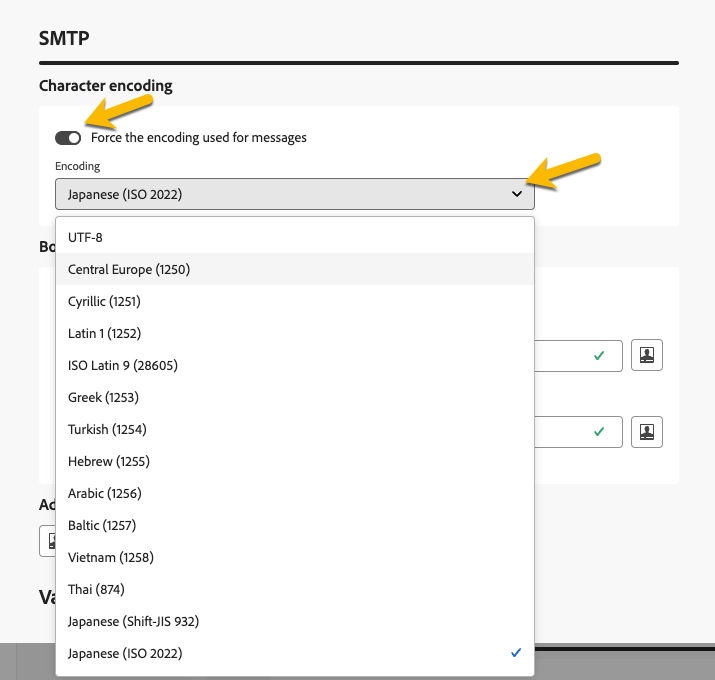

# 配置投放设置 {#del-settings}

投放设置是在投放模板中定义的&#x200B;**技术投放参数**。 每次投放都会使其过载。 这些设置可通过编辑投放或投放模板时可用的&#x200B;**设置**&#x200B;按钮使用。

>[!CAUTION]
>
>对这些设置的描述仅供参考。其中一些描述取决于您的配置和权限。不得在此版本的产品中修改它们。

## 类型设置 {#typology}

>[!CONTEXTUALHELP]
>id="acw_email_settings_typology"
>title="类型"
>abstract="利用类型规则，营销人员可以标准化所有投放中的业务实践。类型是类型规则集合，可让您控制和筛选投放的发送并确定其优先级。在准备阶段，符合类型规则的配置文件将排除在投放受众之外。在 Campaign 客户端控制台中创建类型和类型规则。"

>[!CONTEXTUALHELP]
>id="acw_delivery_template_settings_typology"
>title="投放的类型设置"
>abstract="利用类型规则，营销人员可以标准化所有投放中的业务实践。类型是类型规则集合，可让您控制和筛选投放的发送并确定其优先级。在准备阶段，符合类型规则的配置文件将排除在投放受众之外。在 Campaign 客户端控制台中创建类型和类型规则。"

类型是在准备阶段执行的&#x200B;**类型规则**&#x200B;集，以便一次轻松将多个筛选规则应用于投放。 借助这些工具，营销人员可以标准化所有投放的业务实践，因为可以通过它们来控制、筛选投放并安排其发送优先级。

将分类与消息或消息模板关联时，将执行包含在分类中的分类规则，以在消息准备期间检查投放的有效性。 然后，会从投放受众中排除与分类规则中标准匹配的用户档案。

分类允许您确保投放始终包含特定元素（如退订链接或主题行）或用于从预期目标中排除分组（如取消订阅者、竞争对手或不忠诚客户）的筛选规则。

{zoomable="yes"}

>[!NOTE]
>
>分类和分类规则是在Campaign客户端控制台中创建的。 请参阅[Campaign v8 （客户端控制台）文档](https://experienceleague.adobe.com/docs/campaign/automation/campaign-optimization/campaign-typologies.html?lang=zh-Hans){target="_blank"}以了解有关压力规则以及如何配置疲劳管理的更多信息。

### 压力参数 {#pressure-parameters}

>[!CONTEXTUALHELP]
>id="acw_email_settings_pressure_parameters"
>title="投放的压力参数"
>abstract="利用投放权重，您可以确定疲劳管理框架内的优先级最高的投放。具有最高权重的消息优先。"

>[!CONTEXTUALHELP]
>id="acw_delivery_template_settings_delivery_weight"
>title="投放权重"
>abstract="利用投放权重，您可以确定压力管理框架内的优先级最高的投放。具有最高权重的消息优先。"

在此部分中，压力参数允许您定义&#x200B;**阈值**&#x200B;来设置疲劳管理规则，该规则是在给定时间段内可以发送到一个用户档案的最大消息数。

达到此阈值后，只有在所考虑的时段结束后，才会再进行投放。通过此流程，可在消息数量超过设置的阈值时，自动从投放中排除配置文件，从而避免过度通信。

阈值可以是常量，也可以是变量。这意味着在指定的时间段内，阈值可能因配置文件而异，甚至对于同一配置文件也可能有所不同。

在&#x200B;**[!UICONTROL 权重类型]**&#x200B;字段中，有三个可用选项：

* **[!UICONTROL 常量]**
* **[!UICONTROL 取决于收件人]**
* **[!UICONTROL 在每个规则中定义]**

使用&#x200B;**[!UICONTROL 投放权重]**&#x200B;字段可定义投放优先级。每个投放都有一个代表其优先级的权重。默认情况下，投放权重设置为 5。压力规则可让您定义它们应用于的投放权重。可以通过公式设置或计算权重以满足收件人的需求。例如，您可以根据收件人兴趣来定义投放权重。

使用&#x200B;**[!UICONTROL 投放模式]**&#x200B;字段选择目标评估模式。

提供了三种模式：

* **[!UICONTROL 目标估计和消息个性化]**
* **[!UICONTROL 暂定目标的估算和审批]**
* **[!UICONTROL 目标评估]**

>[!NOTE]
>
>可在Campaign客户端控制台中配置疲劳管理和压力规则。 请参阅[Campaign v8 （客户端控制台）文档](https://experienceleague.adobe.com/docs/campaign/automation/campaign-optimization/pressure-rules.html?lang=zh-Hans){target="_blank"}以了解详情。

### 容量设置 {#capacity-settings}

>[!CONTEXTUALHELP]
>id="acw_email_settings_capacity_settings"
>title="投放的容量设置"
>abstract="在传递消息之前，请使用容量规则来确保您的组织可以处理投放、投放可能生成的集客消息，以及为联系订阅者所要进行的呼叫次数等。在 Adobe Campaign v8 控制台中定义容量规则。在此屏幕中，选择与渠道关联的规则。"

>[!CONTEXTUALHELP]
>id="acw_delivery_template_settings_recipient_importance"
>title="收件人的重要性"
>abstract="收件人的重要性是一个公式，用于确定在超出容量类型规则时保留的配置文件。"

在此部分中，您可以选择在Adobe Campaign v8控制台中定义的容量规则。 此规则已关联到该渠道。

收件人&#x200B;]**字段的**[!UICONTROL &#x200B;重要性是一个公式，用于确定在超出容量类型规则时保留哪些用户档案。

>[!NOTE]
>
>类型规则是在Campaign客户端控制台中配置的。 请参阅[Campaign v8 （客户端控制台）文档](https://experienceleague.adobe.com/docs/campaign/automation/campaign-optimization/consistency-rules.html){target="_blank"}以了解详情。

## 受众设置 {#audience}

>[!CONTEXTUALHELP]
>id="acw_email_settings_audience"
>title="投放的受众设置"
>abstract="在可用的映射中选择一个&#x200B;**目标映射**。在 Adobe Campaign v8 控制台中定义目标映射。您还设置投放的排除参数。"

在此部分中，您可以在这些可用的&#x200B;**目标映射**&#x200B;中选择一个。在 Adobe Campaign v8 控制台中定义目标映射。目标映射是操作正在处理的数据类型。 它允许您定义目标群体：收件人、合同受益人、操作员、订阅者等。 [了解有关目标映射的更多信息](../audience/targeting-dimensions.md)。

在&#x200B;**[!UICONTROL 排除项]**&#x200B;字段中，您可以选择排除不再希望联系或隔离的用户档案。 [了解详情](https://experienceleague.adobe.com/docs/campaign/campaign-v8/send/failures/quarantines.html){target="_blank"}

## 投放 {#delivery}

>[!CONTEXTUALHELP]
>id="acw_email_settings_delivery"
>title="投放的投放设置"
>abstract="投放参数是应用于投放的技术设置。您可以更改投放和常规模式、激活电子邮件密件抄送、使用波次发送，还可以选择发送电子邮件的格式。这些选项仅供专家用户使用。"

**[!UICONTROL 投放]**&#x200B;参数是适用于您的投放的技术设置。

{zoomable="yes"}

默认情况下提供集成的&#x200B;**[!UICONTROL 路由]**&#x200B;外部帐户。 它包含允许应用程序发送投放的技术参数。

您可以定义下面的&#x200B;**[!UICONTROL 发送]**&#x200B;设置。

* **[!UICONTROL 投放优先级]**：使用此选项可通过设置投放的优先级（正常、高或低）来更改投放的发送顺序。

* **[!UICONTROL 消息批处理数量]**：使用此选项定义在同一XML传递包中分组的消息数。 如果参数设置为0，则消息将自动分组。 包大小由计算`<delivery size>/1024`定义，每个包最小为8条，最大为256条消息。

  >[!IMPORTANT]
  >
  >通过复制现有投放创建投放时，此参数会重置。

* **[!UICONTROL 测试SMTP投放]** （电子邮件通道）：此选项用于测试通过SMTP的发送。 电子邮件会一直处理到连接到SMTP服务器，但不会发送：对于电子邮件的每个收件人，Campaign会连接到SMTP提供商服务器，执行SMTP RCPT TO命令，并在SMTP DATA命令之前关闭连接。

* **[!UICONTROL 电子邮件密件抄送]**（电子邮件渠道）：此选项用于通过密件抄送在外部系统上存储电子邮件，只需将密件抄送电子邮件地址添加到邮件目标即可。 请参阅[Campaign v8 （客户端控制台）文档](https://experienceleague.adobe.com/docs/campaign/campaign-v8/send/emails/email-bcc.html){target="_blank"}以了解详情。

在&#x200B;**[!UICONTROL 波次定义]**&#x200B;部分中，选择&#x200B;**[!UICONTROL 使用多个波次发送]**&#x200B;选项，以逐步增加使用波次发送的数量。 这将避免您的邮件被标记为垃圾邮件或您想要限制每天的邮件数。 利用批次，您可以将投放分为多个批次，而不是同时发送大量消息。 [了解详情](send-using-waves.md)

对于电子邮件，您还可以更改已发送邮件的&#x200B;**[!UICONTROL 邮件格式]**，如下所述。

* **[!UICONTROL 使用收件人首选项]**（默认模式）：根据收件人配置文件中存储的数据定义电子邮件格式。 如果收件人希望以特定格式接收电子邮件，则此格式为已发送的格式。 如果未填写该字段，则会发送包含多个替代部分的电子邮件（见下文）。

* **[!UICONTROL 让收件人邮件客户端选择最合适的格式]**：电子邮件包含两种格式：文本和HTML。 接收时显示的格式取决于收件人邮件软件的配置(multipart-alternative)。

  >[!IMPORTANT]
  >
  >此选项包括文档的两个版本。 因此，它会影响投放率，因为电子邮件较大。

* **[!UICONTROL 以文本格式发送所有邮件]**：电子邮件以文本格式发送。 不会发送HTML格式，但仅当收件人单击电子邮件时，才会将其用于镜像页面。

## Web 分析 {#web-analytics}

>[!CONTEXTUALHELP]
>id="acw_email_settings_webanalytics"
>title="投放的网站分析设置"
>abstract="选择一个网站分析帐户。在 Campaign 客户端控制台中配置此帐户。您还可以定义与您正在使用的分析工具共享的标记。"

在此部分中，您可以选择网站分析帐户。 此帐户是在Campaign客户端控制台中配置的。

您还可以定义与您正在使用的分析工具共享的标记。

>[!NOTE]
>
>可以在Campaign客户端控制台中配置网站分析功能。 请参阅[Campaign v8 （客户端控制台）文档](https://experienceleague.adobe.com/docs/campaign/campaign-v8/connect/ac-aa.html#external-account-ac){target="_blank"}以了解详情。

## 重试 {#retries}

>[!CONTEXTUALHELP]
>id="acw_delivery_template_settings_retries"
>title="最大重试次数"
>abstract="如果消息因临时错误而失败，则会执行重试，直到投放持续时间结束。"

<!--Currently not visible in UI > ??-->

由于软错误或忽略错误而临时取消发送的邮件将会自动重试。 默认情况下，安排在投放的第一天进行五次重试，最小间隔为一小时分布在一天中的24小时内。

## 审批（电子邮件渠道） {#approval}

>[!CONTEXTUALHELP]
>id="acw_email_settings_approval"
>title="投放的审批模式"
>abstract="选择审批模式。如果在准备投放期间产生了警告，则可配置投放以定义是否仍应执行它。"

>[!CONTEXTUALHELP]
>id="acw_delivery_template_settings_approval"
>title="投放的审批模式"
>abstract="根据此模板选择投放的审批模式。如果在准备投放期间产生了警告，则可配置投放以定义是否仍应执行它。"

如果在电子邮件投放准备期间生成警告，您可以配置投放以定义是否应仍执行该投放。 默认情况下，用户必须在分析阶段结束时确认发送电子邮件：这是&#x200B;**手动**&#x200B;验证。

您可以在相应的字段中选择其他审批方式。可用的模式为：

* **[!UICONTROL 手动]**：在分析阶段结束时，用户必须确认投放以开始发送。
* **[!UICONTROL 半自动]**：如果分析阶段未生成警告消息，则自动开始发送。
* **[!UICONTROL 自动]**：发送在分析阶段结束时自动开始，不管分析结果如何。

## 有效性 {#validity}

>[!CONTEXTUALHELP]
>id="acw_email_settings_validity"
>title="设置有效期"
>abstract="**投放持续时间**&#x200B;字段可让您输入全球投放重试次数的限制。这意味着，Adobe Campaign 从开始日期开始发送消息，然后对于仅返回错误的消息，将执行定期、可配置的重试，直至达到有效期限。 **资源有效期限**&#x200B;字段用于已上传的资源，如镜像页面或图像。一旦达到期限，资源将不再可用。"

>[!CONTEXTUALHELP]
>id="acw_delivery_template_settings_resources_validity"
>title="资源有效期限"
>abstract="**资源有效期限**&#x200B;字段用于已上传的资源，如镜像页面或图像。这些资源在有限的时间内有效：一旦达到限制，资源将不再可用。"

>[!CONTEXTUALHELP]
>id="acw_delivery_template_settings_delivery_duration"
>title="投放持续时间"
>abstract="**投放持续时间**&#x200B;字段可让您输入全球投放重试次数的限制。这意味着，Adobe Campaign 从开始日期开始发送消息，然后对于仅返回错误的消息，将执行定期、可配置的重试，直至达到有效期限。"

<!--
>[!CONTEXTUALHELP]
>id="acw_email_settings_resources_validity"
>title="Resources validity limit"
>abstract="The Validity limit field is used for uploaded resources, such as the mirror page or images. These resources are valid for a limited time: once the limit is reached, resources are no longer available."
-->

### 有效期 {#validity-period}

**[!UICONTROL 投放持续时间]**&#x200B;字段可让您输入全球投放重试次数的限制。这意味着，Adobe Campaign 从开始日期开始发送消息，然后对于仅返回错误的消息，将执行定期、可配置的重试，直至达到有效期限。

您也可以选择指定日期。为此，请选择&#x200B;**[!UICONTROL 明确设置有效期]**。在此情况下，也可以使用投放和有效期限日期指定时间。默认情况下使用当前时间，但您可以直接在输入字段中修改此项。

**[!UICONTROL 资源有效期限]**&#x200B;用于已上传的资源，主要用于镜像页面和图像。 本页上的资源仅在限制时间内有效（以节省磁盘空间）。在此限制之后，这些资源将不再可用。

{zoomable="yes"}

<!--Change screenshot to be consistent with prod > not sure which version is correct-->

请参阅[Campaign v8 （客户端控制台）文档](https://experienceleague.adobe.com/docs/campaign/campaign-v8/campaigns/send/failures/delivery-failures.html#validity-period){target="_blank"}以了解有关投放有效期的更多信息。

### 镜像页面管理（电子邮件渠道） {#mirror}

镜像页面是可通过 Web 浏览器在线访问的 HTML 页面。其内容与电子邮件的内容相同。默认情况下，如果将链接插入到电子邮件的内容中，则会生成镜像页面。

除默认模式外，还提供了以下选项：

* **[!UICONTROL 强制生成镜像页面]**：使用此模式生成镜像页面，即使电子邮件中未插入指向镜像页面的链接。
* **[!UICONTROL 不生成镜像页面]**：使用此模式可避免生成镜像页面，即使电子邮件中存在链接也是如此。
* **[!UICONTROL 生成仅可使用消息标识符访问的镜像页面]**：如果电子邮件内容中不存在镜像页面链接，请使用此选项启用从客户端控制台在投放日志窗口中访问镜像页面内容的功能。

### 跟踪 {#tracking}

<!--
>[!CONTEXTUALHELP]
>id="acw_email_settings_tracking_validity"
>title="Validity period"
>abstract="This option defines the duration for which the tracking is activated on the URLs."
-->

>[!CONTEXTUALHELP]
>id="acw_delivery_template_settings_tracking_validity"
>title="有效期"
>abstract="有效期可设定在消息 URL 上激活跟踪的持续时间。"

**[!UICONTROL 跟踪]**&#x200B;参数已在相关部分中定义。 可能的选项为：

* **[!UICONTROL 跟踪有效期限制]**：使用此选项可更改在URL上激活跟踪的持续时间。
* **[!UICONTROL 过期URL的替换URL]**：使用此选项可输入后备网页的URL：跟踪过期后将显示该URL。

## 校样设置 {#test-setttings}

>[!CONTEXTUALHELP]
>id="acw_email_settings_testsettings"
>title="定义投放的校样设置"
>abstract="选择排除参数并自定义校样的标签。"

<!--Test to be replaced with Proof everywhere - currently not consistent within UI > changed to Proof to reflect UI here but not consistent in documentation either-->

您可以在此部分中设置排除参数。可用的选项为：

* **[!UICONTROL 保持双面]**&#x200B;允许您授权向满足多个定位条件的用户档案进行多次投放。
* **[!UICONTROL 保留已列入阻止列表的地址]**&#x200B;可让您从目标中保留不再是投放目标的任何配置文件，例如在退订（选择退出）之后。
* **[!UICONTROL 保留隔离地址]**&#x200B;可让您从目标中保留任何具有不响应地址的配置文件。

您还可以自定义校样的标签：

* 使用&#x200B;**[!UICONTROL 保留证明的传递代码]**，将为其相关的传递定义的传递代码与证明关联起来。
* 默认情况下，验证的主题的前缀为“PROOF #”，其中#是验证的编号。 您可以在&#x200B;**[!UICONTROL 标签前缀]**&#x200B;字段中更改此前缀。

## 电子邮件投放的SMTP设置 {#smtp}

>[!CONTEXTUALHELP]
>id="acw_email_settings_smtp"
>title="SMTP参数"
>abstract="您可以向电子邮件投放添加其他SMTP参数。"

您可以向电子邮件投放添加其他SMTP参数。 您可以在投放设置的SMTP选项卡中执行此操作。

{zoomable="yes"}

### 字符编码 {#character-encoding}

**[!UICONTROL 字符编码]**&#x200B;部分允许您设置特定编码。 默认编码为UTF-8，它适用于大多数字符。 但是，如果某些电子邮件提供商不支持UTF-8标准编码，则他们可能无法正确显示特殊字符。

例如，如果要发送包含日语字符的电子邮件，最好使用专门支持这些字符的编码，以便日语受众能够正确查看所有内容。

为此，请激活&#x200B;**[!UICONTROL 强制用于邮件的编码]**&#x200B;切换开关，并从支持特殊字符的列表中选择正确的编码。

{zoomable="yes"}

### 退回电子邮件 {#bounce-emails}

通过投放设置的&#x200B;**[!UICONTROL SMTP]**&#x200B;选项卡，还可以配置退回邮件的管理。

* **[!UICONTROL 错误到地址]**：如果激活&#x200B;**[!UICONTROL 使用为平台]**&#x200B;定义的默认错误地址切换，则会在平台的默认错误框中接收退回的电子邮件。 如果不激活它，则可以为投放定义特定的错误地址。

* **[!UICONTROL 退回地址]**：您还可以定义将未处理的退回电子邮件转发到的其他地址。 利用此地址，可调查应用程序无法自动限定电子邮件时退回的原因。

这两个字段可以按照[此部分](../personalization/gs-personalization.md)中的说明进行个性化。

{zoomable="yes"}

### 其他 SMTP 标题 {#smtp-headers}

您可以在投放设置的SMTP选项卡中向电子邮件投放添加&#x200B;**[!UICONTROL SMTP标头]**。

在此窗口中输入的脚本必须按照以下格式每行引用一个标头： name：value。

如有必要，将自动对值进行编码。

{zoomable="yes"}

>[!IMPORTANT]
>
>高级用户可随时添加脚本以插入其他 SMTP 标头。此脚本的语法必须符合此内容类型的要求：没有未使用的空格，没有空行等。

## 添加变量 {#variables-delivery}

>[!CONTEXTUALHELP]
>id="acw_delivery_settings_variable"
>title="变量"
>abstract="变量"

您可以将变量添加到投放中，这有助于跟踪。 为此，请导航到&#x200B;**[!UICONTROL 变量]**&#x200B;选项卡，如下所示。

{zoomable="yes"}

单击&#x200B;**[!UICONTROL 添加变量]**&#x200B;按钮输入变量的详细信息，然后单击&#x200B;**[!UICONTROL 确认]**&#x200B;保存更改。

{zoomable="yes"}
