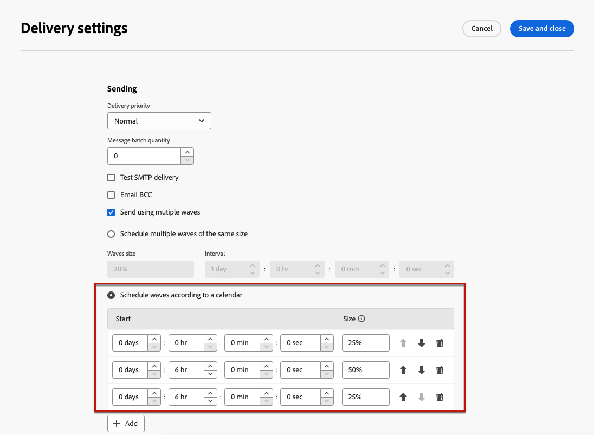

# 按波次发送 {#send-using-waves}

>[!CONTEXTUALHELP]
>id="acw_deliveries_waves_definition"
>title="将投放分为多个批次"
>abstract="定义波次，将投放分为多个批次，而非同时发送大量消息。您可以配置多个相同大小的波次，或者为要发送的不同波次设置日程表。"

>[!CONTEXTUALHELP]
>id="acw_deliveries_waves_size"
>title="定义每个波次的大小"
>abstract="您必须输入要添加的所有波次的大小。输入数值（每个波次的消息数）或百分比 (0-100%)。"

要平衡负载，可以将电子邮件投放分为多个批次。 配置批次的数量及其相对于整个投放的比例以及两个批次之间的间隔。

>[!NOTE]
>
>您只能定义两个连续波形之间的大小和延迟。 无法调整每个批次的收件人选择标准。

要使用批次发送投放，请执行以下步骤。

1. 打开 [投放设置](delivery-settings.md#retries).

1. 浏览至 **[!UICONTROL 投放]** 部分。

1. 选择 **[!UICONTROL 使用多个批次发送]** 选项。

1. 要配置批次，您可以：

   * [安排多个相同大小的批次](#waves-same-size)
   * [根据日历安排批次](#waves-calendar)

1. 照常准备并发送投放。 [了解详情](../msg/gs-deliveries.md)

   >[!CAUTION]
   >
   >确保最后一波不超过()中定义的投放截止日期。 [有效期](delivery-settings.md#validity) 选项卡，否则可能无法发送某些消息。 特定的类型控制规则， **[!UICONTROL 波动计划检查]**，确保最后一个波次的计划时间早于投放有效期限。 在中了解有关控制规则的更多信息 [Campaign v8（客户端控制台）文档](https://experienceleague.adobe.com/docs/campaign/automation/campaign-optimization/control-rules.html?lang=zh-Hans).
   >
   >在配置最后批次时，还必须留出足够的时间进行重试。 [了解详情](delivery-settings.md#retries)

1. 要监控您的发送，请转到 [投放日志](../monitor/delivery-logs.md). 您可以看到已在已处理批次中发送的投放(**[!UICONTROL 已发送]** 状态)和要在剩余批次中发送的投放(**[!UICONTROL 待处理]** 状态)。

## 安排多个相同大小的批次 {#waves-same-size}

如果选择此选项，则所有波浪都具有相同的大小（最后一个波浪除外），并且每个波浪之间的延迟始终相同。

{zoomable=&quot;yes&quot;}

* 指定要将投放拆分为的所有批次的大小。 您可以输入百分比或数值。 只有最后一波报文的大小可以不同，因为它必须包含剩余的消息数量。

  例如，如果您输入 **[!UICONTROL 30%]** 在 **[!UICONTROL 批次大小]** 字段中，前三个批次代表投放中包含的所有消息的30%，第四个批次代表剩余的10%。

* 在 **[!UICONTROL 间隔]** 部分，指定两个连续批次开始之间的延迟。 例如，如果您输入 **[!UICONTROL 2天]**，第一波立即开始，第二波在两天内开始，第三波在四天内开始，以此类推。

使用多个相同大小的批次的一个常见用例是涉及呼叫中心。 在管理电话忠诚度促销活动时，贵组织处理致电订阅者的能力有限。

使用批次，您可以将每天的消息数量限制为20，这是呼叫中心的每日处理能力。

要执行此操作，请选择 **[!UICONTROL 计划多个相同大小的批次]** 选项。 输入 **[!UICONTROL 20]** 随着波浪的大小和 **[!UICONTROL 1天]** 在 **[!UICONTROL 间隔]** 字段。

{zoomable=&quot;yes&quot;}

## 根据日历安排批次 {#waves-calendar}

如果选择此选项，则需要定义要发送的每个波次的开始日期/时间以及每个波次的大小。

* 在 **[!UICONTROL 开始]** 字段，指定两个连续批次开始之间的延迟。

* 在 **[!UICONTROL 大小]** 列中，输入固定数字或百分比。

添加任意所需数量的批次。 您可以根据需要重新排序。

>[!NOTE]
>
>如果使用百分比，则所有批次的总计不应超过100%。

在下面的示例中，第一波表示投放中包含的消息总数的25%，并立即开始。 接下来的两个批次将完成投放，并设置为以六小时间隔开始。

{zoomable=&quot;yes&quot;}

根据日历使用多个批次的一个常见用例是在启动过程中。

使用新平台发送电子邮件时，Internet服务提供商(ISP)会怀疑无法识别的IP地址。 如果突然发送大量电子邮件，ISP通常会将其标记为垃圾邮件。

要避免被标记为垃圾邮件，您可以逐步增加使用批次发送的数量。 这应该可以确保启动阶段的顺利发展，并帮助您降低地址无效的总比率。

要执行此操作，请使用 **[!UICONTROL 根据日程表计划批次]** 选项。 例如，将第一个波次设置为10%，将第二个波次设置为15%，将第三个波次设置为20%，以此类推。

{zoomable=&quot;yes&quot;}
