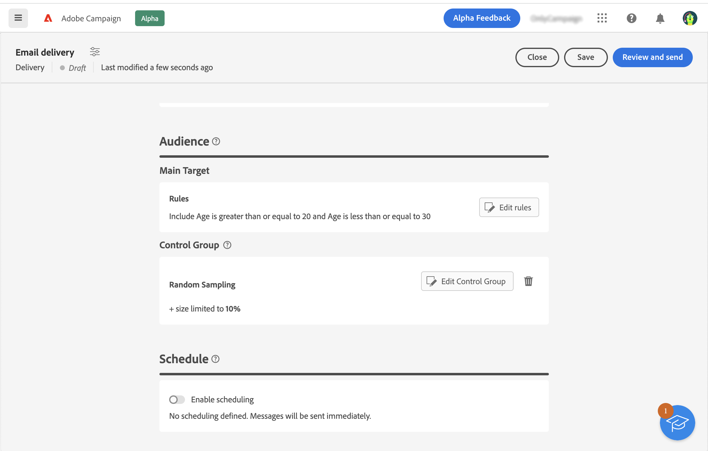

# 开始使用受众 {#about-audiences}

<!--
Audience only created for the delivery, not available later-->

<!--
Three ways:
* existing audience

Campaign or AEP Audiences

* create new on the fly

query like AEP segment builder (same component with campaign data)

* import from file

show use case with a new audience creation (or import from file?)

control groups like acc: exract, random, based on attribute
-->

受众是投放的主要目标：接收消息的收件人。 受众类型取决于投放模板中定义的目标映射。了解什么是投放模板 [在此部分中](../msg/delivery-template.md).

要定义受众群体，您可以：

* 选择在客户端控制台中作为列表创建的现有受众。 [了解详情](add-audience.md)
* 选择Adobe Experience Platform受众。 [了解详情](aep-audience.md)
* 通过定义和组合筛选条件，使用规则生成器构建新受众。 [了解详情](segment-builder.md)
* 使用外部文件中的受众：此选项仅适用于独立电子邮件投放，不能用于营销活动投放。 [了解详情](file-audience.md)

在营销活动工作流的上下文中发送消息时，会在特定中定义受众 **读取受众** 工作流活动。 在此上下文中，您无法从电子邮件投放的文件加载受众，并且该受众仅在此专用活动中定义。 了解如何在活动工作流中定义投放的受众 [在此部分中](../workflows/orchestrate-activities.md).

此外，您可以定义对照组来避免向部分受众发送消息，并衡量营销活动的影响。[了解详情](control-group.md)

