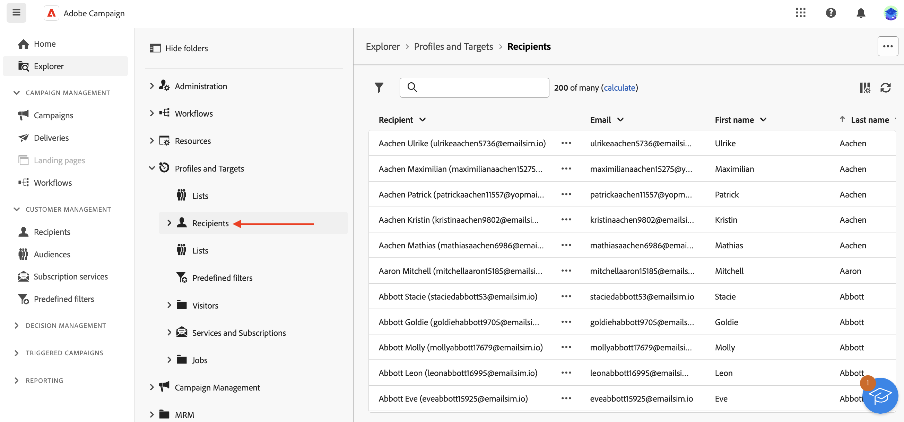

# 与收件人和受众合作 {#about-recipients}

## 什么是收件人？ {#recipients}

>[!CONTEXTUALHELP]
>id="acw_recipients_list"
>title="收件人"
>abstract="收件人是一个配置文件，旨在接收 Adobe Campaign 发送的消息。在 Adobe Campaign 中，收件人是发送投放（电子邮件、手机短信）所针对的默认配置文件。从此列表中可根据您的权限查看收件人的配置文件。使用过滤选项浏览此列表。可编辑和更新收件人的一小部分属性。"

收件人是一个配置文件，旨在接收 Adobe Campaign 发送的消息。在 Adobe　Campaign 中，收件人是发送投放内容（电子邮件、SMS 等）所定位的默认用户档案。通过数据库中存储的收件人数据，您可以创建将接收任何给定投放的受众，并在投放内容中添加个性化数据。 其他类型的用户档案存储在数据库中。 它们专为不同的用途而设计：例如，种子用户档案用于在将投放内容发送给最终受众之前对其进行测试。

只能从Campaign客户端控制台添加收件人。 但是，它们在Campaign Web中可见，位于 **收件人** 左侧导航栏的条目。 您还可以从该屏幕编辑收件人的属性。

要编辑收件人的数据，请单击其名称旁边的三个圆点，然后选择 **编辑……**.

您可以更新一组有限的属性，这些属性包括：其名字、姓氏、电子邮件和电话号码。

>[!NOTE]
>
>此有限的用户档案编辑表单仅供测试版计划测试使用。 将在未来版本中对其进行改进。 它允许用户将电子邮件地址和电话号码快速添加到任何用户档案，以便他/她可以测试电子邮件和短信渠道并接收发送的消息。

您可以使用搜索字段，从 **显示筛选器** 按钮。

您还可以从访问收件人 **资源管理器** 查看、浏览和创建文件夹和子文件夹，并检查关联的权限。

>[!NOTE]
>
>根据您的权限，您可能无法访问存储在数据库中的完整收件人列表。 要了解有关权限的更多信息，请参阅 [本节](../get-started/permissions.md).

此外，您还可以管理收件人对服务（如新闻稿）的订阅和退订。 [了解如何使用订阅服务](manage-services.md)

您可以构建工作流以删除重复、扩充、组合用户档案和构建受众。 在[此章节](../workflows/gs-workflows.md)中了解更多信息。

## 什么是受众？ {#audiences}

受众是投放的主要目标：接收邮件的收件人。受众类型取决于投放模板中定义的目标映射。[了解什么是投放模板](../msg/delivery-template.md).

要定义受众群体，您可以：

* [创建新受众](create-audience.md) 从 **[!UICONTROL 受众]** 菜单，
* [选择现有受众](add-audience.md) 在客户端控制台中作为列表创建，
* [选择Adobe Experience Platform受众](aep-audience.md)，
* [构建新受众](segment-builder.md) 通过定义和组合筛选条件来使用规则生成器，
* [使用外部文件中的受众](file-audience.md).此选项仅适用于独立电子邮件投放，不能用于营销活动投放。

定位受众时，您还可以定义 **对照组** 可避免向部分受众发送消息，并衡量活动的影响。 [了解如何设置对照组](control-group.md)

>[!NOTE]
>
>在营销活动工作流的上下文中发送消息时，会在特定中定义受众 **构建受众** 工作流活动。 在此上下文中，您无法从文件加载受众以进行电子邮件投放，并且受众仅在此专用活动中定义。了解如何在活动工作流中定义投放的受众 [在此部分中](../workflows/activities/build-audience.md)

## 定位维度 {#targeting-dimensions}

目标维度，也就是。 目标映射，是操作所处理的数据类型。 它允许您定义目标群体：收件人、合同受益人、操作员、订阅者等。

工作流的定向维度由第一个维度定义 **[!UICONTROL 构建受众]** 并用于所有后续活动，直到工作流结束。 例如，如果对数据库中的收件人执行查询，则叫客过渡将包含“收件人”类型的数据，并且将传输给下一个活动。

请注意，您可以使用在工作流中切换定向维度 **[!UICONTROL 更改维度]** 活动。 [了解详情](../workflows/activities/change-dimension.md)。例如，这可让您查询特定表（如购买或订阅）上的数据库，然后将定向维度更改为收件人，以将投放发送到相应的收件人。

默认情况下，电子邮件和短信投放模板将定位到 **[!UICONTROL 收件人]**. 因此，其目标维度使用 **nms：recipient** 表格。 对于推送通知，默认目标维度为 **订阅者应用程序nms：appSubscriptionRcp**，链接到收件人表。

您还可以在下面列出的工作流和投放中使用其他内置目标映射：

| 名称 | 使用至 | 架构 |
|---|---|---|
| 收件人 | 投放到收件人（内置收件人表） | nms：recipient |
| 访客 | 向通过反向链接（病毒式营销）收集用户档案的访客投放，例如。 | mns：visitor |
| 订阅 | 发送给订阅了新闻稿等信息服务的收件人 | nms：subscription |
| 访客订阅 | 向订阅了信息服务的访客投放 | nms：visitorSub |
| 运算符 | 交付给Adobe Campaign操作员 | nms：operator |
| 外部文件 | 通过包含投放所需所有信息的文件投放 | 无链接架构，未输入目标 |
| 订阅者申请 | 投放到订阅了应用程序的收件人 | nms：appSubscriptionRcp |

此外，您可以根据需要创建新的目标映射。 此操作从客户端控制台执行。 了解详情，请参阅 [Campaign v8（客户端控制台）文档](https://experienceleague.adobe.com/docs/campaign/campaign-v8/audience/add-profiles/target-mappings.html#new-mapping){target="_blank"}.
