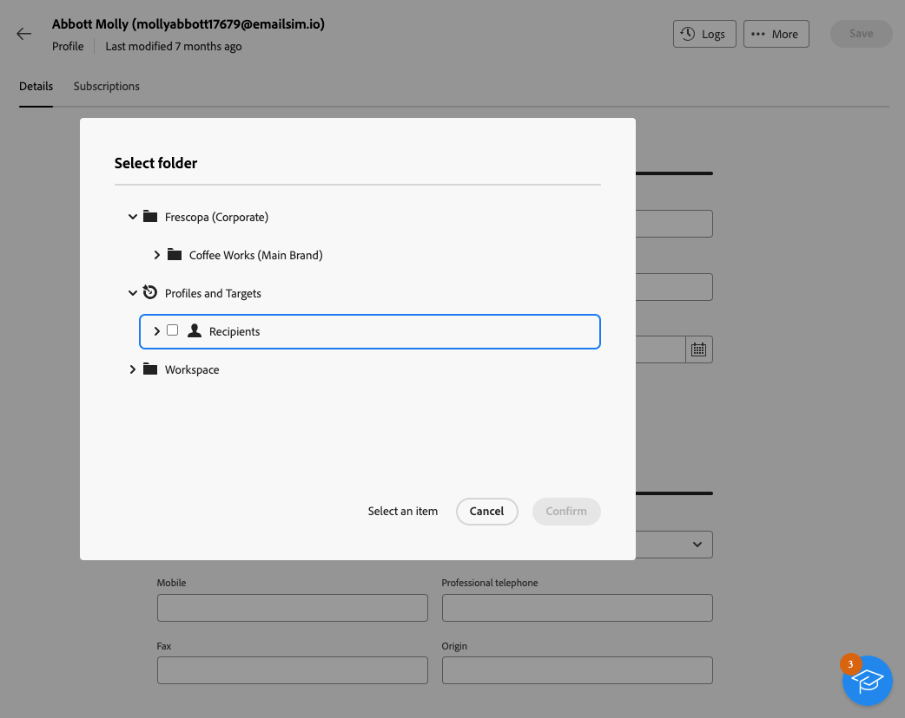

# 监控和编辑配置文件 {#profiles}

>[!CONTEXTUALHELP]
>id="acw_homepage_rn4"
>title="全面查看配置文件"
>abstract="创建新的配置文件，并通过强大的报告和工具对其进行监测。访问配置文件的属性、交互和日志。使用过滤选项浏览配置文件列表、编辑和更新其配置文件。"
>additional-url="https://experienceleague.adobe.com/docs/campaign-web/v8/whats-new.html" text="请参阅发行说明"

>[!CONTEXTUALHELP]
>id="acw_recipients_list"
>title="用户档案"
>abstract="配置文件是单个对象，旨在接收 Adobe Campaign 发送的消息。从此列表中可根据您的权限查看配置文件详情。使用过滤选项浏览此列表。可编辑和更新配置文件的一小部分属性。"

## 开始使用用户档案 {#gs}

Adobe Campaign Web中的用户档案是存储在数据库中的个人，它充当以下对象的关键组件： [创建受众](create-audience.md) 用于投放和 [添加个性化](../personalization/personalize.md) 数据到您的内容。

其他类型的用户档案存储在数据库中，例如 **[!UICONTROL 测试用户档案]**，专门用于在投放内容发送给最终受众之前对其进行测试。 [了解详情](test-profiles.md)

只能从Adobe Campaign客户端控制台创建配置文件 —  [了解如何](https://experienceleague.adobe.com/docs/campaign/campaign-v8/audience/add-profiles/create-profiles.html){target="_blank"}. 但是，它们可以在Adobe Campaign Web中的以下位置访问和编辑： **[!UICONTROL 客户管理]** > **配置文件** 条目进行导航。

>[!NOTE]
>
>根据您的权限，您可能无法访问存储在数据库中的用户档案的完整列表。 [了解有关权限的更多信息](../get-started/permissions.md).

* 您可以筛选 **[!UICONTROL 配置文件]** 使用 **显示筛选器** 按钮。 您可以将结果限制为特定 [文件夹](../get-started/permissions.md#folders) 使用下拉列表，或者使用添加规则 [查询建模器](../query/query-modeler-overview.md).

  

* 要删除配置文件，请从 **[!UICONTROL 更多操作]** 菜单。

* 要编辑配置文件，请在列表中单击所需的项目。 [了解详情](#access)

您还可以通过以下方式访问用户档案 **[!UICONTROL 资源管理器]** 视图，从 **[!UICONTROL 配置文件和目标]** > **[!UICONTROL 收件人]** 节点。

从该位置，您可以浏览、创建和管理文件夹或子文件夹，以及检查关联的权限。 [了解如何创建文件夹](../get-started/permissions.md#folders)

从 **[!UICONTROL 资源管理器]** 视图您还可以筛选、删除和 [编辑](#access) 配置文件。

## 访问和编辑配置文件的属性 {#access}

>[!CONTEXTUALHELP]
>id="acw_recipients_creation_details"
>title="基本详细信息"
>abstract="本节提供对配置文件基本细节的深入了解。要修改任何信息，请直接在相应字段中进行更改，然后单击屏幕右上角的&#x200B;**保存**&#x200B;按钮。"

>[!CONTEXTUALHELP]
>id="acw_recipients_creation_contactinformation"
>title="联系人信息"
>abstract="本部分提供对配置文件联系信息的深入了解。要修改任何信息，请直接在相应字段中进行更改，然后单击屏幕右上角的&#x200B;**保存**&#x200B;按钮。"

>[!CONTEXTUALHELP]
>id="acw_recipients_creation_address"
>title="地址"
>abstract="本部分提供有关配置文件的邮政地址和地址质量的见解。要修改任何信息，请直接在相应字段中进行更改，然后单击屏幕右上角的&#x200B;**保存**&#x200B;按钮。"

>[!CONTEXTUALHELP]
>id="acw_recipients_creation_account"
>title="帐户详细信息"
>abstract="本节提供对配置文件帐户细节的深入了解。要修改任何信息，请直接在相应字段中进行更改，然后单击屏幕右上角的&#x200B;**保存**&#x200B;按钮。"

>[!CONTEXTUALHELP]
>id="acw_recipients_creation_nolongercontact"
>title="收件人不再联系"
>abstract="本节提供对配置文件的联系偏好设置的深入了解。要修改任何信息，请直接在相应字段中进行更改，然后单击屏幕右上角的&#x200B;**保存**&#x200B;按钮。"

>[!CONTEXTUALHELP]
>id="acw_recipients_creation_customfields"
>title="自定义字段"
>abstract="自定义字段是根据您的需求定制并为您的实例配置的特定属性。要修改任何信息，请直接在相应字段中进行更改，然后单击屏幕右上角的&#x200B;**保存**&#x200B;按钮。"

>[!CONTEXTUALHELP]
>id="acw_recipients_creation_othersfields"
>title="其他 "
>abstract="本节提供额外的内置属性。要修改任何信息，请直接在相应字段中进行更改，然后单击屏幕右上角的&#x200B;**保存**&#x200B;按钮。"

>[!CONTEXTUALHELP]
>id="acw_recipients_subscription_list"
>title="收件人订阅列表"
>abstract="此选项卡列出了配置文件订阅的所有服务。"

要访问并编辑配置文件的详细信息，请执行以下步骤。

1. 浏览至 **[!UICONTROL 客户管理]** > **[!UICONTROL 配置文件]** 然后单击页面上的所需项目 **[!UICONTROL 配置文件]** 列表。

   

1. 此时将显示有关用户档案的详细信息。

   此 **[!UICONTROL 详细信息]** 选项卡允许您浏览配置文件的内置属性和自定义属性。 要编辑属性，请在所需字段中进行更改，然后单击 **[!UICONTROL 保存]** 按钮。

   

   1. 默认情况下，配置文件存储在 **[!UICONTROL 收件人]** 文件夹。 您可以通过浏览到所需的位置来更改它。 [了解如何使用文件夹](../get-started/permissions.md#folders)

      

   1. 在 **[!UICONTROL 联系信息]** 部分，您可以更新电子邮件地址和其他相关数据。 电子邮件地址显示在用户档案标签后面的括号之间。

      

   1. 查看 **[!UICONTROL 不再联系]** 选项，并根据需要更新它们。 当选择这些选项中的任何一个选项时，配置文件将处于阻止列表状态。 例如，如果收件人点击了新闻稿中的退订链接，此信息将添加到联系人数据。 所选渠道上不再定向此类收件人。 [了解详情](https://experienceleague.adobe.com/docs/campaign/campaign-v8/send/failures/quarantines.html){target="_blank"}

      

   1. 如果有 **[!UICONTROL 自定义字段]**&#x200B;中，您可以根据需要更新其值。 自定义字段是添加到 **[!UICONTROL 配置文件]** Adobe Campaign模式。 [了解详情](https://experienceleague.adobe.com/docs/campaign/campaign-v8/developer/shemas-forms/extend-schema.html){target="_blank"}

      

1. 单击 **[!UICONTROL 订阅]** 选项卡访问有关用户档案订阅的服务的信息。 [了解有关订阅服务的更多信息](manage-services.md)

   

1. 单击 **[!UICONTROL 日志]** 按钮图标，用于通过发送、排除和跟踪日志查看用户档案交互的历史记录。 [了解有关投放日志的更多信息](../monitor/delivery-logs.md)

   您还可以查看呈现给用户档案的优惠，位于 **[!UICONTROL 建议]** 选项卡。 [了解有关优惠的更多信息](../msg/offers.md)

   
