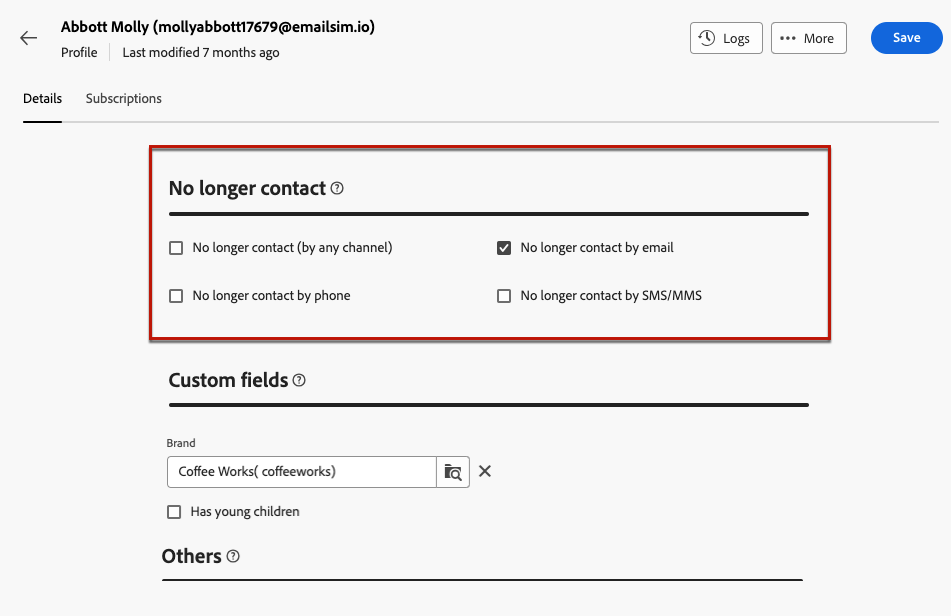

# 管理同意 {#manage-consent}

## 一般建议 {#general-recommendations}

通过 Adobe Campaign，您可以收集数据，包括个人信息和敏感信息。因此，您必须在遵守GDPR（《通用数据保护条例》）等数据保护法规和其他适用的隐私法律的情况下，获取并监控收件人的同意。

* 首先，避免发送未经请求的电子邮件、推送通知和短信（“垃圾邮件”）。 为了实现客户存留期值并提高客户忠诚度，Adobe坚信许可营销原则，因此我们严格禁止使用Adobe Campaign发送未经请求的消息。 [了解详情](#denylisted-profiles)

* 通过提供选择退出投放的功能，让收件人始终同意接收通信<!-- and keep honoring opt-out requests as quickly as possible-->。 [了解详情](#opt-out)

* 通过订阅管理流程，您可以管理收件人的偏好并跟踪哪些收件人已选择加入哪种类型的订阅。 [了解详情](../../delivery/using/about-services-and-subscriptions.md)

## 管理选择退出 {#opt-out}

向收件人提供取消订阅以停止从品牌接收通信的功能是一项法律要求，同时需要确保遵循此选择。<!--Learn more about the applicable legislation in the [Adobe Campaign Classic v7 documentation](https://experienceleague.adobe.com/docs/campaign-classic/using/getting-started/privacy/privacy-and-recommendations.html#privacy-regulations){target="_blank"}.-->

**为什么它很重要？**

* 未能遵守这些法规会为您的品牌带来法律监管风险。
* 它有助于避免向收件人发送未经请求的通信，这种通信可能会使他们将您的邮件标记为垃圾邮件并损害您的声誉。

使用Adobe Campaign Web发送投放时，您必须始终确保客户可以取消订阅未来的通信。 取消订阅后，用户档案将自动从未来营销消息的受众中删除。

### 电子邮件选择退出 {#email-opt-out}

要向收件人提供取消订阅以停止接收电子邮件通信的功能，您必须在发送给收件人的每封电子邮件中始终包含&#x200B;**取消订阅链接**。

为此，请执行以下步骤。

1. 创建外部登陆页面，并将其托管在您选择的第三方系统上。

1. 创建电子邮件投放。 [了解如何操作](../email/create-email.md)

1. 插入指向您的电子邮件内容的链接。 [了解如何操作](../email/message-tracking.md#insert-links)

   

1. 在&#x200B;**[!UICONTROL Url]**&#x200B;字段中，将链接粘贴到您的第三方登陆页面。

1. 单击左侧窗格中的&#x200B;**[!UICONTROL 链接]**&#x200B;图标以显示要跟踪的内容的所有 URL 的列表。

1. 单击新链接旁边的铅笔图标可进行编辑。

1. 修改&#x200B;**[!UICONTROL 跟踪类型]**&#x200B;并将其设置为&#x200B;**[!UICONTROL 选择退出]**。

   

1. 单击&#x200B;**[!UICONTROL 保存]**&#x200B;并发送消息。 [了解详情](../monitor/prepare-send.md)

1. 收到消息后，如果收件人单击取消订阅链接，则会显示您的登陆页面。

1. 当收件人提交登陆页面表单时，将更新用户档案数据。 [了解详情](#denylisted-profiles)

<!--Any other option availabe such as one-click opt-out link or List-Unsubscribe (to include an unsubscribe link in the email header) to enable opt-out in a delivery?-->

## 列入阻止列表的设定档 {#denylisted-profiles}

退订（选择退出）后，给定渠道的用户档案处于&#x200B;**阻止列表**&#x200B;上：这表示它们不再被任何投放定向。

>[!NOTE]
>
>如果电子邮件渠道阻止列表上的用户档案有两个电子邮件地址，则这两个地址都将排除在投放之外。

您可以在配置文件的&#x200B;**[!UICONTROL 详细信息]**&#x200B;选项卡的&#x200B;**[!UICONTROL 不再联系]**&#x200B;部分中检查配置文件是否正在阻止列表一个或多个渠道。 [了解详情](../audience/about-recipients.md#access)

<!--Denylisted status on quarantine list

Additionally, when recipients report your message as spam, or reply to an SMS message with a keyword such as "STOP", their address or phone number is quarantined with the **[!UICONTROL Denylisted]** status. Their profile is updated accordingly.

QUESTION: When a user marks an email as spam, is the profile's No longer contact section also updated? Apparently no (not the same = quarantine vs denylist)

>[!NOTE]
>
>The **[!UICONTROL Denylisted]** status refers to the address only, the profile is not on the denylist, so that the user continues receiving SMS messages and push notifications.

Learn more about Feedback loops in the [Delivery Best Practices Guide](https://experienceleague.adobe.com/docs/deliverability-learn/deliverability-best-practice-guide/transition-process/infrastructure.html#feedback-loops){target="_blank"}.

Learn more on quarantine in the [Campaign v8 (client console) documentation](https://experienceleague.adobe.com/docs/campaign/campaign-v8/send/failures/quarantines.html#non-deliverable-bounces){target="_blank"}.-->

