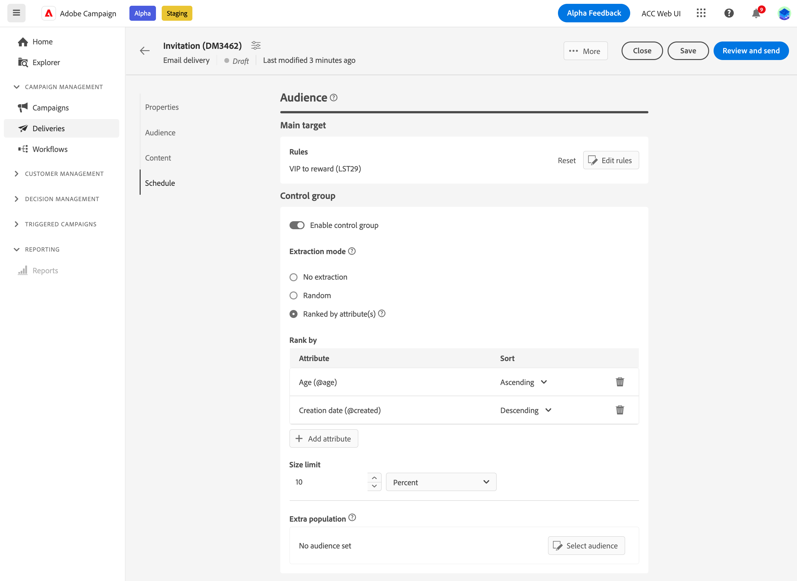
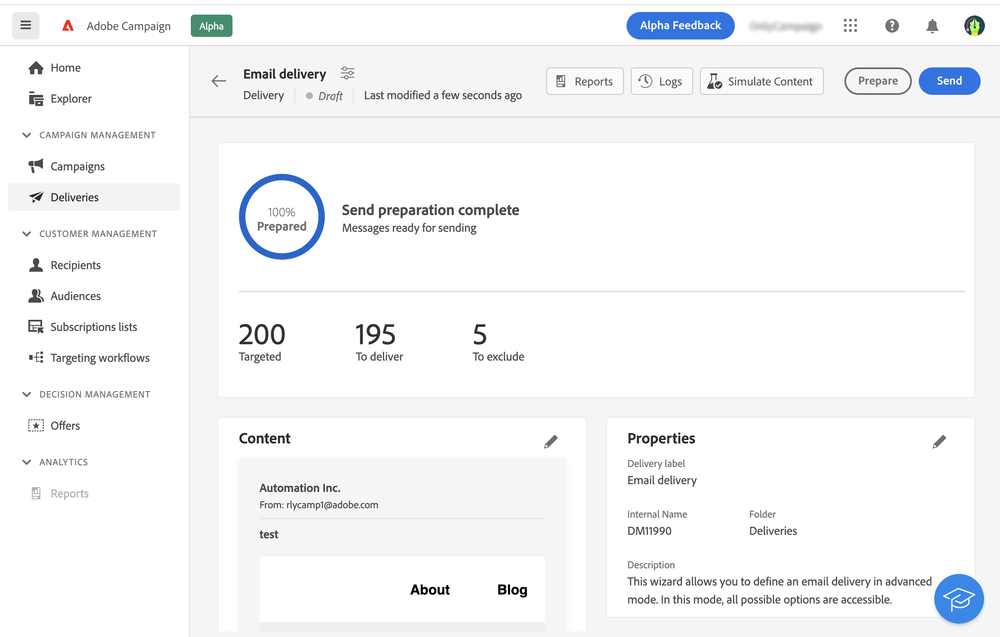
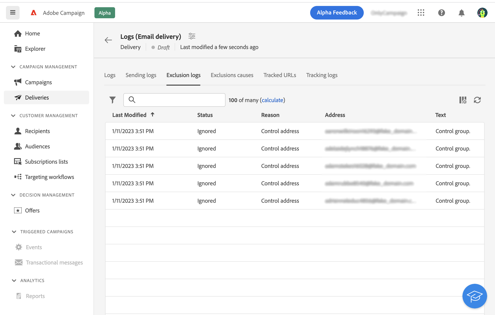

# 设置对照组 {#control-group}

控制组是从投放中排除的子群体。 您可以定义控制组以避免向部分受众发送消息，并比较投放后的行为与主要目标。 此选项可帮助您衡量营销活动的影响。

## 启用对照组{#add-a-control-group}

要添加控制组，请在定义投放受众时启用选项。 可以从主目标随机提取和/或从特定群体中选择该控制组。因此，有两种主要方法可定义控制组：

* 从主目标提取大量配置文件。
* 从列表中排除某些用户档案，或根据查询中定义的条件排除某些用户档案。

定义控制组时，可以合并这两种方法。

在投放准备步骤中属于对照组的所有配置文件都将从主目标中删除。这些配置文件将不会收到消息。

>[!CAUTION]
>
>[从外部文件](file-audience.md)加载目标人群时，无法使用对照组。

要将控制组添加到投放，请激活 **[!UICONTROL 启用对照组]** 切换，从 **Audience** 投放创建屏幕的部分。

## 从目标中提取 {#extract-target}

>[!CONTEXTUALHELP]
>id="acw_deliveries_email_controlgroup_target"
>title="提取模式"
>abstract="要定义对照组，您可以选择随机或基于排序从目标人群提取某个百分比或固定数量的配置文件。"

### 构建对照组 {#build-extract-target}

要定义对照组，您可以选择随机或基于排序从目标人群提取某个百分比或固定数量的配置文件。如果您希望添加额外群体，请选择 **无提取** 选项并选择额外群体 [详细内容见此处](#extra-population).

首先，定义从目标提取用户档案的方式：随机或基于排序。

在 **对照组** 部分，选择 **提取模式**：

* **随机**：在准备投放时，Adobe Campaign 将随机提取与百分比或与将设置为大小限制的最大数量对应的配置文件数。

* **按属性排名**：此选项使您能够根据特定属性按特定排序顺序排除一组配置文件。

然后使用 **大小限制** 部分，以设置需要从主目标提取的配置文件数。 它可以是原始数字（例如，要排除的50个配置文件）或初始受众的百分比（例如，主目标的5%）。

### 对照组的示例{#control-group-sample}

例如，要创建包含100个最新收件人的控制组，请执行以下步骤：

1. 选择 **年龄** 字段作为排序条件。 保留 **升序** 排序选项。
1. 添加 **创建日期** 字段。 更改为 **降序** 排序选项。
1. 在中将100定义为阈值 **大小限制** 部分。

   

随后，这100个最年轻的新收件人将被排除在主要目标之外。

### 检查您的对照组 {#check-control-group}

您可以查看日志以检查和识别排除的配置文件。让我们以随机排除五个配置文件为例。

在投放准备之后，您可以查看排除项的应用方式：

* 在投放仪表板中，在发送之前，检查 **要排除** KPI

   

* 在投放日志中，“日志”选项卡显示排除步骤。

   

* 此 **排除日志** 选项卡显示每个用户档案和相关排除项 **原因**.

   

* 此 **排除原因** 选项卡显示每个分类规则的已排除配置文件的数量。

   

有关投放日志的更多信息，请参阅此[章节](../monitor/delivery-logs.md)。

## 添加额外群体 {#extra-population}

>[!CONTEXTUALHELP]
>id="acw_deliveries_email_controlgroup_extra"
>title="额外群体"
>abstract="您可以通过选择现有受众或定义查询来从目标中排除特定群体。"

定义对照组的另一种方法是通过使用现有受众或定义查询来从目标中排除特定群体。

从&#x200B;**对照组**&#x200B;定义屏幕的&#x200B;**额外群体**&#x200B;部分中，单击&#x200B;**[!UICONTROL 选择受众]**&#x200B;按钮。

* 要使用现有受众，请单击&#x200B;**选择受众**。请参阅此[章节](add-audience.md)。

* 要定义新查询，请选择&#x200B;**创建您自己的**，并使用规则生成器定义排除标准。请参阅此[章节](segment-builder.md)。

将从目标中排除包含在受众中或与查询结果匹配的配置文件。

## 比较结果{#control-group-results}

发送投放后，您可以提取发送日志，以比较未收到通信的用户档案和有效目标之间的行为。 您还可以使用投放日志来构建新目标。

要查看从目标中删除了哪些配置文件，请查看 **投放日志**. 了解详情 [在此部分中](#check-control-group).

