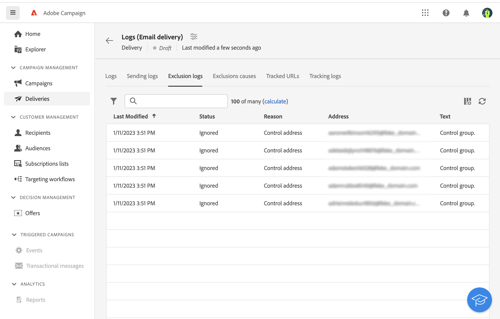

# 设置控制组 {#control-group}

您可以使用控制组避免向部分受众发送消息，以便衡量活动的影响。

为此，请在定义投放的受众时创建一个控制组。 用户档案会随机、已筛选或未筛选或者根据条件添加到控制组中。然后，您可以将收到消息的目标群体的行为与未定向的联系人的行为进行比较。

可以从主目标随机提取和/或从特定群体中选择该控制组。因此，有两种主要方法可定义控制组：

* 从主目标提取大量用户档案。
* 根据查询中定义的条件排除某些用户档案。

在定义控制组时，可以同时使用这两种方法。

在投放准备步骤中属于控制组的所有用户档案都将从主目标中删除。 他们不会收到消息。

要创建控制组，请单击 **[!UICONTROL 设置控制组]** 按钮，从 **受众** 投放创建助手一节。

## 从目标中提取 {#extract-target}

>[!CONTEXTUALHELP]
>id="acw_deliveries_email_controlgroup_target"
>title="从目标中提取"
>abstract="热障涂层"

要定义控制组，您可以选择随机或基于排序从目标群体提取某个百分比或固定数量的用户档案。

首先，定义从目标提取用户档案的方式：随机或基于排序。

在 **从目标提取** 选择 **排除类型**:

* **随机**:在准备投放时，Adobe Campaign会随机提取与百分比或与设置为大小限制的最大数量对应的用户档案数。

   

* **按属性排名**:利用此选项，可根据特定排序顺序中的特定属性排除一组配置文件。

   

然后，定义 **大小限制**:您必须设置如何限制从主目标提取的用户档案数。

**示例**

您可以查看日志以检查和识别排除的用户档案。 让我们举一个随机排除五个用户档案的示例。

在投放准备之后，您可以在以下屏幕上查看排除项：

* 的 **排除** 投放仪表板中的KPI（发送之前）。

   

* 的 **排除日志** 显示每个用户档案和相关排除 **原因**.

   

* 的 **排除原因** 显示每个分类规则的已排除配置文件数。

   

有关投放日志的更多信息，请参阅 [部分](../monitor/delivery-logs.md).

## 额外人群 {#extra-population}

>[!CONTEXTUALHELP]
>id="acw_deliveries_email_controlgroup_extra"
>title="额外人群"
>abstract="热障涂层"

定义控制组的另一种方法是使用现有受众或通过定义查询从目标中排除特定群体。

从 **额外人口** 部分 **控制组** 定义屏幕，单击 **[!UICONTROL 选择受众]** 按钮。

* 要使用现有受众，请单击 **选择受众**. 请参阅 [部分](add-audience.md).

* 要定义新查询，请选择 **创建您自己的** 和使用规则生成器定义排除条件。 请参阅 [部分](segment-builder.md).

目标中将排除受众中包含的或与查询结果匹配的用户档案。