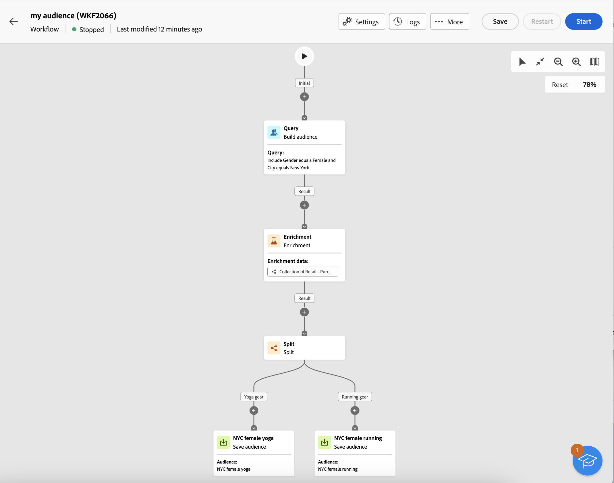

# 创建受众 {#create-audiences}

>[!CONTEXTUALHELP]
>id="acw_audiences_list"
>title="受众"
>abstract="在此页面中，您可以访问工作流或独立投放中可定位的所有受众列表。单击&#x200B;**创建**，在可视化画布中创建新的受众。  除了从头开始创建简单受众之外，还可利用工作流活动细化受众。例如，您可以将多个受众合并为单个受众、用外部属性充实受众，或根据所选择的规则将其划分为多个受众。"

<!--
[!CONTEXTUALHELP]
>id="acw_audiences_create_settings"
>title="Audience settings"
>abstract="Enter the name of the audience and additional options, then click the **Create Audience** button."-->

Campaign Web允许您在可视化工作流画布中创建新受众。 除了从头开始创建简单受众之外，还可利用工作流活动细化受众。例如，您可以将多个受众合并为单个受众、用外部属性充实受众，或根据所选择的规则将其划分为多个受众。

制作工作流后，生成的受众将自动与现有受众一起存储在Campaign数据库中。 然后，可以在工作流或独立投放中定位这些受众。

**[!UICONTROL Origin]**&#x200B;列指示受众的来源： **[!UICONTROL Adobe Campaign]**&#x200B;受众是在Adobe Campaign v8控制台或Web用户界面中创建的，而&#x200B;**[!UICONTROL Adobe Experience Platform：]**&#x200B;受众是在Adobe Experience Platform中创建的，并使用Adobe Sources与Destinations集成集成到Campaign中。

➡️ [通过观看视频了解此功能](#video)

## 创建您的第一个受众 {#create}

要创建受众，请执行以下步骤：

1. 导航到&#x200B;**[!UICONTROL 受众]**&#x200B;菜单，然后单击右上角的&#x200B;**[!UICONTROL 创建受众]**&#x200B;按钮。

1. 系统会自动创建一个新工作流，允许您合并活动以生成受众。 默认情况下，画布包含两个主要活动：

   * “查询”**[!UICONTROL 构建受众]**&#x200B;活动是工作流的起点。 它允许您创建受众，并将其用作工作流的基础。

   * “新受众”**[!UICONTROL 保存受众]**&#x200B;活动表示工作流中的最后一步。 这使您可以将结果另存为新受众。

   {zoomable="yes"}

   >[!IMPORTANT]
   >
   >受众工作流与其他营销活动工作流一起存储在&#x200B;**工作流**&#x200B;菜单中。 它们专门为构建受众而设计，可通过其垂直画布进行识别。

1. 为了提高可读性，请在工作流设置&#x200B;**标签**&#x200B;字段中更改工作流的名称。 [了解如何配置工作流设置](../workflows/workflow-settings.md)

1. 打开&#x200B;**[!UICONTROL 构建受众]**&#x200B;活动，然后使用查询建模器，通过筛选数据库中包含的数据来定义要包含在受众中的群体。 [了解如何配置生成受众活动](../workflows/activities/build-audience.md)

1. 如果想要对工作流中的目标群体执行其他操作，请根据需要添加尽可能多的活动，并将它们连接在一起。 有关如何配置工作流活动的更多信息，请参阅[工作流文档](../workflows/activities/about-activities.md)。

   >[!NOTE]
   >
   >渠道活动不可用于受众工作流。

   {zoomable="yes"}

1. 配置&#x200B;**[!UICONTROL 保存受众]**&#x200B;活动，以指定您希望如何保存工作流上游计算的群体。 [了解如何配置保存受众活动](../workflows/activities/save-audience.md)

1. 工作流就绪后，单击&#x200B;**[!UICONTROL 启动]**&#x200B;以执行工作流。

工作流保存在&#x200B;**[!UICONTROL 工作流]**&#x200B;列表中，而生成的受众可在&#x200B;**[!UICONTROL 受众]**&#x200B;列表中（使用&#x200B;**保存受众**&#x200B;活动中定义的标签）访问。 在[本节](manage-audience.md)中了解如何监视和管理受众

您现在可以使用此受众作为投放的主要目标。 [了解详情](add-audience.md)

## 受众工作流示例 {#example}

下方的示例显示了一个受众工作流，该工作流配置为定向居住在纽约的女客户，并根据他们最近购买过的物品（瑜伽或跑步装备）创建两个新受众。

{zoomable="yes"}

1. **[!UICONTROL 构建受众]**&#x200B;活动面向居住在纽约的所有女性用户档案。
1. **[!UICONTROL 扩充]**&#x200B;活动通过Purchases表中的信息丰富了受众，以确定客户购买的产品类型。
1. **[!UICONTROL 拆分]**&#x200B;活动根据客户的最新购买将工作流划分为两个路径。
1. 每个路径末尾的&#x200B;**[!UICONTROL 保存受众]**&#x200B;活动会在数据库中创建两个新受众，包括在每个路径中计算的群体。

## 编辑受众 {#edit}

您可以根据需要通过重新执行相应的工作流来修改从工作流生成的受众。 这样，您就可以刷新受众数据，或通过调整查询来满足您的需求来优化受众。

1. 导航到&#x200B;**受众**&#x200B;菜单，然后打开要编辑的受众。
1. 在&#x200B;**概述**&#x200B;选项卡中，**上一个工作流**&#x200B;部分提供了用于生成受众的工作流的链接。 单击以访问工作流。
1. 进行所需的更改，然后单击“**开始**”按钮以重新运行工作流。 完成后，工作流产生的受众将自动更新为最新的工作流结果。

默认情况下，重新运行受众工作流会使用新数据替换受众的整个内容，从而导致以前的数据丢失。

如果不希望替换现有的受众结果，请配置&#x200B;**保存受众**&#x200B;活动以符合您的要求。 例如，您可以更改&#x200B;**受众标签**&#x200B;字段以在新受众中存储新结果，或将新结果添加到现有受众内容而不擦除以前的数据。 [了解如何配置保存受众活动](../workflows/activities/save-audience.md)

{zoomable="yes"}

## 操作说明视频 {#video}

了解如何构建和管理受众、如何为投放选择受众以及定义控制组。

>[!VIDEO](https://video.tv.adobe.com/v/3425861?quality=12)