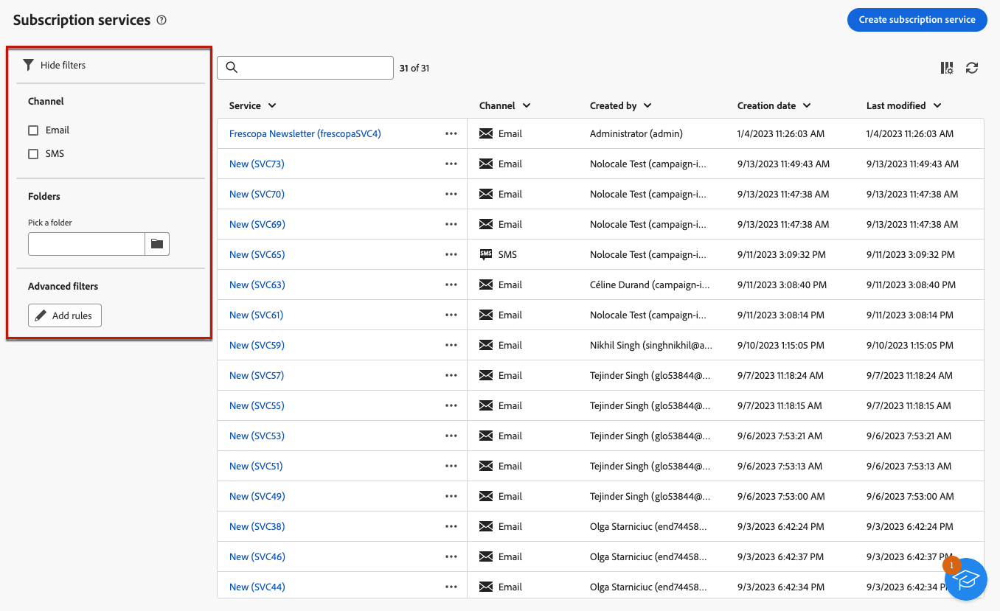
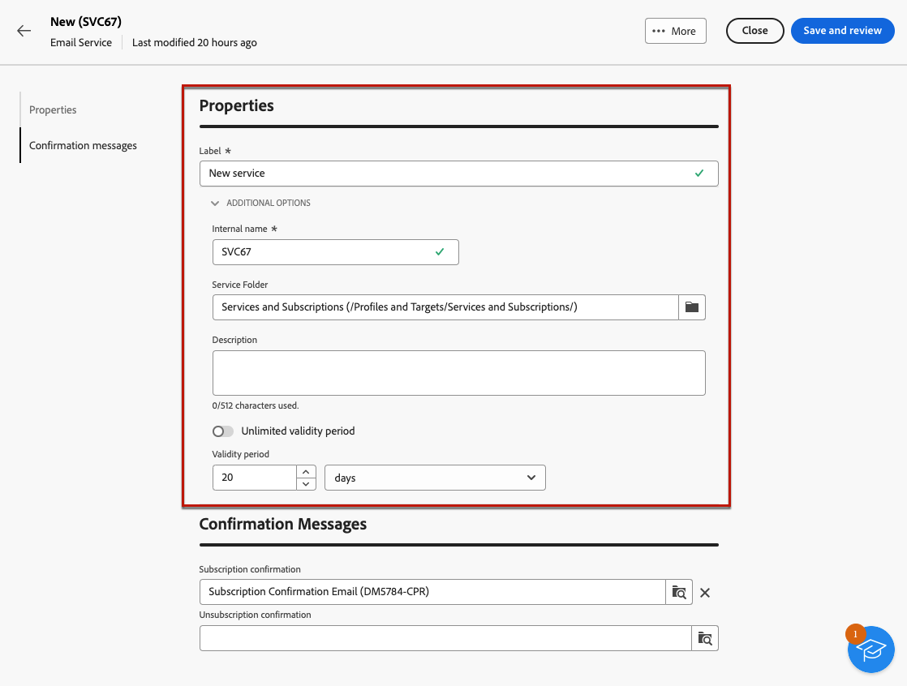
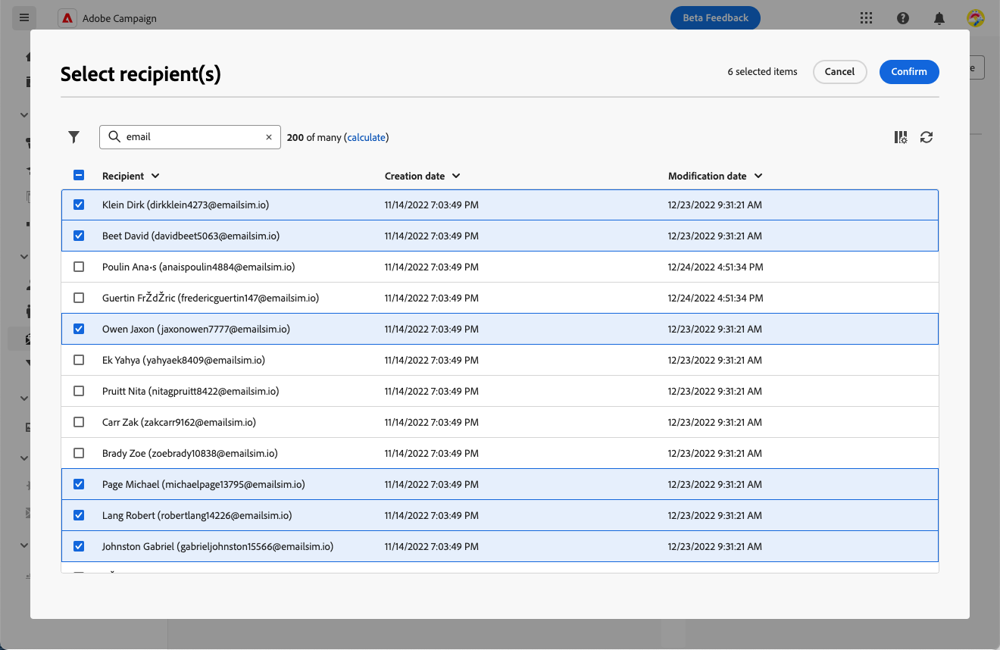
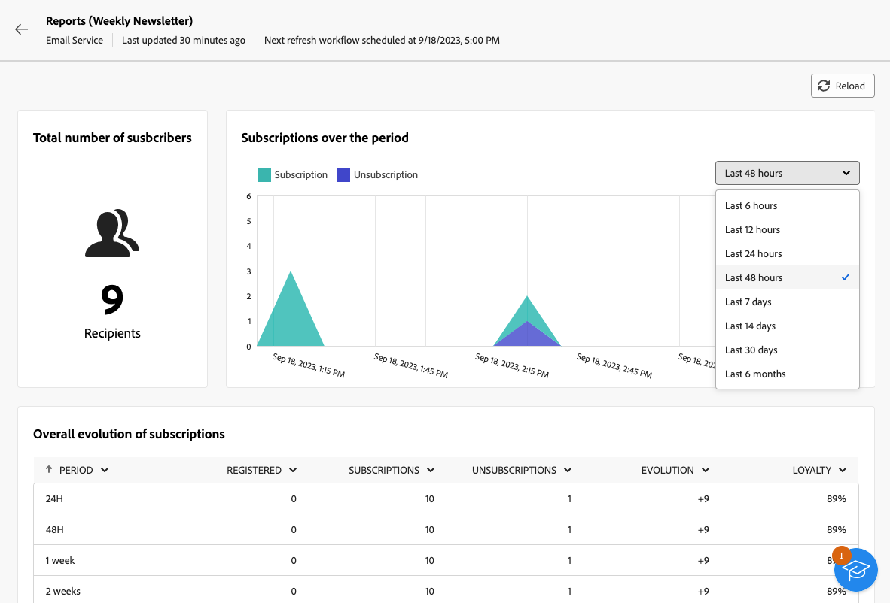

# 使用订阅服务 {#create-services}

>[!CONTEXTUALHELP]
>id="acw_subscriptions_list"
>title="创建和管理您的服务"
>abstract="使用Adobe Campaign创建和监控服务（如新闻稿），并检查这些服务的订阅或退订。 订阅仅适用于电子邮件和短信投放。"

使用Adobe Campaign Web管理和创建服务（如新闻稿），并检查这些服务的订阅或退订。

>[!NOTE]
>
>订阅仅适用于电子邮件和短信投放。

可以并行定义多种服务，例如：特定产品类别、网站主题或区域的新闻稿、各种类型警报消息的订阅以及实时通知。

要了解有关管理订阅和退订的更多信息，请参阅 [Campaign v8（客户端控制台）文档](https://experienceleague.adobe.com/docs/campaign/campaign-v8/audience/subscriptions.html){target="_blank"}.

## 访问订阅服务 {#access-services}

要访问适用于您的平台的订阅服务，请执行以下步骤。

1. 浏览至 **[!UICONTROL 订阅服务]** 菜单的位置。

   

1. 此时将显示所有现有订阅服务的列表。 您可以搜索服务和筛选渠道、文件夹，或者使用高级筛选器。

   

1. 要编辑现有服务，请单击其名称。

1. 您可以使用此服务名称旁边的三个圆点图标来删除或复制任何服务。

## 创建您的第一个订阅服务 {#create-service}

>[!CONTEXTUALHELP]
>id="acw_subscriptions_list_properties"
>title="定义您的服务属性"
>abstract="输入订阅服务的标签，并定义其他选项，如服务的有效期。"

>[!CONTEXTUALHELP]
>id="acw_subscriptions_list_confirm"
>title="选择确认消息"
>abstract="当用户订阅或取消订阅服务时，您可以发送确认消息。 选择要用于该消息的模板。"

要创建订阅服务，请执行以下步骤。

1. 选择 **[!UICONTROL 创建订阅服务]** 按钮。

   

1. 选择渠道： **[!UICONTROL 电子邮件]** 或 **[!UICONTROL 短信]**.

1. 在服务属性中，输入标签并根据需要定义其他选项。

   

1. 默认情况下，订阅无限制。 您可以禁用 **[!UICONTROL 有效期无限制]** 用于定义服务的有效期的选项。 在下面的示例中，20天后，没有任何用户能够再订阅此服务。

   

1. 当用户订阅或取消订阅服务时，您可以发送确认消息。 根据您的用例选择用于该消息的模板。 这些模板必须配置 **[!UICONTROL 订阅]** 目标映射。 [了解详情](#create-confirmation-message)

   

1. 单击 **[!UICONTROL 保存并审阅]**. 新服务将添加到 **[!UICONTROL 订阅服务]** 列表。

## 创建确认消息 {#create-confirmation-message}

要向订阅或取消订阅您的服务的用户发送确认消息，您必须使用创建投放模板 **[!UICONTROL 订阅]** 目标映射，无已定义目标。 为此，请执行以下步骤。

1. 为订阅确认创建投放模板。 [了解如何操作](../msg/delivery-template.md)

1. 请勿为此投放选择受众。 相反，访问 **[!UICONTROL 投放设置]**，转到 [受众](../advanced-settings/delivery-settings.md#audience) 选项卡，然后选择 **[!UICONTROL 订阅]** 列表中的目标映射。

   

   >[!NOTE]
   >
   >如果您不选择  **[!UICONTROL 订阅]** 目标映射，您的订阅者将不会收到确认消息。 在 Campaign v8 控制台中定义目标映射。了解更多 [Adobe Campaign v8文档](https://experienceleague.adobe.com/docs/campaign/campaign-v8/audience/add-profiles/target-mappings.html){target="_blank"}.

1. 编辑投放模板的内容，保存并关闭它。

   

   >[!NOTE]
   >
   >了解有关投放渠道以及如何在中定义投放内容的更多信息 [电子邮件渠道](../email/create-email.md) 和 [短信渠道](../sms/create-sms.md) 部分。

1. 重复上述步骤以创建用于取消订阅确认的投放模板。

现在，您可以在以下情况下选择这些消息 [创建订阅服务](#create-service). 订阅或取消订阅该服务的用户将收到所选的确认消息。

## 将订阅者添加到您的服务 {#add-subscribers}

创建服务后，即可手动添加订阅者。 请按照以下步骤操作。

1. 从中选择现有服务 **[!UICONTROL 订阅服务]** 列表。

1. 选择 **[!UICONTROL 订阅者]** 选项卡，然后单击 **[!UICONTROL 添加用户档案]**.

   

1. 从列表中选择要添加的配置文件，然后单击 **[!UICONTROL 确认]**.

   

1. 单击 **[!UICONTROL 发送]**. 选定的收件人将收到订阅 [确认消息](#create-confirmation-message) 您选择的时机 [创建服务](#create-service).

   

添加的用户档案将显示在 **[!UICONTROL 订阅者]** 列表。 他们现在已订阅您的服务。

## 从服务中删除订阅者 {#remove-subscribers}

将订阅者添加到服务后，即可将其删除。 请按照以下步骤操作。

1. 从中选择现有服务 **[!UICONTROL 订阅服务]** 列表。

1. 单击所需收件人名称旁边的三个圆点图标，然后选择 **[!UICONTROL 删除]**.

   

1. 确认删除并单击 **[!UICONTROL 发送]**. 选定的收件人将收到退订 [确认消息](#create-confirmation-message) 您选择的时机 [创建服务](#create-service).

   

收件人将从 **[!UICONTROL 订阅者]** 列表且不再订阅您的服务。

## 订阅服务日志和报告 {#logs-and-reports}

要衡量订阅服务对短信和电子邮件渠道的有效性，您可以访问给定服务的日志和报告。

1. 从中选择现有服务 **[!UICONTROL 订阅服务]** 列表。 单击 **[!UICONTROL 计算]** 获取订阅者总数。

   

1. 从服务仪表板中，选择 **[!UICONTROL 日志]** 查看此服务的订阅者列表。 您可以检查订阅者的总数、每个收件人的姓名和地址以及他们订阅或取消订阅的时间。 您还可以对其进行过滤。

   

1. 从服务仪表板中，选择 **[!UICONTROL 报表]**. 检查以下指示器：

   * 此 **[!UICONTROL 订阅者总数]** 将显示。

   * 您可以查看选定时段内的订阅和退订数量。 使用下拉列表更改时间范围。

     

   * 此 **[!UICONTROL 订阅的总体演变]** 图表按期间显示细分，包括订阅、取消订阅、数量演变和忠诚度百分比。<!--what is Registered?-->

   * 使用 **[!UICONTROL 重新加载]** 按钮以检索跟踪工作流执行和计划的最后一个值。

## 交付给服务的订阅者

一旦您 [已创建订阅服务](#create-service)，您可以在投放中定位其订阅者。 请按照以下步骤操作。

1. [创建受众](../audience/create-audience.md) 包括您创建的服务的订阅者：

   * 在 **[!UICONTROL 构建受众]** 活动，显示高级属性，然后选择 **[!UICONTROL 收件人]** > **[!UICONTROL 订阅]** > **[!UICONTROL 服务]**.

   * 在此示例中，选择订阅了服务的用户，该服务具有 **Luma新闻稿** 标签。

   

1. [创建投放](../msg/gs-messages.md) 并选择您在上面创建的受众。

   

1. 根据需要编辑消息内容并发送投放。

   

您的投放仅发送给该服务的订阅者。

