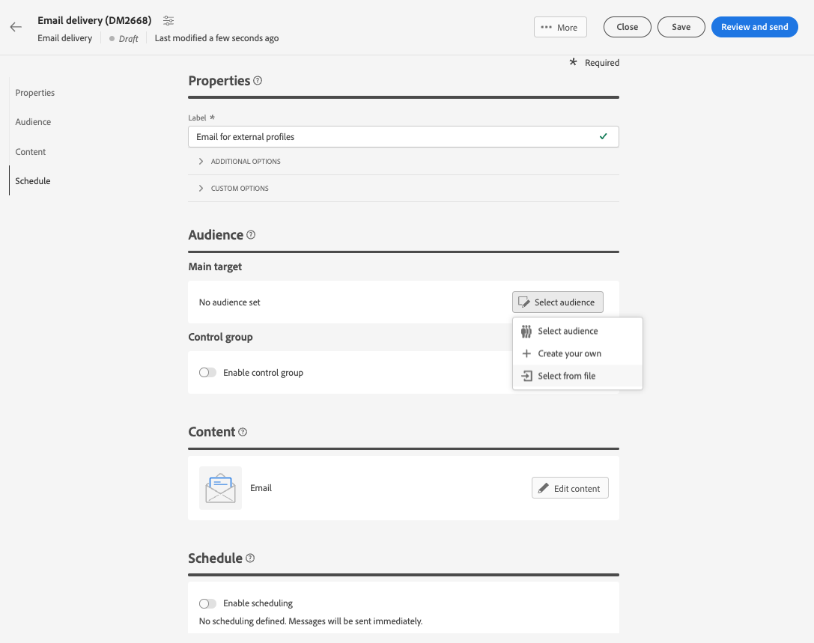
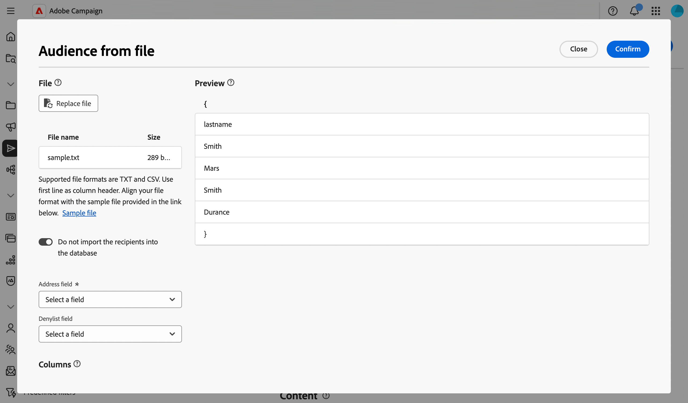
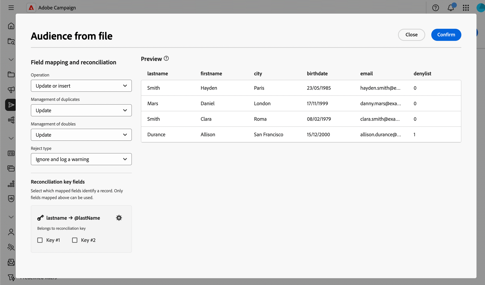
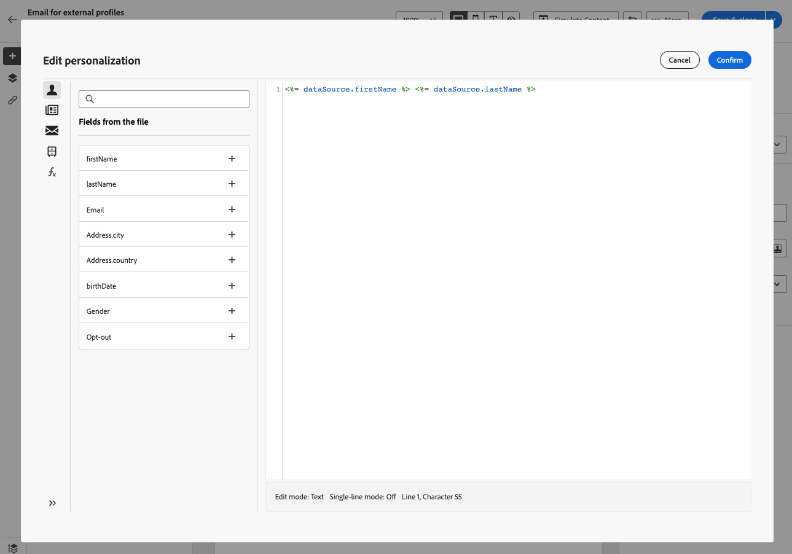
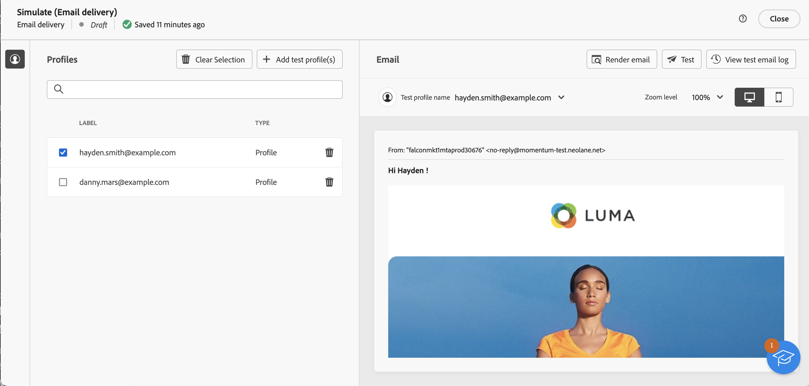
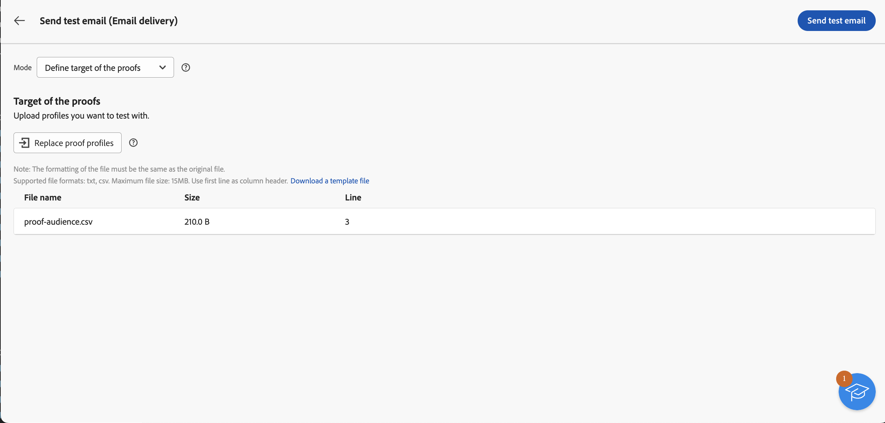

# 从文件加载电子邮件受众 {#audience-from-file}

>[!CONTEXTUALHELP]
>id="acw_audience_fromfile_select"
>title="文件选择"
>abstract="选择要上传的本地文件。 支持的格式为 TXT 和 CSV。 将您的文件格式与下方链接的示例文件保持一致。"

>[!CONTEXTUALHELP]
>id="acw_audience_fromfile_columns"
>title="列定义"
>abstract="检查外部文件中列的格式。"

>[!CONTEXTUALHELP]
>id="acw_audience_fromfile_formatting"
>title="格式化参数"
>abstract="指定如何编排外部文件的格式以确保正确地导入数据。"

>[!CONTEXTUALHELP]
>id="acw_audience_fromfile_preview"
>title="预览文件"
>abstract="检查对外部文件的列的预览。 此屏幕最多只能显示 30 条记录。"

Adobe Campaign Web用户界面允许您定位存储在外部文件中的用户档案。 加载用户档案后，输入文件中的所有字段都可用于个性化投放[了解如何个性化内容](../personalization/personalize.md)。

您可以选择仅为此特定的独立电子邮件投放加载用户档案，而不将它们添加到数据库中，也可以将这些用户档案导入并协调到数据库中。 [了解详情](#upload)。

>[!NOTE]
>
>本页介绍在创建独立的电子邮件投放时，如何从文件加载外部用户档案。 若要从工作流上下文中的文件加载数据，请参阅[此页面](../workflows/activities/load-file.md)。

## 必读 {#must-read}

* 此功能仅适用于&#x200B;**电子邮件投放**。
* 支持的文件格式有：文本 (TXT) 和逗号分隔值 (CSV)。
* 从外部文件加载目标人群时无法使用[对照组](control-group.md)。

## 选择并配置输入文件 {#upload}

要在电子邮件中定位来自文件的用户档案，请执行以下步骤：

1. 打开现有的电子邮件投放，或[创建新的电子邮件投放](../email/create-email.md)。
1. 在&#x200B;**受众**&#x200B;部分中，单击&#x200B;**选择受众**&#x200B;按钮，然后选择&#x200B;**从文件选择**。

   {zoomable="yes"}

1. 选择要加载的本地文件。 文件格式必须与[示例文件](#sample-file)一致。
1. 在屏幕的中央部分预览和检查如何映射数据。

   

1. 从&#x200B;**地址字段**&#x200B;下拉列表中指定包含电子邮件地址的列。 如果输入文件中包含此类信息，也可以选择“阻止列表”列。
1. 在&#x200B;**[!UICONTROL 列]**&#x200B;部分中，展开一列以调整其设置并使用可用选项定义数据格式化的方式。 对于要用于协调的每个列，请使用&#x200B;**[!UICONTROL 选择目标字段]**&#x200B;将其映射到收件人架构属性。

1. 使用&#x200B;**[!UICONTROL 不将收件人导入数据库]**&#x200B;开关来控制是否将文件的配置文件导入并协调到数据库中。 如果选择导入它们，则显示&#x200B;**[!UICONTROL 字段映射和协调]**&#x200B;部分。 配置以下参数：

   

   +++**[!UICONTROL 操作]**

   选择要在数据库上执行的操作：

   * **[!UICONTROL 更新或插入]**：如果记录存在于数据库中，则更新该记录，否则创建该记录。
   * **[!UICONTROL 插入]**：将记录插入数据库。
   * **[!UICONTROL 更新]**：仅更新现有记录。
   * **[!UICONTROL 仅协调]**：在数据库中查找记录，但不执行更新。
   * **[!UICONTROL 删除]**：从数据库中删除记录。

   +++

   +++**[!UICONTROL 重复项管理]**

   选择如何处理文件和数据库中都存在的记录：

   * **[!UICONTROL 更新]**（默认）：更新记录。
   * **[!UICONTROL 拒绝实体]**：排除它并记录错误。
   * **[!UICONTROL 忽略]**：排除它而不保留跟踪。

   +++

   +++**[!UICONTROL 双人管理]**

   选择如何处理在文件本身中出现多次的记录：

   * **[!UICONTROL 更新]**（默认）：不删除重复项；最后一个匹配记录优先。
   * **[!UICONTROL 拒绝实体]**：排除多余的记录并记录错误。
   * **[!UICONTROL 忽略]**：排除多余的记录而不保留跟踪。

   +++

   +++**[!UICONTROL 拒绝类型]**

   选择协调期间如何处理字段级错误：

   * **[!UICONTROL 忽略并记录警告]**：导入所有其他字段并记录错误。
   * **[!UICONTROL 拒绝父元素]**：拒绝整个记录。
   * **[!UICONTROL 拒绝所有元素]**：停止导入并拒绝所有内容。

   +++

   +++**[!UICONTROL 协调键字段]**

   在&#x200B;**[!UICONTROL 列]**&#x200B;部分中，您已将某些列映射到目标字段。 在此，选择这些映射字段中的哪些字段应该用于标识记录。

   +++

1. 在&#x200B;**[!UICONTROL 格式]**&#x200B;部分中，指定文件使用的编码、字符串分隔符和列分隔符。
1. 在确认设置正确后，单击&#x200B;**确认**。

创建消息内容时，利用输入文件中的字段添加个性化。 [了解如何个性化内容](../personalization/personalize.md)

{zoomable="yes"}

## 示例文件 {#sample-file}

>[!CONTEXTUALHELP]
>id="acw_audience_fromfile_samplefile"
>title="从文件加载受众"
>abstract="支持的文件格式为 TXT 和 CSV。 使用第一行作为列标题。 使您的文件格式与在下方链接中提供的示例文件一致。"

在加载外部文件以定向投放中的用户档案时，请确保输入文件与以下推荐相匹配：

* 支持的格式为 TXT 和 CSV。
* 文件中的第一行是列标题。
* 将文件格式与下面的示例文件对齐：

  ```
  lastname,firstname,city,birthdate,email,denylist
  Smith,Hayden,Paris,23/05/1985,hayden.smith@example.com,0
  Mars,Daniel,London,17/11/1999,danny.mars@example.com,0
  Smith,Clara,Roma,08/02/1979,clara.smith@example.com,0
  Durance,Allison,San Francisco,15/12/2000,allison.durance@example.com,1
  ```

## 预览和测试电子邮件 {#test}

使用Campaign Web，您可以预览和发送使用从文件上传的受众的验证。 为此，请执行以下步骤：

1. 单击投放内容编辑屏幕中的&#x200B;**[!UICONTROL 模拟内容按钮]**，然后单击&#x200B;**[!UICONTROL 添加测试配置文件]**&#x200B;按钮。

1. 将显示上传的文件中包含的用户档案。 选择要用于预览内容的配置文件，然后单击&#x200B;**[!UICONTROL 选择]**。

1. 投放内容的预览显示在屏幕的右侧窗格中。 个性化元素被替换为在左窗格中选择的配置文件中的数据。 [了解有关投放内容预览的更多信息](../preview-test/preview-content.md)

   {zoomable="yes"}

1. 若要发送校样，请单击&#x200B;**[!UICONTROL 发送校样]**&#x200B;按钮。

1. 单击&#x200B;**[!UICONTROL 上传校样配置文件]**&#x200B;按钮，然后选择包含校样收件人的.txt或.csv文件。

   >[!CAUTION]
   >
   >确保文件格式与用于上传受众的文件格式匹配。 任何格式错误都会显示警报。

1. 添加验证配置文件并准备好发送验证时，单击&#x200B;**[!UICONTROL 发送验证]**&#x200B;按钮，并确认发送。

   {zoomable="yes"}

1. 随时使用&#x200B;**[!UICONTROL 查看校样]**&#x200B;按钮监视校样的发送。 [了解有关验证监视的详细信息](../preview-test/test-deliveries.md#access-test-deliveries)