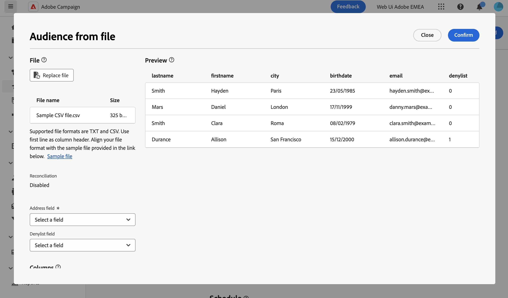

# 从文件加载电子邮件受众 {#audience-from-file}

>[!CONTEXTUALHELP]
>id="acw_audience_fromfile_select"
>title="文件选择"
>abstract="选择要上传的本地文件。支持的格式为 TXT 和 CSV。将您的文件格式与下方链接的示例文件保持一致。"

>[!CONTEXTUALHELP]
>id="acw_audience_fromfile_columns"
>title="列定义"
>abstract="检查外部文件中列的格式。"

>[!CONTEXTUALHELP]
>id="acw_audience_fromfile_formatting"
>title="格式化参数"
>abstract="指定如何编排外部文件的格式以确保正确地导入数据。"

>[!CONTEXTUALHELP]
>id="acw_audience_fromfile_preview"
>title="预览文件"
>abstract="检查对外部文件的列的预览。此屏幕最多只能显示 30 条记录。"

Adobe Campaign Web用户界面允许您定位存储在外部文件中的用户档案。 加载用户档案后，输入文件中的所有字段都可用于将投放个性化 [了解如何个性化您的内容](../personalization/personalize.md).

输入文件中的配置文件不会添加到数据库中。 它们已加载，并且仅可用于此特定的独立电子邮件投放。

>[!NOTE]
>
>本页介绍在创建独立的电子邮件投放时，如何从文件加载外部用户档案。 要在工作流上下文中从文件加载数据，请参阅 [此页面](../workflows/activities/load-file.md).

## 必读 {#must-read}

* 此功能适用于 **电子邮件投放** 仅限。
* 支持的文件格式为：文本(TXT)和逗号分隔值(CSV)。
* 从外部文件加载目标人群时无法使用[对照组](control-group.md)。

## 选择并配置输入文件 {#upload}

要在电子邮件中定位来自文件的用户档案，请执行以下步骤：

1. 打开现有的电子邮件投放，或 [创建新的电子邮件投放](../email/create-email.md).
1. 在 **受众** 部分，单击 **选择受众** 按钮，然后选择 **从文件选择**.

   {zoomable=&quot;yes&quot;}

1. 选择要加载的本地文件。 文件格式必须与 [示例文件](#sample-file).
1. 在屏幕的中央部分预览和检查如何映射数据。

   

1. 指定包含来自的电子邮件地址的列 **地址字段** 下拉列表。 如果在输入的文件中有阻止列表列，则还可选择此类信息。
1. 调整列设置以及如何通过可用选项设置数据的格式。
1. 在确认设置正确后，单击&#x200B;**确认**。

创建消息内容时，您可以利用输入文件中的字段添加个性化。 [了解如何个性化内容](../personalization/personalize.md)

{zoomable=&quot;yes&quot;}

## 示例文件 {#sample-file}

>[!CONTEXTUALHELP]
>id="acw_audience_fromfile_samplefile"
>title="从文件加载受众"
>abstract="支持的文件格式为 TXT 和 CSV。使用第一行作为列标题。使您的文件格式与在下方链接中提供的示例文件一致。"

在加载外部文件以定向投放中的用户档案时，请确保输入文件与以下推荐相匹配：

* 支持的格式为TXT和CSV。
* 文件中的第一行是列标题。
* 将文件格式与下面的示例文件对齐：

  ```javascript
  {
  lastname,firstname,city,birthdate,email,denylist
  Smith,Hayden,Paris,23/05/1985,hayden.smith@example.com,0
  Mars,Daniel,London,17/11/1999,danny.mars@example.com,0
  Smith,Clara,Roma,08/02/1979,clara.smith@example.com,0
  Durance,Allison,San Francisco,15/12/2000,allison.durance@example.com,1
  }
  ```

## 预览和测试电子邮件 {#test}

使用Campaign Web，您可以预览和发送使用从文件上传的受众的验证。 为此，请执行以下步骤：

1. 单击 **[!UICONTROL “模拟内容”按钮]** 在投放内容编辑屏幕中，单击 **[!UICONTROL 添加测试配置文件]** 按钮。

1. 将显示上传的文件中包含的用户档案。 选择要用于预览内容的配置文件，然后单击 **[!UICONTROL 选择]**.

1. 投放内容的预览显示在屏幕的右侧窗格中。 个性化元素被替换为在左窗格中选择的配置文件中的数据。 [了解有关投放内容预览的更多信息](../preview-test/preview-content.md)

   {zoomable=&quot;yes&quot;}

1. 要发送校样，请单击 **[!UICONTROL 发送验证]** 按钮。

1. 单击 **[!UICONTROL 上传校对配置文件]** 按钮并选择包含验证收件人的.txt或.csv文件。

   >[!CAUTION]
   >
   >确保文件格式与用于上传受众的文件格式匹配。 任何格式错误都会显示警报。

1. 添加验证配置文件并准备好发送验证时，单击 **[!UICONTROL 发送验证]** 按钮并确认发送。

   {zoomable=&quot;yes&quot;}

1. 您可以使用监控证明的发送 **[!UICONTROL 查看验证]** 按钮。 [了解有关验证监控的更多信息](../preview-test/test-deliveries.md#access-test-deliveries)
