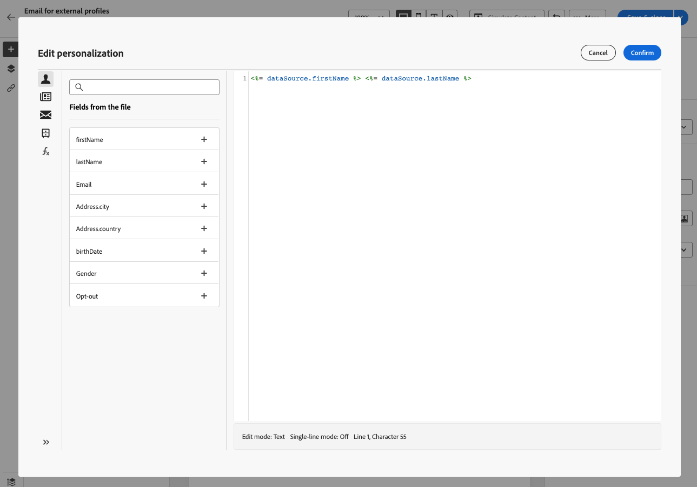

# 從檔案定位收件者 {#audience-from-file}

>[!CONTEXTUALHELP]
>id="acw_audience_fromfile_select"
>title="文件选择"
>abstract="选择要上传的本地文件。支援的格式為TXT和CSV。 將檔案格式與下方連結的範例檔案對齊。"

>[!CONTEXTUALHELP]
>id="acw_audience_fromfile_columns"
>title="列定义"
>abstract="檢查要從本機檔案插入的欄格式。"

>[!CONTEXTUALHELP]
>id="acw_audience_fromfile_formatting"
>title="格式化参数"
>abstract="檢查檔案的格式引數。"

您可以從外部檔案上傳連絡人。 此功能僅適用於電子郵件傳遞。 支援的檔案格式為：文字(TXT)和逗號分隔值(CSV)。 設定檔不會新增至資料庫，但輸入檔案中的所有欄位都可用於個人化。

>[!NOTE]
>
>您可以建立匯入工作流程，以新增或更新資料庫中的多個設定檔。 了解详情


若要直接從介面從本機檔案定位設定檔，請遵循下列步驟：

1. 在電子郵件傳遞建立視窗中，從 **對象** 區段，按一下 **選取對象** 按鈕並選擇 **從檔案選取** 選項。

   

1. 选择要上传的本地文件。
1. 預覽並檢查資料在畫面中央區段的對應方式。
1. 從中選擇包含電子郵件地址的欄 **位址列位** 下拉式清單。 如果輸入檔案中有這類資訊，您也可以選取封鎖清單欄。
1. 調整欄設定，以及如何從可用選項格式化資料。
1. 在确认设置正确后，单击&#x200B;**确认**。

在创建和个性化消息内容时，可以在个性化编辑器中从输入文件中选择字段。



## 示例文件 {#sample-file}

>[!CONTEXTUALHELP]
>id="acw_audience_fromfile_samplefile"
>title="示例文件"
>abstract="支援的檔案格式： txt、csv。 使用第一行作为列标题。"


```json
{
lastname,firstname,city,birthdate,email,denylist
Smith,Hayden,Paris,23/05/1985,hayden.smith@example.com,0
Mars,Daniel,London,17/11/1999,dannymars@example.com,0
Smith,Clara,Roma,08/02/1979,clara.smith@example.com,0
Durance,Allison,San Francisco,15/12/2000,allison.durance@example.com,1
}
```
