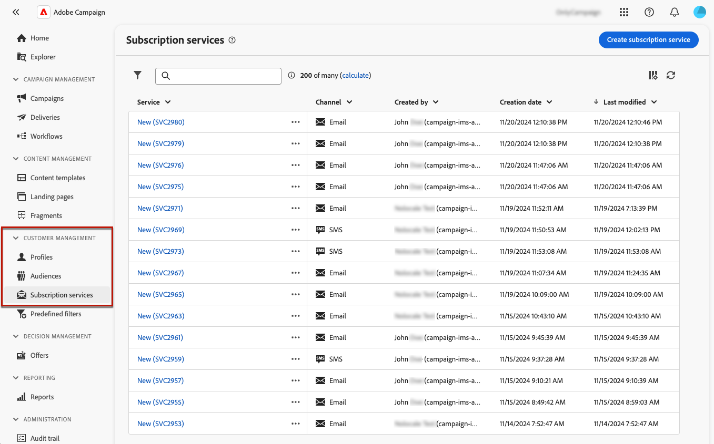

# 创建和管理订阅服务 {#manage-services}

>[!CONTEXTUALHELP]
>id="acw_subscriptions_list"
>title="创建和管理服务"
>abstract="使用 Adobe Campaign 创建和监测您的服务（如新闻稿）以及检查这些服务的订阅或取消订阅情况。订阅仅适用于电子邮件和短信投放。"

使用Adobe Campaign Web管理和创建服务（如新闻稿），并检查这些服务的订阅或退订。

可以并行定义多种服务，例如：特定产品类别、网站主题或区域的新闻稿、各种类型警报消息的订阅以及实时通知。

>[!NOTE]
>
>订阅仅适用于电子邮件和短信投放。

## 访问订阅服务 {#access-services}

要访问适用于您的平台的订阅服务，请执行以下步骤。

1. 在左侧导航边栏的&#x200B;**[!UICONTROL 客户管理]**&#x200B;下，浏览到&#x200B;**[!UICONTROL 订阅服务]**&#x200B;菜单。

   {zoomable="yes"}

1. 此时将显示所有现有订阅服务的列表。 您可以使用[查询建模器](../query/query-modeler-overview.md)在渠道、文件夹或添加规则上搜索服务和筛选。

   {zoomable="yes"}

1. 要编辑现有服务，请单击其名称。

1. 您可以使用服务名称旁边的三个圆点图标来删除或复制任何服务。<!--so all subscribers are unsubscribed - need to mention?-->

## 创建您的第一个订阅服务 {#create-service}

>[!CONTEXTUALHELP]
>id="acw_subscriptions_list_properties"
>title="定义服务属性"
>abstract="输入订阅服务的标签并定义其他选项，如服务的有效期。"

>[!CONTEXTUALHELP]
>id="acw_subscriptions_list_confirm"
>title="选择确认消息"
>abstract="当用户订阅服务或从服务取消订阅时，您可发送确认消息。选择用于该消息的模板。"

>[!CONTEXTUALHELP]
>id="acw_subscriptions_defaultlp"
>title="默认登陆页面"
>abstract="选择与此服务相关的默认登陆页面。"

要创建订阅服务，请执行以下步骤。

1. 选择&#x200B;**[!UICONTROL 创建订阅服务]**&#x200B;按钮。

   {zoomable="yes"}

1. 选择一个渠道：**[!UICONTROL 电子邮件]**&#x200B;或&#x200B;**[!UICONTROL 短信]**。

1. 在服务属性中，输入标签并根据需要定义&#x200B;**[!UICONTROL 其他选项]**。

   {zoomable="yes"}

1. 默认情况下，服务存储在&#x200B;**[!UICONTROL 服务和订阅]**&#x200B;文件夹中。 您可以通过浏览到所需的位置来更改它。 [了解如何使用文件夹](../get-started/permissions.md#folders)

1. 默认情况下，订阅无限制。

   您可以禁用&#x200B;**[!UICONTROL 无限有效期]**&#x200B;选项以定义服务的有效期。 有效期结束后：
   * 任何用户档案都不能再订阅此服务
   * 此服务的所有订阅者都会自动取消订阅

   {zoomable="yes"}

1. 当用户订阅服务或从服务取消订阅时，您可发送确认消息。根据您的用例选择用于该消息的模板。 这些模板必须使用&#x200B;**[!UICONTROL 订阅]**&#x200B;目标映射进行配置。 [了解详情](#create-confirmation-message)

   {zoomable="yes"}

1. 单击&#x200B;**[!UICONTROL 保存并审阅]**。 新服务已添加到&#x200B;**[!UICONTROL 订阅服务]**&#x200B;列表。

1. 您还可以选择与此服务关联的默认订阅和退订登陆页面。

   >[!AVAILABILITY]
   >
   >此功能位于有限可用性(LA)中。 仅供&#x200B;**从 Adobe Campaign Standard 迁移到 Adobe Campaign v8** 的客户使用，并且不能部署在任何其他环境上。

   {zoomable="yes"}

   完成后，当[在电子邮件中插入链接](../email/message-tracking.md)时，请选择&#x200B;**[!UICONTROL 订阅链接]**&#x200B;或&#x200B;**[!UICONTROL 取消订阅链接]**。 单击该链接后，用户将被定向到服务中引用的订阅或退订登陆页面。<!--After submitting the form, they will be subscribed to / unsubscribed from the service.-->

   {zoomable="yes"}

1. 保存并查看更改。

您现在可以：

* 手动将订阅者添加到此服务，并取消订阅用户档案。 [了解详情](../audience/manage-subscribers.md)

* 通过登陆页面邀请您的客户订阅此服务。 [了解详情](../landing-pages/lp-use-cases.md#lp-subscription)

* 向此服务的订阅者发送消息。 [了解如何操作](../msg/send-to-subscribers.md)

## 创建确认消息 {#create-confirmation-message}

>[!CONTEXTUALHELP]
>id="acw_subscriptions_delivery_template"
>title="选择订阅投放模板"
>abstract="要将确认消息发给订阅您的服务的用户，您必须根据&#x200B;**[!UICONTROL 订阅]**&#x200B;目标映射选择一个未定义目标的特定投放模板。"

>[!CONTEXTUALHELP]
>id="acw_unsubscriptions_delivery_template"
>title="选择取消订阅投放模板"
>abstract="要将确认消息发给取消订阅您的服务的用户，您必须根据&#x200B;**[!UICONTROL 订阅]**&#x200B;目标映射选择一个未定义目标的特定投放模板。"

要向订阅或取消订阅服务的用户发送确认消息，您必须创建具有&#x200B;**[!UICONTROL 订阅]**&#x200B;目标映射的投放模板，且未定义目标。 要实现此目的，请执行以下步骤：

1. 为订阅确认创建投放模板。 [了解如何创建模板](../msg/delivery-template.md)

1. 请勿为此投放选择受众。 请访问投放&#x200B;**[!UICONTROL 设置]**，转到[受众](../advanced-settings/delivery-settings.md#audience)选项卡，然后从列表中选择&#x200B;**[!UICONTROL 订阅]**&#x200B;目标映射。

   {zoomable="yes"}

   >[!NOTE]
   >
   >如果不选择&#x200B;**[!UICONTROL 订阅]**&#x200B;目标映射，订阅者将不会收到确认消息。 在[本节](../audience/targeting-dimensions.md)中了解有关目标映射的更多信息。

1. 编辑投放模板的内容，保存并关闭它。

   {zoomable="yes"}

   >[!NOTE]
   >
   >在[电子邮件渠道](../email/create-email.md)和[短信渠道](../sms/create-sms.md)部分中了解有关投放渠道以及如何定义投放内容的更多信息。

1. 重复上述步骤以创建用于取消订阅确认的投放模板。

现在，您可以在[创建订阅服务](#create-service)时选择这些消息。 订阅或取消订阅该服务的用户将收到所选的确认消息。

## 监测订阅服务 {#logs-and-reports}

>[!CONTEXTUALHELP]
>id="acw_subscriptions_totalnumber_subscribers"
>title="订阅者计数"
>abstract="单击&#x200B;**计算**&#x200B;以获取此服务的订阅者的总数。"

>[!CONTEXTUALHELP]
>id="acw_subscriptions_totalnumber_subscribers_report"
>title="订阅者总数"
>abstract="关键绩效指标 (KPI) 提供了订阅者群体的全面视图，显示了订阅此服务的个人总数。"

>[!CONTEXTUALHELP]
>id="acw_subscriptions_overtheperiod_subscribers"
>title="时段的订阅数"
>abstract="使用下拉列表更改时间范围并查看所选时段的订阅数和取消订阅数。"

>[!CONTEXTUALHELP]
>id="acw_subscriptions_overallevolution_subscribers"
>title="订阅整体演变"
>abstract="此图显示各时段的细分，包括订阅数、取消订阅数、数量演变和忠诚度百分比。"

要衡量订阅服务对短信和电子邮件渠道的有效性，您可以访问给定服务的日志和报告。

1. 从&#x200B;**[!UICONTROL 订阅服务]**&#x200B;列表中选择现有服务。 单击&#x200B;**[!UICONTROL 计算]**&#x200B;以获取订阅者总数。

   {zoomable="yes"}

1. 从服务仪表板中，选择&#x200B;**[!UICONTROL 日志]**&#x200B;以查看此服务的订阅者列表。

   您可以检查订阅者总数、每个收件人的姓名和地址以及他们订阅或取消订阅的时间。 您还可以对其进行过滤。

   {zoomable="yes"}

1. 从服务仪表板中，选择&#x200B;**[!UICONTROL 报告]**。 检查以下指示器：

   * 显示了&#x200B;**[!UICONTROL 订阅者总数]**。

   * 您可以查看选定时段内的订阅和退订数量。 使用下拉列表更改时间范围。

     {zoomable="yes"}

   * **[!UICONTROL 订阅的整体演变]**&#x200B;图形显示按周期细分，包括订阅、取消订阅、数量演进和忠诚度百分比。<!--what is Registered?-->

1. 使用&#x200B;**[!UICONTROL 重新加载]**&#x200B;按钮检索跟踪工作流执行和计划的最后值。

<!--## Best practices {#best-practices}

It is recommended to send a confirmation message to the new subscribers of a service. To do so, create a delivery template and select it when creating a subscription service. [Learn more](#create-confirmation-message).

Send communications targeting your subscribers only. [Learn how](../msg/send-to-subscribers.md)

Always provide your subscribers the capability to unsubscribe from your services. [Learn how](consent.md#email-opt-out)

* When creating a confirmation message:

    * Do not select an audience for this delivery.

    * Select the **[!UICONTROL Subscriptions]** target mapping. Otherwise, your subscribers will not receive the confirmation message.
-->