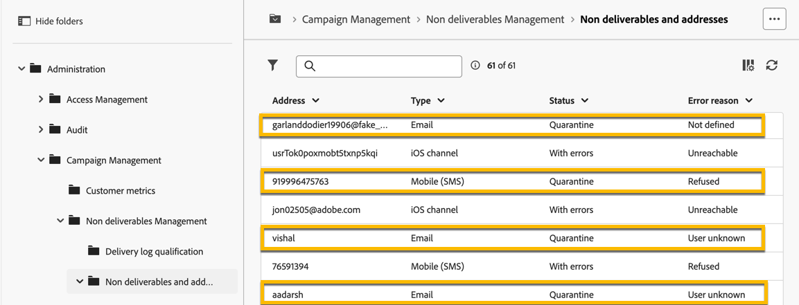

# 隔离

Adobe Campaign管理隔离地址（电子邮件、短信、推送通知）。

隔离仅适用于&#x200B;**电子邮件地址**、**电话号码**&#x200B;或&#x200B;**设备令牌**，而不适用于配置文件本身。 例如，其电子邮件地址被隔离的用户档案可以更新其用户档案并输入新地址，然后再次被投放操作定向。 同样，如果两个用户档案碰巧拥有相同的电话号码，那么隔离该号码将会同时影响这两个用户档案。

>[!CAUTION]
>
>Adobe Campaign中的隔离会区分大小写。

## 什么是隔离？

隔离是&#x200B;**管理投放**&#x200B;中的无效地址的方法。

如果投放的无效地址比率很高，则可能会将其视为垃圾邮件。 通过隔离管理这些地址可避免您被Internet提供商列入阻止列表。 这对你的声誉很重要。

在Adobe Campaign中隔离地址后，该用户档案将在投放分析期间自动从目标中排除。

隔离将帮助您通过从投放中排除错误的电话号码来降低SMS发送成本。

## 将地址添加到隔离区的原因

将地址添加到隔离区有许多原因：

- 对于短信，为错误的电话号码
- 对于短信，当用户档案回复带有关键词（如“STOP”）的短信消息时
- 对于电子邮件，当您的邮件报告为垃圾邮件时。 邮件会自动重定向到由Adobe管理的技术邮箱。 列入阻止列表随后，该用户的电子邮件地址会自动添加到隔离，且状态为。
- 例如，当邮箱已满、地址不存在或电子邮件服务器不可用时，可以隔离电子邮件地址。

[了解有关投放失败的更多信息](https://experienceleague.adobe.com/en/docs/campaign-classic/using/sending-messages/monitoring-deliveries/understanding-delivery-failures)

## 在何处查找隔离地址

您可以在&#x200B;**[!UICONTROL Explorer]** > **[!UICONTROL 管理]** > **[!UICONTROL Campaign Management]** > **[!UICONTROL 不可交付结果管理]** > **[!UICONTROL 不可交付结果和地址]**&#x200B;中查看实例的所有隔离地址。 此部分列出了电子邮件、短信和推送通知渠道的隔离元素。

{zoomable="yes"}

您还可以在实例中包含有关隔离的报告：

{zoomable="yes"}

对于每次投放，您还可以检查投放摘要报告：它显示投放目标中隔离的地址数：

{zoomable="yes"}

在Adobe Campaign控制台中管理隔离地址的可能性更大。 [了解详情](https://experienceleague.adobe.com/en/docs/campaign/campaign-v8/send/failures/quarantines#access-quarantined-addresses)
