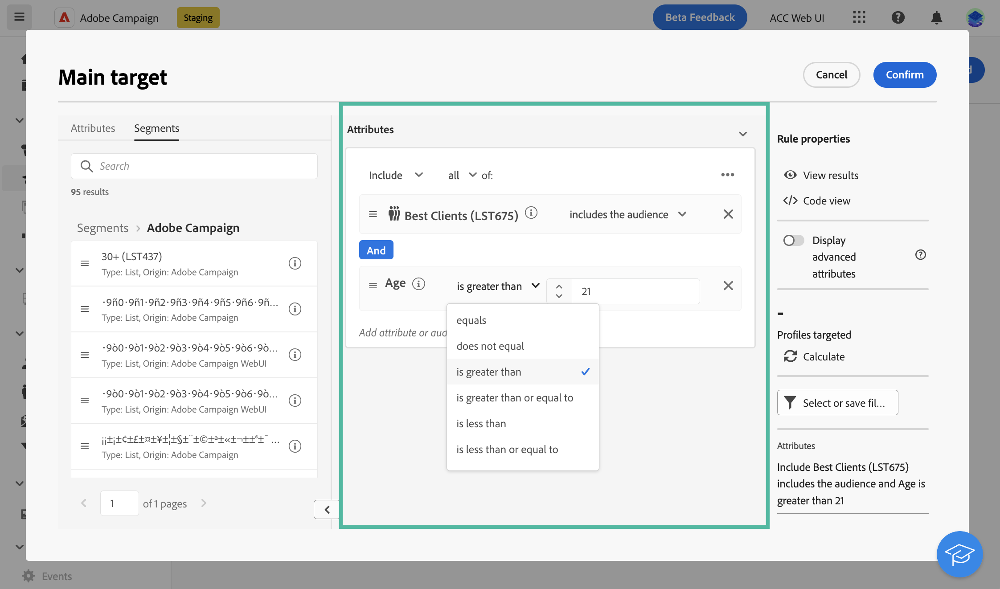
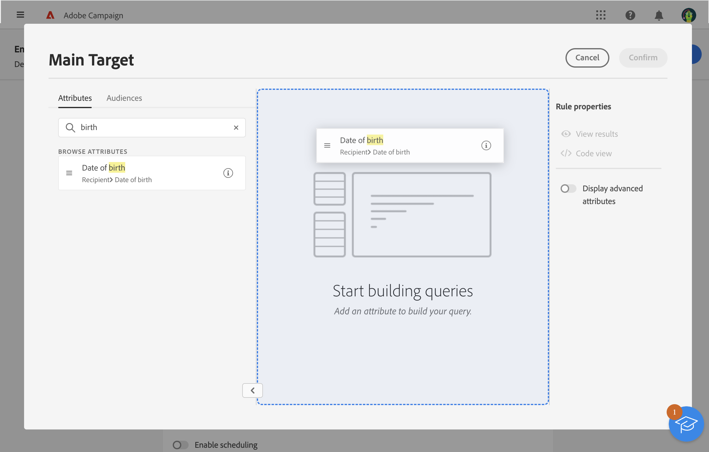
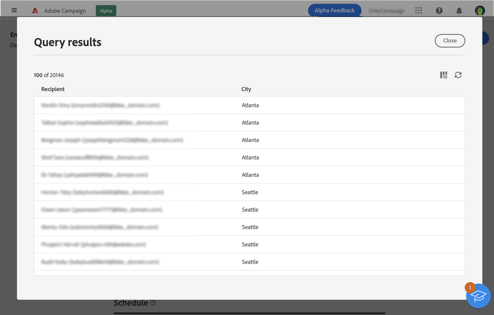

# 使用规则生成器 {#segment-builder}

规则生成器允许您通过过滤数据库中包含的数据来定义投放所定向的群体。 您可以使用它在工作流中构建受众。 **[!UICONTROL 构建受众]** 活动，或在创建投放以创建一次性受众时直接创建。

* [了解如何创建和保存受众](create-audience.md)
* [了解如何为投放创建一次性受众](one-time-audience.md)

## 面板

左侧的面板包含可筛选以创建受众的所有元素。您可以使用搜索栏快速查找元素。 必须将调色板中包含的拼贴移动到中心画布中，才能进行配置并加以考虑。

{width="70%" align="left"}

面板分为两个选项卡：

* **属性**：此选项卡可让您访问架构中的所有可用字段。字段列表取决于电子邮件模板中定义的定位架构。

* **受众**：利用此选项卡，可使用在“Campaign Classic”控制台中或从Adobe Experience Platform中定义的某个现有受众进行过滤。 了解如何在中监控和管理受众 [本节](manage-audience.md)

  >[!NOTE]
  >
  >要利用 Adobe Experience Platform 受众，您需要配置与 Destinations 的集成。请参阅 [Adobe Experience Platform目标文档](https://experienceleague.adobe.com/docs/experience-platform/destinations/home.html?lang=zh-Hans){target="_blank"}.

## 画布

画布是指位于中央的区域，您可以在其中根据从面板添加的元素来配置和组合规则。要添加新规则，请从面板中拖动一个磁贴并将其放到画布上。之后，将根据要添加的数据类型为您提供特定于上下文的选项。

{width="70%" align="left"}

## “规则属性”窗格

在右边， **规则属性** 窗格允许您执行下面列出的操作。

{width="70%" align="left"}

* **查看结果**：显示按受众定位的收件人的列表。
* **代码视图**：在 SQL 中显示基于代码的受众版本。
* **显示高级属性**：如果您要在左侧面板中查看完整属性列表，请选中此选项：节点、分组、1-1 链接、1-N 链接。
* **计算**：更新并显示查询所定向的用户档案数。
* **选择或保存筛选器**：使用预定义过滤器筛选查询，或将查询另存为新过滤器以供将来重用。 [了解如何使用预定义过滤器](../get-started/predefined-filters.md)

  >[!IMPORTANT]
  >
  >在该版本的产品中，用户界面中没有某些预定义过滤器。 但仍可使用这些它们。[了解详情](../get-started/guardrails.md#predefined-filters-filters-guardrails-limitations)

* **属性**：显示已创建受众的描述。

## 示例

在此示例中，我们生成了一个受众来定位所有居住在亚特兰大或西雅图的 1980 年之后出生的客户。

1. 在面板的&#x200B;**属性**&#x200B;选项卡中，搜索&#x200B;**出生日期**&#x200B;字段。拖动磁贴并将其放到画布上。

   

1. 在画布中，选择 **After** 运算符并输入所需日期。

   

1. 在面板中，搜索&#x200B;**城市**&#x200B;字段，并将其添加到画布中第一条规则的下方。

   

1. 在文本字段中，输入第一个城市名称，然后按 Enter。

   

1. 对第二个城市名称重复此操作。

   

1. 单击&#x200B;**查看结果**&#x200B;以显示与查询匹配的收件人的列表和数量。还可以添加列以可视化和检查数据。在我们的示例中，添加&#x200B;**城市**&#x200B;列，应看到亚特兰大和西雅图。

   

1. 单击&#x200B;**确认**。