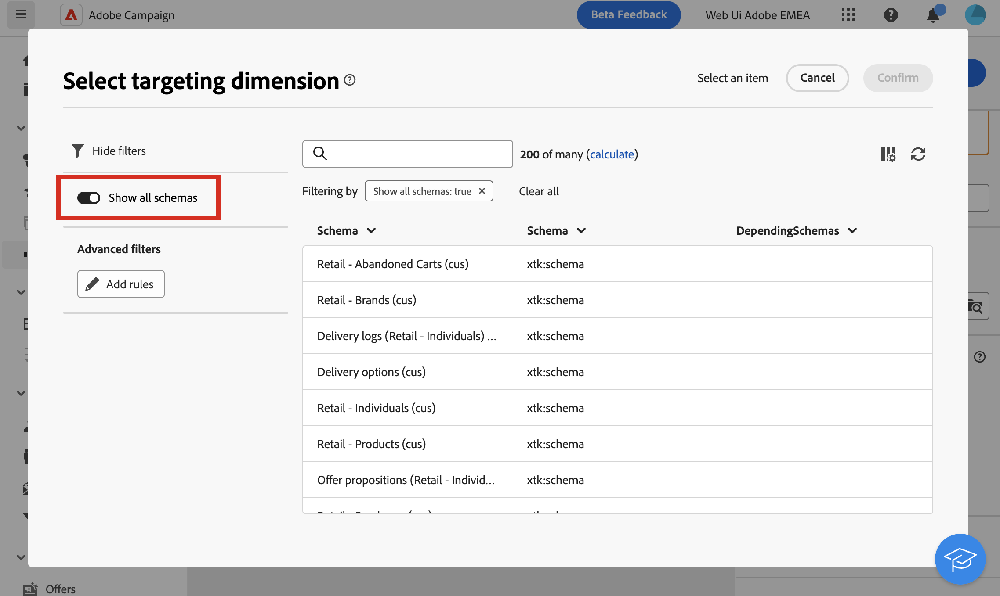

# 定位维度 {#targeting-dimensions}

>[!CONTEXTUALHELP]
>id="acw_orchestration_build_audience_dimension"
>title="选择定位维度"
>abstract="定位维度可让您定义操作的目标人群：收件人、合同受益人、操作人员、订阅者等。默认情况下从收件人中选择目标。"

目标维度，也就是。 目标映射，是操作所处理的数据类型。 它可让您定义目标群体：用户档案、合同受益人、操作员、订阅者等。

## 工作流的定位维度 {#workflow}

工作流的定向维度由第一个维度定义 **[!UICONTROL 构建受众]** 并用于所有后续活动，直到工作流结束。 例如，如果对数据库中的用户档案执行查询，则叫客过渡将包含“recipient”类型的数据，并将其传输到下一个活动。

请注意，您可以使用在工作流中切换定向维度 [更改维度活动](../workflows/activities/change-dimension.md). 例如，这可让您查询特定表（如购买或订阅）上的数据库，然后将定向维度更改为收件人，以将投放发送到相应的用户档案。

选择定向维度时(在工作流设置中，或在活动(例如 **构建受众**， **调解** 或 **更改维度**)，则默认情况下将在列表中显示一系列常用架构。 要显示所有可用的架构，请打开 **[!UICONTROL 显示所有架构]** 按钮。 将为每个用户保存选项选择。

{zoomable=&quot;yes&quot;}

## 定位维度 {#list}

默认情况下，电子邮件和短信投放模板会定向用户档案。 因此，其目标维度使用 **nms：recipient** 表格。 对于推送通知，默认目标维度为 **订阅者应用程序nms：appSubscriptionRcp**，链接到收件人表。

您还可以在下面列出的工作流和投放中使用其他内置目标映射：

| 名称 | 使用至 | 架构 |
|---|---|---|
| 收件人 | 投放到收件人（内置收件人表） | nms：recipient |
| 访客 | 向通过反向链接（病毒式营销）收集用户档案的访客投放，例如。 | mns：visitor |
| 订阅 | 发送给订阅了新闻稿等信息服务的收件人 | nms：subscription |
| 访客订阅 | 向订阅了信息服务的访客投放 | nms：visitorSub |
| 运算符 | 交付给Adobe Campaign操作员 | nms：operator |
| 外部文件 | 通过包含投放所需所有信息的文件投放 | 无链接架构，未输入目标 |
| 订阅者申请 | 投放到订阅了应用程序的收件人 | nms：appSubscriptionRcp |

此外，您可以根据需要创建新的目标映射。 此操作从客户端控制台执行。 了解详情，请参阅 [Campaign v8（客户端控制台）文档](https://experienceleague.adobe.com/docs/campaign/campaign-v8/audience/add-profiles/target-mappings.html#new-mapping){target="_blank"}.
