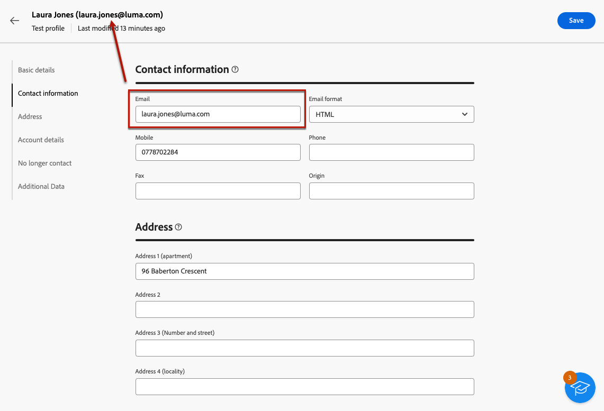

# 创建和管理测试轮廓 {#create-test-profiles}

>[!CONTEXTUALHELP]
>id="acw_recipients_testprofiles_menu"
>title="创建测试轮廓"
>abstract="测试轮廓是额外的收件人，以便您在发送消息之前预览和测试个性化和渲染。您可以在预览消息内容时选择测试轮廓，并将校样发送到测试轮廓，以控制和验证您的消息内容和设置。"

测试用户档案用于发送校样并验证消息内容和设置。 这些用户档案是额外的收件人，允许您在发送消息之前预览和测试个性化和呈现。 您可以在预览消息内容时选择测试用户档案，并向测试用户档案发送校样，以控制和验证消息内容和设置。

➡️ [通过观看视频了解此功能](#video)

<!--Learn more about test profiles in the [Campaign v8 (client console) documentation](https://experienceleague.adobe.com/docs/campaign/campaign-v8/audience/add-profiles/test-profiles.html?lang=zh-Hans){target="_blank"}.-->

在[此部分](../preview-test/test-deliveries.md#test-profiles)中详细说明了向测试用户档案发送校样的步骤。

>[!NOTE]
>
>* 测试用户档案在客户端控制台中创建为种子地址。
>
>* 测试配置文件自动从有关以下投放统计信息的报告中排除：**[!UICONTROL 点击次数]**、**[!UICONTROL 打开次数]**、**[!UICONTROL 取消订阅]**。

## 访问和管理测试用户档案 {#access-test-profiles}

要访问测试配置文件列表，请从左侧菜单中选择&#x200B;**[!UICONTROL 客户管理]** > **[!UICONTROL 配置文件]**，然后单击&#x200B;**[!UICONTROL 测试配置文件]**&#x200B;选项卡。

{zoomable="yes"}

* 您可以使用下拉列表对特定[文件夹](../get-started/permissions.md#folders)进行筛选，或者使用[查询建模器](../query/query-modeler-overview.md)添加规则。

  {zoomable="yes"}

* 您可以复制任何测试用户档案并根据需要对其进行更新。 编辑测试配置文件的步骤与[创建测试配置文件](#create-test-profile)时的步骤相同。

* 要删除测试配置文件，请从&#x200B;**[!UICONTROL 更多操作]**&#x200B;菜单中选择相应的选项。

  {zoomable="yes"}

* 要编辑测试用户档案，请在列表中单击所需的项目。 编辑测试配置文件的步骤与[创建测试配置文件](#create-test-profile)时的步骤相同。

您还可以通过&#x200B;**[!UICONTROL 资源管理器]**&#x200B;视图，从&#x200B;**[!UICONTROL 资源]** > **[!UICONTROL 促销活动管理]** > **[!UICONTROL 种子地址]**&#x200B;节点访问测试配置文件。

从该位置，您可以浏览、创建和管理文件夹或子文件夹，以及检查关联的权限。 [了解如何创建文件夹](../get-started/permissions.md#folders)

{zoomable="yes"}

从&#x200B;**[!UICONTROL 资源管理器]**&#x200B;视图中，您还可以筛选、删除、编辑和[创建](#create-test-profile)测试配置文件。

## 创建测试轮廓 {#create-test-profile}

>[!CONTEXTUALHELP]
>id="acw_recipients_testprofiles_additionaldata"
>title="测试轮廓其他数据"
>abstract="输入用于在数据管理工作流中创建的投放的个性化数据，以及要为其分配特定值的数据。"

要创建测试用户档案，请执行以下步骤：

1. 浏览到&#x200B;**[!UICONTROL 客户管理]** > **[!UICONTROL 配置文件]**，然后选择&#x200B;**[!UICONTROL 测试配置文件]**&#x200B;选项卡。

1. 单击&#x200B;**[!UICONTROL 创建测试配置文件]**&#x200B;按钮。

   {zoomable="yes"}

1. 根据需要填写测试用户档案的详细信息。<!--Most of the fields are the same as when creating profiles. [Learn more]-->

   {zoomable="yes"}

   >[!NOTE]
   >
   >**[!UICONTROL 标签]**&#x200B;字段会自动填写您所定义的名字和姓氏。

1. 默认情况下，测试配置文件存储在&#x200B;**[!UICONTROL 种子地址]**&#x200B;文件夹中。 您可以通过浏览到所需的位置来更改它。 [了解如何使用文件夹](../get-started/permissions.md#folders)

   <!--{zoomable="yes"}-->

<!--
You do not need to enter all fields of each tab when creating a seed address. Missing personalization elements are entered randomly during delivery analysis. (Not valid?)
-->

1. 在&#x200B;**[!UICONTROL 联系人信息]**&#x200B;部分中，输入电子邮件地址和其他相关数据。 电子邮件地址显示在测试用户档案标签后面的括号之间。

   {zoomable="yes"}

1. 如果选中&#x200B;**[!UICONTROL 不再联系（通过任何渠道）]**&#x200B;复选框，则测试配置文件将处于阻止列表状态。 任何渠道（电子邮件、短信等）不再定向此类收件人。

1. 在&#x200B;**[!UICONTROL 其他数据]**&#x200B;选项卡中，输入用于数据管理工作流中创建的投放且要为其分配特定值的个性化数据。 [了解有关工作流的详细信息](../workflows/gs-workflows.md)

   {zoomable="yes"}

   请确保已在&#x200B;**[!UICONTROL 扩充]**&#x200B;工作流活动中定义了其他目标数据，且别名以“@”开头。 否则，您无法将其与投放活动中的种子地址正确一起使用。 [了解有关扩充活动的更多信息](../workflows/activities/enrichment.md)

1. 单击&#x200B;**[!UICONTROL 保存]**&#x200B;按钮。

您刚刚创建的测试用户档案现已准备就绪，可用于发送校样。 [了解详情](../preview-test/test-deliveries.md#test-profiles)

<!--Use test profiles in Direct mail? cf v7/v8-->

## 操作说明视频 {#video}

了解如何使用Campaign Web用户界面创建和管理测试用户档案。

>[!VIDEO](https://video.tv.adobe.com/v/3442905?captions=chi_hans&quality=12)