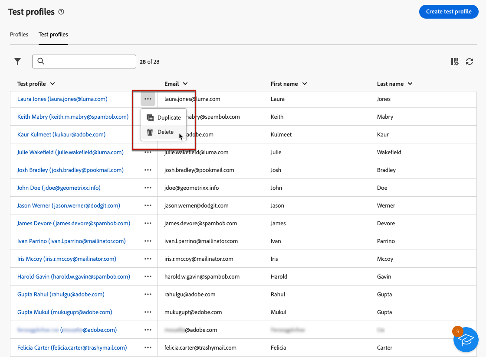

# 创建和管理测试用户档案 {#create-test-profiles}

>[!CONTEXTUALHELP]
>id="acw_recipients_testprofiles_menu"
>title="创建测试配置文件"
>abstract="测试用户档案作为种子地址创建。 它们是数据库中的附加收件人，用于定位不符合所定义的目标标准的虚拟用户档案。"

测试用户档案作为种子地址创建。 它们是数据库中的附加收件人，用于定位不符合所定义的目标标准的虚拟用户档案。 它们允许您在发送投放之前通过发送校样来预览和测试个性化和呈现。

<!--Learn more on test profiles in the [Campaign v8 (client console) documentation](https://experienceleague.adobe.com/docs/campaign/campaign-v8/audience/add-profiles/test-profiles.html){target="_blank"}.-->

有关将测试消息发送到种子地址的详细步骤，请参见 [本节](../preview-test/test-deliveries.md#test-profiles).

>[!NOTE]
>
>测试用户档案会自动从有关以下投放统计的报告中排除： **[!UICONTROL 点击次数]**， **[!UICONTROL 打开次数]**， **[!UICONTROL 取消订阅]**. [了解有关报告的更多信息]

## 访问和管理测试用户档案 {#access-test-profiles}

要访问测试配置文件列表，请选择 **[!UICONTROL 客户管理]** > **[!UICONTROL 配置文件]** 从左侧菜单中，单击 **[!UICONTROL 测试用户档案]** 选项卡。

* 您可以根据特定的 [文件夹](../get-started/permissions.md#folders) 使用下拉列表或使用添加规则 [查询建模器](../query/query-modeler-overview.md).

  

* 您可以复制任何测试用户档案并根据需要对其进行更新。 编辑测试用户档案的步骤与以下步骤相同： [创建测试用户档案](#create-test-profile).

* 要删除测试用户档案，请从 **[!UICONTROL 更多操作]** 菜单。

  

* 要编辑测试用户档案，请在列表中单击所需的项目。 编辑测试用户档案的步骤与以下步骤相同： [创建测试用户档案](#create-test-profile).

您还可以通过以下方式访问测试用户档案 **[!UICONTROL 资源管理器]** 视图，从 **[!UICONTROL 资源]** > **[!UICONTROL Campaign Management]** > **[!UICONTROL 种子地址]** 节点。

从该位置，您可以浏览、创建和管理文件夹或子文件夹，以及检查关联的权限。 [了解如何创建文件夹](../get-started/permissions.md#folders)

从 **[!UICONTROL 资源管理器]** 视图您还可以筛选、删除、编辑和 [创建](#create-test-profile) 测试用户档案。

## 创建测试用户档案 {#create-test-profile}

>[!CONTEXTUALHELP]
>id="acw_recipients_testprofiles_additionaldata"
>title="测试配置文件附加数据"
>abstract="输入个性化数据，该数据用于在Data Management工作流中创建的投放，并且您要将特定值分配给该数据。"

要创建测试用户档案，请执行以下步骤。

1. 浏览至 **[!UICONTROL 客户管理]** > **[!UICONTROL 配置文件]** 并选择 **[!UICONTROL 测试用户档案]** 选项卡。

1. 单击 **[!UICONTROL 创建测试用户档案]** 按钮。

   

1. 根据需要填写测试用户档案的详细信息。 <!--Most of the fields are the same as when creating profiles. [Learn more]-->

   

   >[!NOTE]
   >
   >此 **[!UICONTROL 标签]** 字段会自动填写您所定义的名字和姓氏。

1. 默认情况下，测试用户档案存储在 **[!UICONTROL 种子地址]** 文件夹。 您可以通过浏览到所需的位置来更改它。 [了解如何使用文件夹](../get-started/permissions.md#folders)

   

<!--
You do not need to enter all fields of each tab when creating a seed address. Missing personalization elements are entered randomly during delivery analysis. (Not valid?)
-->

1. 在 **[!UICONTROL 联系信息]** 部分，输入电子邮件地址和其他相关数据。 电子邮件地址显示在测试用户档案标签后面的括号之间。

   

1. 如果您选择 **[!UICONTROL 不再联系（通过任何渠道）]** 复选框，测试配置文件处于列入阻止列表状态。 任何渠道（电子邮件、短信等）不再定向此类收件人。

1. 在 **[!UICONTROL 其他数据]** 选项卡，输入用于在Data Management工作流中创建的投放且要为其分配特定值的个性化数据。 [了解有关工作流的更多信息](../workflows/gs-workflows.md)

   

   请确保已定义其他目标数据，并在中以“@”开头的别名 **[!UICONTROL 扩充]** 工作流活动。 否则，您无法将其与投放活动中的种子地址正确一起使用。 [了解有关扩充活动的更多信息](../workflows/activities/enrichment.md)

1. 单击 **[!UICONTROL 保存]** 按钮。

您刚刚创建的测试用户档案现已准备就绪，可用于发送测试。 [了解详情](../preview-test/test-deliveries.md#test-profiles)

<!--Use test profiles in Direct mail? cf v7/v8-->

