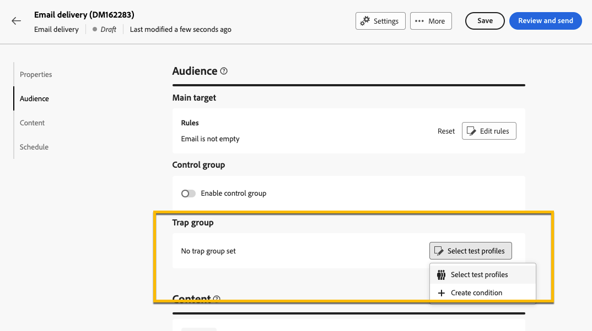

# 使用陷印组 {#trap-group}

>[!CONTEXTUALHELP]
>id="acw_homepage_welcome_rn3"
>title="陷印组"
>abstract="您可以使用陷印组将特定地址包含在您的投递中，通过定位不符合定义的目标条件的配置文件来监控和验证分发过程。"
>additional-url="https://experienceleague.adobe.com/docs/campaign-web/v8/release-notes/release-notes.html?lang=zh-Hans" text="请参阅发行说明"

**[!UICONTROL 陷阱组]**（也称为&#x200B;**[!UICONTROL 种子列表]**）用于在投放中包含特定地址，以通过定向不符合定义的目标条件的用户档案来监视和验证分发过程。 这样，超出投放范围的收件人可以像任何其他目标收件人一样接收投放。

**[!UICONTROL 陷阱组]**&#x200B;是Campaign Web用户界面上名为&#x200B;**[!UICONTROL 测试配置文件]**&#x200B;的一组&#x200B;**[!UICONTROL 种子地址]**。

## 为何使用陷阱组 {#why-trap-group}

您可以使用&#x200B;**[!UICONTROL 陷阱组]**：

1. **作为证明**： **[!UICONTROL 陷阱组]**&#x200B;的每个成员都将收到投放，就像他们属于受众一样。

1. **为了保护您的邮件列表**：如果邮件列表由第三方使用，通过接收受众将收到的内容，将注意到&#x200B;**[!UICONTROL 陷阱组]**&#x200B;的每个&#x200B;**[!UICONTROL 测试配置文件]**。

>[!NOTE]
>
>除了在创建投放](../email/create-email.md#preview-test)期间和从[控制组](control-group.md)中发送[验证外，添加陷阱组也是测试受众的好方法。

## 关于陷阱组 {#about-trap-group}

测试配置文件自动从有关以下投放统计信息的报告中排除：**点击次数**、**打开次数**、**取消订阅**。 这些报表只涉及真实受众。

对于电子邮件投放，**[!UICONTROL 陷阱组]**&#x200B;只需要电子邮件地址，Campaign将随机填充其他字段的个性化设置。

## 在投放中添加陷阱组 {#trap-group-in-delivery}

要设置&#x200B;**[!UICONTROL 陷阱组]**，请转到投放的&#x200B;**[!UICONTROL 受众]**&#x200B;设置。 您将有2个选项：

* [选择测试配置文件](#select-test-profile)
* [创建条件](#create-condition)

{zoomable="yes"}

### 选择测试配置文件 {#select-test-profiles}

当您选择&#x200B;**选择测试配置文件**&#x200B;时，可以使用&#x200B;**添加测试配置文件**&#x200B;按钮，如下所示：

{zoomable="yes"}

单击该按钮后，您便可以访问可以添加&#x200B;**[!UICONTROL 陷阱组]**&#x200B;的测试配置文件。 选择您要使用的库。

您还可以创建新的测试用户档案。 [了解详情](#create-seed)

{zoomable="yes"}

当您确认测试配置文件时，请检查您在&#x200B;**[!UICONTROL 陷阱组]**&#x200B;下是否具有正确的编号。

{zoomable="yes"}

### 创建条件 {#create-condition}

使用&#x200B;**[!UICONTROL 创建条件]**&#x200B;选项，您可以创建查询以定义要使用的测试用户档案：

{zoomable="yes"}

您的查询显示在&#x200B;**[!UICONTROL 陷阱组]**&#x200B;下。

{zoomable="yes"}

## 创建新的测试配置文件 {#create-seed}

您可以从&#x200B;**[!UICONTROL 资源管理器]** > **[!UICONTROL 资源]** > **[!UICONTROL Campaign Management]** > **[!UICONTROL 种子成员]**&#x200B;文件夹创建新的&#x200B;**[!UICONTROL 测试配置文件]**。

{zoomable="yes"}

将&#x200B;**[!UICONTROL 测试配置文件]**&#x200B;的所有设置配置为任何配置文件：

{zoomable="yes"}
