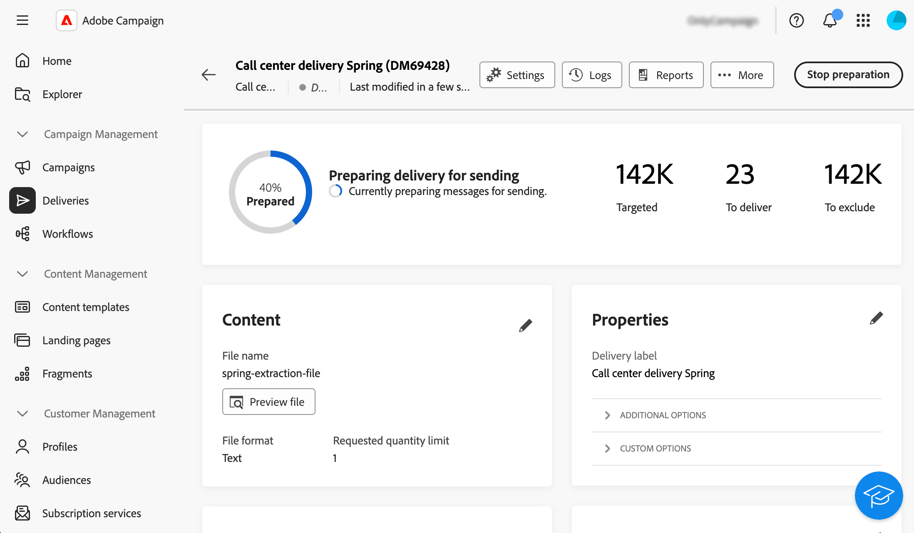

# 创建并发送呼叫中心投放 {#create-call-center}

您可以创建独立的呼叫中心投放，或在活动工作流的上下文中创建一个。 以下步骤详细介绍了独立（一次性）投放的过程。 如果您在营销活动工作流的上下文中工作，有关创建步骤的详情，请参阅[此部分](../workflows/activities/channels.md#create-a-delivery-in-a-campaign-workflow)。

要创建并发送新的独立呼叫中心投放，请执行以下步骤：

1. 创建投放，[了解更多](#create-delivery)
1. 定义受众，[了解更多](#select-audience)
1. 编辑内容，[阅读更多](#edit-content)
1. 预览并发送投放，[了解更多](#preview-send)

## 创建投放{#create-delivery}

请按照以下步骤创建投放并配置其属性：

1. 选择&#x200B;**[!UICONTROL 投放]**&#x200B;菜单并单击&#x200B;**[!UICONTROL 创建投放]**&#x200B;按钮。

1. 选择&#x200B;**[!UICONTROL 呼叫中心]**&#x200B;作为渠道，然后单击&#x200B;**[!UICONTROL 创建投放]**&#x200B;以进行确认。

   {zoomable="yes"}

   >[!NOTE]
   >
   >如果要选择其他模板，请参阅此[页面](../msg/delivery-template.md)。

1. 在&#x200B;**[!UICONTROL 属性]**&#x200B;下，输入投放的&#x200B;**[!UICONTROL 标签]**。 此[部分](../email/create-email.md#create-email)中详细介绍了其他选项。

   {zoomable="yes"}

>[!NOTE]
>
>您可以计划在特定日期发送投放。 有关更多信息，请参阅此](../msg/gs-deliveries.md#gs-schedule)章节[。

## 定义受众{#select-audience}

现在，您需要定义提取文件将定向的受众。

1. 在投放页面的&#x200B;**[!UICONTROL 受众]**&#x200B;部分中，单击&#x200B;**[!UICONTROL 选择受众]**。

   {zoomable="yes"}

1. 选择现有受众或创建您自己的受众。

   * [了解如何选择现有受众](../audience/add-audience.md)
   * [了解如何创建新受众](../audience/one-time-audience.md)

   {zoomable="yes"}

>[!NOTE]
>
>呼叫中心收件人必须至少包含其姓名和电话号码。 所有信息不完整的收件人都将排除在呼叫中心投放之外。
>
>要了解如何配置控制组，请参阅此[页面](../audience/control-group.md)。

## 编辑内容{#edit-content}

现在，让我们编辑将由呼叫中心投放生成的提取文件的内容。

1. 在投放页面中，单击&#x200B;**[!UICONTROL 编辑内容]**&#x200B;按钮。

   {zoomable="yes"}

1. 指定&#x200B;**[!UICONTROL 文件名]**。 要了解如何个性化文件名，请参阅此[页面](../personalization/personalize.md)。

1. 选择&#x200B;**[!UICONTROL 文件格式]**：**文本**、**使用固定宽度列的文本**、**CSV (Excel)**&#x200B;或&#x200B;**XML**。

   {zoomable="yes"}

   >[!NOTE]
   >
   >此[页面](../direct-mail/content-direct-mail.md#properties)中详细介绍了提取格式选项。

1. 如果无法限制投放的收件人数量，请打开&#x200B;**[!UICONTROL 请求的数量]**&#x200B;选项。

1. 在&#x200B;**[!UICONTROL Content]**&#x200B;部分中，单击&#x200B;**[!UICONTROL 添加属性]**&#x200B;按钮创建一个新列以在提取文件中显示。

1. 选择要显示在列中的属性，然后确认。 有关如何选择属性并将其添加到收藏夹的详细信息，请参阅此[页面](../get-started/attributes.md)。

   

1. 重复这些步骤以根据需要为提取文件添加任意数量的列。

   然后，您可以编辑属性、对提取文件排序或更改列的位置。 有关详细信息，请参见此 [ 页面](../direct-mail/content-direct-mail.md#content)。

   

## 预览并发送投放{#preview-send}

当投放内容准备就绪时，您可以使用测试用户档案预览该内容并发送校样。 然后，您可以发送呼叫中心投放以生成提取文件。

预览和发送提取文件的主要步骤如下。 [此页面](../direct-mail/send-direct-mail.md)中提供了更多详细信息。

1. 在投放内容页面中，单击&#x200B;**[!UICONTROL 模拟内容]**&#x200B;按钮。

   {zoomable="yes"}

1. 选择一个或多个测试配置文件以预览个性化内容。 您还可以发送校样。 [了解更多信息](../direct-mail/send-direct-mail.md#preview-dm)

   {zoomable="yes"}

1. 在投放页面中，单击&#x200B;**[!UICONTROL 审阅并发送]**。

   {zoomable="yes"}

1. 单击&#x200B;**[!UICONTROL 准备]**&#x200B;并监视提供的进度和统计信息，然后确认。

   {zoomable="yes"}

1. 单击&#x200B;**[!UICONTROL 发送]**&#x200B;以继续执行最终发送过程，然后确认。

发送投放后，将自动生成提取文件并将其导出到在投放模板的&#x200B;**[!UICONTROL 高级设置]**&#x200B;中选择的[路由](../advanced-settings/delivery-settings.md)外部帐户中指定的位置。 您还可以通过单击屏幕&#x200B;**Content**&#x200B;部分中的&#x200B;**Preview file**&#x200B;按钮预览文件。

跟踪投放页面中的KPI（关键绩效指标）数据和&#x200B;**[!UICONTROL 日志]**&#x200B;菜单中的数据。

开始使用内置报告衡量消息的影响。 [了解详情](../reporting/direct-mail.md)
