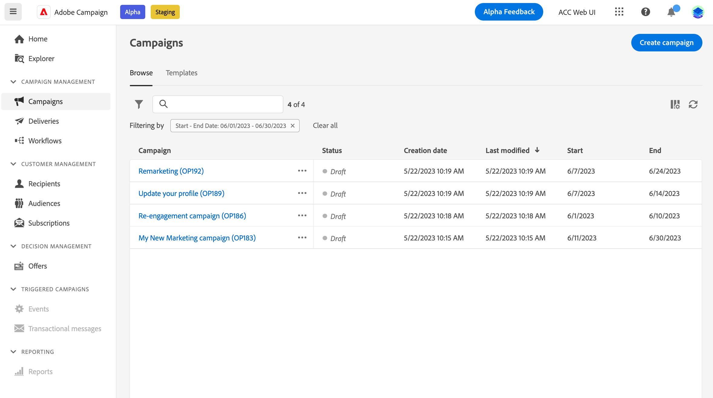

# 开始使用营销活动 {#campaigns}

使用Adobe Campaign建立跨頻道行銷活動。 透過其行銷活動協調功能，您可以管理和集中客戶資料、設計客戶通訊和行銷活動，以建立不同管道的個人化體驗。 電子郵件、推播和簡訊頻道可供使用。

針對所有平台和熒幕大小，設計和執行非大量電子郵件行銷活動，以傳遞個人化訊息。
<!--Measure the effectiveness of your deliveries with detailed reports including thecounts of opens, clicks, forwards, and more.--> 透過Adobe Campaign細分功能，您可以針對大量資料庫執行查詢，並輕鬆定義動態行銷區段，以完美鎖定您的行銷活動。

## 建立跨頻道行銷活動 {#cross-channel-campaign}

在跨渠道营销活动中，单个营销通信使用不同的渠道。 数据在各渠道之间传递。 例如，客户基于他们与先前通信的交互通过多个渠道接收通信。

## 定義您的行銷活動屬性 {#campaign-properties}

>[!CONTEXTUALHELP]
>id="acw_campaign_creation_properties"
>title="Campaign 创建属性"
>abstract="定義行銷活動的屬性和中繼資料。"

>[!CONTEXTUALHELP]
>id="acw_campaign_properties"
>title="Campaign 属性"
>abstract="定義您的Campaign設定和中繼資料。"

行銷活動屬性會在建立新行銷活動時顯示。

您也可以從以下位置存取行銷活動屬性： **設定行銷活動設定** 圖示，位於行銷活動標籤旁。

在此畫面中，您可以變更：

## 定義您的行銷活動排程 {#campaign-schedule}

>[!CONTEXTUALHELP]
>id="acw_campaign_creation_schedule"
>title="Campaign 创建计划"
>abstract="使用行銷活動屬性的「排程」區段來選取其時間範圍。 行銷活動在到達開始日期時開始。"

使用 **排程** 促銷活動屬性的區段來選取其時間範圍。 行銷活動在到達開始日期時開始。

開始和結束日期會顯示在行銷活動清單中，並可作為篩選條件使用。

若要依行銷活動排程進行篩選，請開啟篩選器，然後使用 **開始 — 結束日期** 區段：

