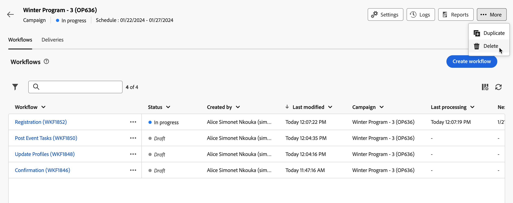

# 访问和管理营销活动{#manage-campaigns}

>[!CONTEXTUALHELP]
>id="acw_campaign_schedule"
>title="营销活动计划"
>abstract="设置或修改营销活动计划。"

要访问和管理营销策划，请单击 **[!UICONTROL 营销活动]** 菜单。

## 活动列表 {#access-campaigns}

在营销活动列表中，有两个选项卡可用：

* **浏览**&#x200B;选项卡将列出所有现有的营销活动。您可以单击一个营销活动以打开其仪表板，也可以通过单击&#x200B;**创建营销活动**&#x200B;按钮来创建新的营销活动。请参阅此[章节](create-campaigns.md#create-campaigns)。

* **模板**&#x200B;选项卡将列出所有可用的营销活动模板。您可以查看现有模板或创建新模板。 [阅读更多](#manage-campaign-templates)。

默认情况下，列表中的每个营销活动都会显示有关其当前状态、开始和结束日期、创建日期、上次修改时间等的信息。

可以通过单击列表右上角的&#x200B;**为自定义版面配置列**&#x200B;图标来自定义显示的列。这允许您添加或删除列，并对营销活动列表中的信息重新排序。

此外，还可使用搜索栏和过滤器以便在列表中轻松搜索。[了解详情](../get-started/user-interface.md#list-screens)。

例如，您可以根据营销活动计划进行过滤。打开过滤器面板并使用&#x200B;**开始 - 结束日期**&#x200B;部分：

## 营销活动仪表板 {#campaign-dashboard}

>[!CONTEXTUALHELP]
>id="acw_campaign_delivery_list"
>title="营销活动中的投放的列表"
>abstract="**投放**&#x200B;选项卡列出所有链接到当前营销活动的投放。单击投放的名称以编辑该投放。使用“创建投放”按钮为此营销活动添加新的投放。"

>[!CONTEXTUALHELP]
>id="acw_campaign_workflow_list"
>title="Campaign 中的工作流列表"
>abstract="Campaign 中的工作流列表"

在 **浏览** 选项卡上，单击促销活动名称以显示其详细信息。

营销活动的状态和计划将显示在屏幕顶部。您可以使用 **设置** 按钮更新营销活动的属性，如其标签、文件夹和描述。 您还可以从设置屏幕更改营销活动计划。 在中了解有关营销活动计划的更多信息 [本节](create-campaigns.md#campaign-schedule).

在活动仪表板中，使用 **日志** 和 **报表** 用于监视营销活动的按钮。 在本节中了解详情 [部分](create-campaigns.md#create-campaigns)

对于每个活动，仪表板都显示两个主要选项卡：工作流和投放。

* 此 **工作流** 选项卡列出了与活动关联的所有工作流。 此选项卡还可让您在营销活动中创建新的工作流。请参阅此[章节](create-campaigns.md#create-campaigns)。

* 此 **投放** 选项卡列出了在当前营销活动中创建的所有投放。 您还可以在营销活动中创建新的投放。请参阅此[章节](create-campaigns.md#create-campaigns)。

>[!NOTE]
>
>**投放**&#x200B;选项卡显示所有链接到该营销活动的投放。但是，无法从那里删除在工作流中创建的投放。要删除在工作流的上下文中创建的投放，必须从该工作流中删除投放活动。[了解详情](../msg/gs-messages.md#delivery-delete)。

## 删除活动 {#campaign-delete}

您可以通过两种方式删除营销策划：

* 从营销活动列表中，单击省略号按钮，然后选择 **删除**

  

* 在营销策划中，单击 **更多** 按钮，然后选择 **删除**

  

## 复制营销活动 {#campaign-duplicate}

您可以通过两种方式复制营销策划：

* 从营销活动列表中，单击省略号按钮，然后选择 **复制**

* 在营销策划中，单击 **更多** 按钮，然后选择 **复制**

在这两种情况下，确认复制以创建新营销策划。 营销活动的标签 **副本`<label of the initial campaign`**. 浏览到Campaign设置以更新此标签。

## 使用活动模板{#manage-campaign-templates}

营销活动模板包含预配置的设置，可重复用于创建新营销活动。 提供了一组内置模板来帮助您入门。 您可以创建和配置活动模板，然后从这些模板创建活动。

活动模板可以存储以下信息：

* 营销活动 **设置**
* 营销活动  **计划**
* 工作流模板
* 投放模板

要创建营销活动模板，请执行以下步骤：

1. 单击 **[!UICONTROL 营销活动]** 菜单，浏览到 **模板** 选项卡，然后单击 **[!UICONTROL 创建模板]** 按钮。
1. 选择 **模板** 以使用。 这样，您就可以基于之前创建的模板创建新模板。
1. 为模板提供标签。
1. 如果需要，可以更改以下内容 **其他选项**：内部名称、文件夹、被分派人、描述和性质。
1. 定义 **计划** 您的营销活动中的。 了解如何在中设置活动计划 [本节](create-campaigns.md#campaign-schedule)
1. 单击 **创建**.
1. 将工作流和投放模板添加到您的营销活动。
