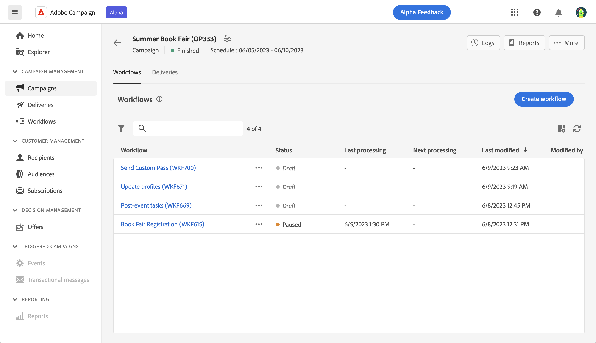

# 访问和管理营销活动{#manage-campaigns}

>[!CONTEXTUALHELP]
>id="acw_campaign_schedule"
>title="营销活动计划"
>abstract="设置或修改营销活动计划。"

要创建新的营销活动或管理现有的营销活动，请单击左侧导航上的&#x200B;**[!UICONTROL 营销活动]**&#x200B;菜单。

## 营销活动列表{#access-campaigns}

在营销活动列表中，有两个选项卡可用：

* **浏览**&#x200B;选项卡将列出所有现有的营销活动。您可以单击一个营销活动以打开其仪表板，也可以通过单击&#x200B;**创建营销活动**&#x200B;按钮来创建新的营销活动。请参阅此[章节](create-campaigns.md#create-campaigns)。

* **模板**&#x200B;选项卡将列出所有可用的营销活动模板。已预配置营销活动模板，以便在创建新的营销活动时重用这些模板。它们是从客户端控制台创建的。[了解更多信息](https://experienceleague.adobe.com/docs/campaign/automation/campaign-orchestration/marketing-campaign-templates.html?lang=zh-Hans)

默认情况下，列表中的每个营销活动都显示有关其当前状态、创建日期、上次修改时间等方面的信息。

可以通过单击列表右上角的&#x200B;**为自定义版面配置列**&#x200B;图标来自定义显示的列。这将允许您向列表中添加其他信息。此外，还可使用搜索栏和过滤器以便在列表中轻松搜索。[了解详情](../get-started/user-interface.md#list-screens)。

例如，您可以根据营销活动计划进行过滤。打开过滤器面板并使用&#x200B;**开始 - 结束日期**&#x200B;部分：

## 营销活动仪表板{#campaign-dashboard}

在营销活动列表的&#x200B;**浏览**&#x200B;选项卡中，单击营销活动以显示其详细信息。

营销活动的状态和计划将显示在屏幕顶部。可以使用&#x200B;**配置营销活动设置**&#x200B;图标来修改在创建营销活动时定义的营销活动属性。提供了三个按钮，供您查看日志、报告、复制或删除营销活动。请参阅此[章节](create-campaigns.md#create-campaigns)

提供了以下两个选项卡：

* **工作流**&#x200B;选项卡将列出链接到营销活动的所有工作流。此选项卡还可让您在营销活动中创建新的工作流。请参阅此[章节](create-campaigns.md#create-campaigns)。

* **投放**&#x200B;选项卡列出所有链接到当前营销活动的投放。您还可以在营销活动中创建新的投放。请参阅此[章节](create-campaigns.md#create-campaigns)。

## 重复和删除营销活动

可重复或删除营销活动：

* 从营销活动的列表中，单击省略号按钮，然后选择&#x200B;**重复**&#x200B;或&#x200B;**删除**。
* 从营销活动本身中，单击&#x200B;**更多**&#x200B;按钮，然后选择&#x200B;**重复**&#x200B;或&#x200B;**删除**。

>[!NOTE]
>
>**投放**&#x200B;选项卡显示所有链接到该营销活动的投放。但是，无法从那里删除在工作流中创建的投放。要删除在工作流的上下文中创建的投放，必须从该工作流中删除投放活动。[了解详情](../msg/gs-messages.md#delivery-delete)。
