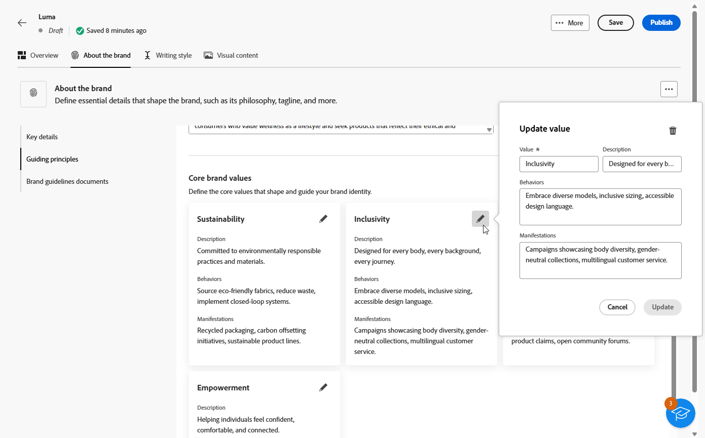

# 个性化您的品牌 {#brands-personalize}

要创建全面的品牌套件以确保所有内容和渠道的一致性，请配置以下四个选项卡，每个选项卡侧重于品牌标识的不同方面：

* **[!UICONTROL 关于品牌]**&#x200B;建立品牌的核心标识和值。
* **[!UICONTROL 书写样式]**&#x200B;定义语言和内容标准。
* **[!UICONTROL 视觉内容]**&#x200B;设置图像和设计准则。
* **[!UICONTROL 颜色]**&#x200B;管理您品牌的颜色系统和使用情况。

配置后，您可以使用品牌指南来验证内容质量和品牌一致性。 [了解有关内容质量验证的更多信息](brands-score.md#validate-quality)

## 关于品牌 {#about-brand}

使用&#x200B;**[!UICONTROL 关于品牌]**&#x200B;选项卡建立品牌的核心标识 — 概述其用途、个性、标语和其他定义属性。

1. 首先在&#x200B;**[!UICONTROL 关键详细信息]**&#x200B;类别中填写品牌的基本信息：

   * **[!UICONTROL 品牌套件名称]**：输入您的品牌套件名称。

   * **[!UICONTROL 何时使用]**：指定应应用此品牌套件的方案或上下文。

   * **[!UICONTROL 品牌名称]**：输入品牌的正式名称。

   * **[!UICONTROL 品牌描述]**：提供此品牌代表的概述。

   * **[!UICONTROL 默认标语]**：添加与品牌关联的主要标语。

     

1. 在&#x200B;**[!UICONTROL 指导原则]**&#x200B;类别中，阐明品牌的核心方向和理念：

   * **[!UICONTROL 任务]**：详细描述您的品牌目的。

   * **[!UICONTROL 愿景]**：描述您的长期目标或期望的未来状态。

   * **[!UICONTROL 市场定位]**：说明您的品牌在市场中的定位。

   

1. 在&#x200B;**[!UICONTROL 核心品牌值]**&#x200B;类别中，单击以添加品牌的核心值并填写详细信息：

   * **[!UICONTROL 值]**：命名核心品牌值。

   * **[!UICONTROL 描述]**：说明该值对于您的品牌意味着什么。

   * **[!UICONTROL 行为]**：概述在实践中反映此值的操作或态度。

   * **[!UICONTROL 表现形式]**：举例说明如何以真实世界的品牌形式表示此值。

     

1. 如果需要，请单击图标以更新或删除您的核心品牌价值之一。

   

您现在可以进一步个性化您的品牌或[发布您的品牌](#create-brand-kit)。

## 写作风格 {#writing-style}

**[!UICONTROL 书写样式]**&#x200B;部分概述了书写内容的标准，详细说明了如何使用语言、格式和结构来保持所有材料的清晰度、一致性和一致性。

+++ 可用类别和示例

<table>
  <thead>
    <tr>
      <th>类别</th>
      <th>子类别</th>
      <th>准则示例</th>
      <th>排除项示例</th>
    </tr>
  </thead>
  <tbody>
    <tr>
      <td rowspan="4">内容创建标准</td>
      <td>品牌报文传送标准</td>
      <td>强调创新和客户至上的报文传送。</td>
      <td>不要过度承诺产品功能。</td>
    </tr>
    <tr>
      <td>标语用法</td>
      <td>在所有数字营销资源上的徽标下放置标语。</td>
      <td>请勿修改或翻译标语。</td>
    </tr>
    <tr>
      <td>核心消息</td>
      <td>强调关键优势陈述 — 如提高生产效率。</td>
      <td>请勿使用不相关的值建议。</td>
    </tr>
    <tr>
      <td>命名标准</td>
      <td>使用简单的描述性名称，如“ProScheduler”。</td>
      <td>请勿使用复杂术语或特殊字符。</td>
    </tr>
    <tr>
      <td rowspan="5">品牌沟通风格</td>
      <td>品牌人格特征</td>
      <td>友好平易近人。</td>
      <td>别失败了。</td>
    </tr>
    <tr>
      <td>书写力学</td>
      <td>保持句子简短并有影响力。</td>
      <td>不要用过多的行话。</td>
    </tr>
    <tr>
      <td>情景色调</td>
      <td>在危机沟通中保持专业语调。</td>
      <td>在支持性通信中不要轻视。</td>
    </tr>
    <tr>
      <td>Word选择准则</td>
      <td>用“创新”和“聪明”等词语。</td>
      <td>避免使用“廉价”或“黑客”之类的词语。</td>
    </tr>
    <tr>
      <td>语言标准</td>
      <td>遵循美式英语惯例。</td>
      <td>不要混用英美两种语言。</td>
    </tr>
    <tr>
      <td rowspan="3">法律合规性标准</td>
      <td>商标标准</td>
      <td>始终使用™或®符号。</td>
      <td>必要时，请勿忽略法律符号。</td>
    </tr>
    <tr>
      <td>版权标准</td>
      <td>在营销材料中包含版权声明。</td>
      <td>未经许可，请勿使用第三方内容。</td>
    </tr>
    <tr>
      <td>免责声明标准</td>
      <td>在数字资产上清楚地显示免责声明。</td>
      <td>请勿隐藏非可见区域中的免责声明。</td>
    </tr>
</table>

+++

 

个性化您的&#x200B;**[!UICONTROL 书写样式]**：

1. 在&#x200B;**[!UICONTROL 写入样式]**&#x200B;选项卡中，单击以添加准则、异常或排除项。

1. 输入您的指南、例外或排除项。 您还可以包括&#x200B;**[!UICONTROL 示例]**&#x200B;以更好地说明应如何应用它。

   

1. 为准则、异常或排除指定&#x200B;**[!UICONTROL 使用上下文]**：

   * **[!UICONTROL 渠道类型]**：选择应用此准则、异常或排除项的位置。 例如，您可能希望特定书写样式仅显示在电子邮件、移动设备、打印或其他通信渠道中。

   * **[!UICONTROL 元素类型]**：指定应用规则的内容元素。 这可能包括标题、按钮、链接或内容中的其他组件等元素。

   

1. 设置指南、例外或排除项后，单击&#x200B;**[!UICONTROL 添加]**。
1. 如果需要，请选择要更新或删除的准则或排除项。

1. 单击以编辑您的示例，或单击图标以删除它。

   

您现在可以进一步个性化您的品牌或[发布您的品牌](#create-brand-kit)。

## 视觉内容 {#visual-content}

**[!UICONTROL 可视化内容]**&#x200B;部分定义了图像和设计的标准，详细说明了保持统一和一致的品牌外观所需的规范。

+++ 可用类别和示例

<table>
  <thead>
    <tr>
      <th>类别</th>
      <th>准则示例</th>
      <th>排除项示例</th>
    </tr>
  </thead>
  <tbody>
    <tr>
      <td>摄影标准</td>
      <td>户外拍摄时使用自然光线。</td>
      <td>避免过度编辑或像素化的图像。</td>
    </tr>
    <tr>
      <td>插图标准</td>
      <td>使用简洁、极简的风格。</td>
      <td>避免过于复杂。</td>
    </tr>
    <tr>
      <td>图标标准</td>
      <td>使用一致的24像素网格系统。</td>
      <td>请勿混合图标尺寸、使用不一致的描边粗细或偏离网格规则。</td>
    </tr>
    <tr>
      <td>使用指南</td>
      <td>选择反映真实客户在专业环境中使用该产品的生活方式形象。</td>
      <td>请勿使用与品牌风格相抵触或看起来与上下文不相干的图像。</td>
    </tr>
</table>

+++

 

要个性化您的&#x200B;**[!UICONTROL 可视化内容]**，请执行以下操作：

1. 在&#x200B;**[!UICONTROL 可视内容]**&#x200B;选项卡中，单击以添加指南、排除项或示例。

1. 输入您的指南、排除项或示例。

   

1. 为准则或排除项指定&#x200B;**[!UICONTROL 使用上下文]**：

   * **[!UICONTROL 渠道类型]**：选择应用此准则、异常或排除项的位置。 例如，您可能希望特定书写样式仅显示在电子邮件、移动设备、打印或其他通信渠道中。

   * **[!UICONTROL 元素类型]**：指定应用规则的内容元素。 这可能包括标题、按钮、链接或内容中的其他组件等元素。

     

1. 设置指南、例外或排除项后，单击&#x200B;**[!UICONTROL 添加]**。

1. 要添加显示正确用法的图像，请选择&#x200B;**[!UICONTROL 示例]**&#x200B;并单击&#x200B;**[!UICONTROL 选择图像]**。 您还可以添加显示不正确用法的图像作为排除示例。

   

1. 选择一个要更新或删除的准则或排除项。

1. 选择一个指南或排除项以更新它。 单击图标以将其删除。

   

您现在可以进一步个性化您的品牌或[发布您的品牌](#create-brand-kit)。

## 颜色 {#colors}

**[!UICONTROL 颜色]**&#x200B;部分介绍了品牌颜色系统的标准，概述了如何在体验间选择、组织和应用颜色。 它确保了一致地使用主要颜色、次要颜色、强调色和中性颜色，以保持有凝聚力、可访问和可识别的品牌标识。

+++ 可用类别和示例

<table>
  <thead>
    <tr>
      <th>类别</th>
      <th>准则示例</th>
      <th>排除项示例</th>
    </tr>
  </thead>
  <tbody>
    <tr>
      <td>主要颜色</td>
      <td>对徽标、标题和主要call-to-action元素使用主要品牌颜色。</td>
      <td>请勿替换或修改主要品牌颜色。</td>
    </tr>
    <tr>
      <td>次要颜色</td>
      <td>使用辅助颜色支持布局、插图和UI组件。</td>
      <td>不要让次要颜色超过主要品牌颜色。</td>
    </tr>
    <tr>
      <td>重点颜色</td>
      <td>请谨慎使用强调色来显示按钮、链接和警报。</td>
      <td>对于较大的背景区域，请勿使用强调色。</td>
    </tr>
    <tr>
      <td>中性色</td>
      <td>对文本、分隔线、边框和细微UI元素使用中性色。</td>
      <td>避免使用对比度差或色度投射较重的中性色。</td>
    </tr>
    <tr>
      <td>背景颜色</td>
      <td>使用浅色或中性背景以确保可读性和视觉清晰度。</td>
      <td>请勿在低对比度背景上放置文本或徽标。</td>
    </tr>
    <tr>
      <td>其他颜色</td>
      <td>仅将数据可视化或批准的营销活动使用其他颜色。</td>
      <td>不要引入未经批准或品牌外颜色。</td>
    </tr>
    <tr>
      <td>颜色比例</td>
      <td>对UI状态（例如悬停、活动和禁用）使用批准的色调和底纹。</td>
      <td>请勿创建非官方的阴影或渐变。</td>
    </tr>
    <tr>
      <td>使用指南</td>
      <td>在所有资产中保持一致的颜色使用率和可访问的对比度。</td>
      <td>请勿混合冲突的调色板或应用颜色不一致。</td>
    </tr>
</table>

+++

 

个性化您的&#x200B;**[!UICONTROL 颜色]**：

1. 在&#x200B;**[!UICONTROL 颜色]**&#x200B;选项卡中，单击以添加颜色、准则或排除项。

1. 输入颜色信息以准确定义它：

   * **颜色名称**：提供一个清晰的描述性名称，以标识品牌系统中的颜色。

   * **颜色值**：使用色相选择器选择您的颜色，或使用RGB、十六进制或Pantone名称/代码输入精确值，以确保数字资源和打印资源的一致性。

   

1. 检查您的选择以确认准确性和视觉一致性，然后单击&#x200B;**[!UICONTROL 添加]**&#x200B;保存您的颜色。

1. 然后，输入您的准则或排除项。

1. 指定指南或排除项的使用上下文：

   * **[!UICONTROL 渠道类型]**：选择应用此准则、异常或排除项的位置。 例如，您可能希望特定书写样式仅显示在电子邮件、移动设备、打印或其他通信渠道中。

   * **[!UICONTROL 元素类型]**：指定应用规则的内容元素。 这可能包括标题、按钮、链接或内容中的其他组件等元素。

     

1. 设置指南、例外或排除项后，单击&#x200B;**[!UICONTROL 添加]**。

1. 如果需要，请选择要更新或删除的准则或排除项。

1. 选择一个指南或排除项以更新它。 单击图标以将其删除。

   

1. 单击&#x200B;**[!UICONTROL 添加群组]**&#x200B;为您的品牌定义其他颜色或添加色阶群组。

您现在可以进一步个性化您的品牌或[发布您的品牌](brands.md#create-brand-kit)。

