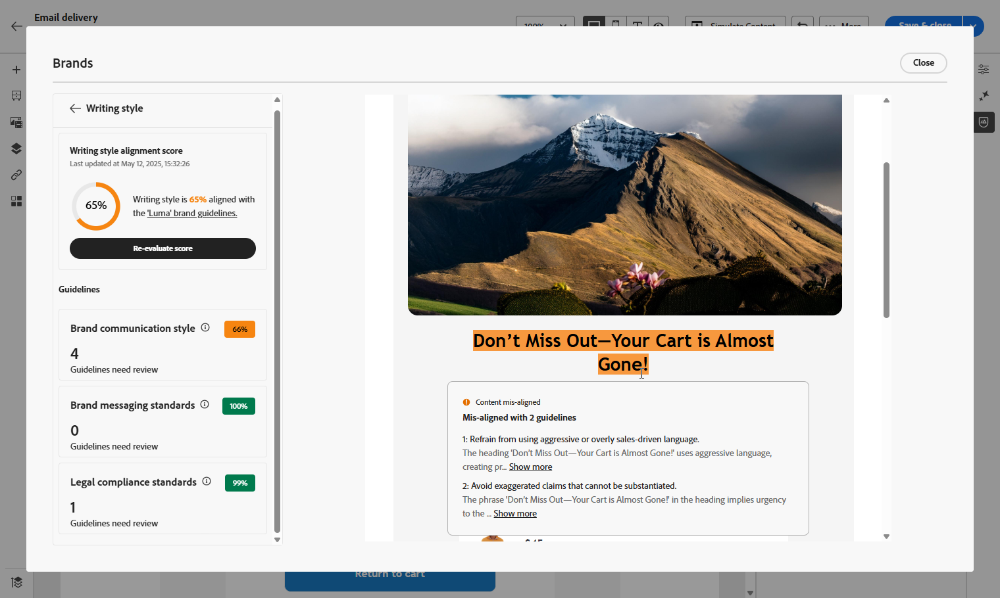

# 评估您的内容 {#brands-score}

>[!AVAILABILITY]
>
>您必须同意[用户协议](https://www.adobe.com/cn/legal/licenses-terms/adobe-dx-gen-ai-user-guidelines.html){target="_blank"}，然后才能使用AI助手。 有关更多信息，请与您的 Adobe 代表联系。

内容审查功能提供了全面的评估工具，用于衡量营销活动与品牌准则的符合程度并在所有通信中保持内容质量标准：

* **品牌协调**：审查和管理符合品牌准则的内容。 这可确保在电子邮件促销活动中的语气、消息传递和视觉身份的一致性。
* **质量检查**：在内容上线之前对其进行验证，以保持高标准和品牌完整性。

## 通过品牌一致性验证内容 {#validate-content}

设置并发布[您的品牌后](brands.md)，请直接在电子邮件促销活动中评估您的品牌一致性分数，以确保您的内容与品牌准则保持一致：

1. 创建您的[电子邮件营销活动](../email/create-email.md)。

1. 在电子邮件设计器中打开&#x200B;**[!UICONTROL 品牌对齐方式]**&#x200B;菜单。

   系统会自动根据默认品牌评估您的内容。 [了解如何分配默认品牌](brands.md)。

   

1. 若要使用其他品牌进行评估，请从&#x200B;**[!UICONTROL 品牌]**&#x200B;下拉菜单中选择该品牌，然后单击&#x200B;**[!UICONTROL 重新评估得分]**。

   

1. 浏览&#x200B;**品牌一致性分数**(高、Medium、低)并查看详细反馈。

1. 单击图标查看更多有关您得分的分析。

   

1. 选择任意已标记的准则以查看特定反馈和建议。

   

1. 根据推荐编辑您的内容以提高品牌一致性。

1. 进行更改后手动重新评估内容，以刷新对齐分数。

## 验证内容质量 {#validate-quality}

>[!NOTE]
>
>内容质量评估与品牌指南无关。 即使从下拉菜单中选择了品牌，其指导方针也不会应用于质量检查。 品牌选择仅与品牌关联度评分相关。

除了品牌协调之外，您还可以评估总体内容质量，以确定可读性、内容一致性和有效性方面的潜在问题，而不受品牌指南的影响。

要评估内容质量，请执行以下操作：

1. 创建您的[电子邮件投放](../email/create-email.md)。

1. 在Email Designer中打开&#x200B;**[!UICONTROL Brand Alignment]**&#x200B;菜单。

   

1. 单击&#x200B;**[!UICONTROL 评估得分]**&#x200B;以生成品牌一致性和内容质量得分。

   

1. 导航到&#x200B;**[!UICONTROL 整体质量]**&#x200B;选项卡，以查看您的内容质量见解和推荐。

   

1. 单击图标获取质量得分的详细视图。

   

1. 选择任意已标记的项目以查看特定反馈和可操作的改进建议。 得分基于以下类别：

   * **[!UICONTROL CTA效果]**：评估您的call-to-action在多大程度上促使读者采取所需的操作。
   * **[!UICONTROL 主题行]**：评估清晰度、相关性和吸引注意力的质量，以鼓励打开电子邮件。
   * **[!UICONTROL 可读性]**：衡量内容对读者来说有多么容易理解和引人入胜。
   * **[!UICONTROL 垃圾邮件检查]**：识别可能影响投放能力的常见垃圾邮件触发器。
   * **[!UICONTROL 内容一致性]**：确保您的内容流畅处理并停留在主题上。
   * **[!UICONTROL 校对]**：检查拼写、语法和清晰度问题。

   

1. 根据推荐编辑内容，以增强可读性、内容一致性和总体质量。

1. 进行更改后单击&#x200B;**[!UICONTROL 重新评估分数]**&#x200B;以刷新您的质量分数。
