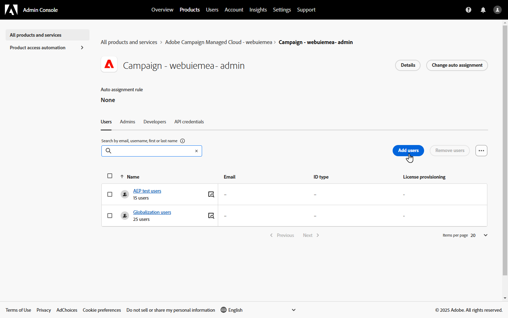

# 创建和管理您的品牌 {#brands}

>[!AVAILABILITY]
>
>此功能作为专用测试版发布。 它将在即将发布的版本中逐步向所有客户提供。

品牌指南是一套全面的规则和标准，用于定义品牌的视觉和语言标识。 它们用作参考，以确保在所有营销和通信渠道中一致的品牌代表性。

在[!DNL Adobe Campaign Web]中，用户可以手动输入和组织品牌信息或上传品牌准则文档以进行自动数据提取。

## 访问品牌 {#generative-access}

要访问[!DNL Adobe Campaign Web]中的&#x200B;**[!UICONTROL 品牌]**&#x200B;菜单，必须向用户分配&#x200B;**[!UICONTROL 管理员（管理员）]**&#x200B;和&#x200B;**[!UICONTROL 品牌套件]**&#x200B;产品配置文件，才能创建和管理品牌。 要获得只读访问权限，用户需要[!UICONTROL AI助手]产品配置文件。

[了解详情](https://experienceleague.adobe.com/en/docs/campaign/campaign-v8/admin/permissions/manage-permissions)

+++ 了解如何分配与品牌相关的权限

1. 在[Admin Console](https://adminconsole.adobe.com/enterprise)主页中，访问您的促销活动产品。

   显示Campaign产品访问权限的

1. 根据要授予用户的权限级别选择&#x200B;**[!DNL Product profile]**。

   在Admin Console中选择

1. 单击&#x200B;**[!DNL Add users]**&#x200B;以分配选定的产品配置文件。

   在Admin Console中

1. 键入您的用户名、用户组或电子邮件地址。

1. 单击&#x200B;**保存**&#x200B;以应用更改。

已分配给此角色的用户会自动更新其权限。

+++

## 创建您的品牌 {#create-brand-kit}

要创建和管理您的品牌指南，请执行以下步骤。

用户可以手动输入详细信息或上传品牌指南文档以自动提取信息：

1. 从&#x200B;**[!UICONTROL 内容管理]**&#x200B;菜单中选择&#x200B;**[!UICONTROL 品牌]**。

1. 在&#x200B;**[!UICONTROL 品牌]**&#x200B;菜单中，单击&#x200B;**[!UICONTROL 创建品牌]**。

   

1. 为您的品牌输入&#x200B;**[!UICONTROL 名称]**。

1. 拖放或选择您的文件以上传品牌指南并自动提取相关的品牌信息。 单击&#x200B;**[!UICONTROL 创建品牌]**。

   信息提取过程开始。 请注意，它可能需要几分钟才能完成。

   

1. 您的内容和可视化创建标准会自动填充。 浏览不同的选项卡以根据需要调整信息。

1. 在&#x200B;**[!UICONTROL 书写样式]**&#x200B;选项卡中，单击以添加准则或排除项，包括示例。

   

1. 在&#x200B;**[!UICONTROL 可视内容]**&#x200B;选项卡中，单击以添加其他准则或排除项。

1. 要添加显示正确用法的图像，请选择&#x200B;**[!UICONTROL 示例]**&#x200B;并单击&#x200B;**[!UICONTROL 选择图像]**。 您还可以添加显示不正确用法的图像作为排除示例。

   

1. 配置完毕后，单击&#x200B;**[!UICONTROL 保存]**，然后单击&#x200B;**[!UICONTROL 发布]**，以便在AI助手中提供您的品牌指南。

1. 要修改已发布的品牌，请单击&#x200B;**[!UICONTROL 编辑品牌]**。

   >[!NOTE]
   >
   >这会在编辑模式下创建一个临时副本，并在发布后替换实时版本。

   

1. 在&#x200B;**[!UICONTROL Brands]**&#x200B;仪表板中，单击图标打开高级菜单，以：

   * 查看品牌
   * 编辑
   * 复制
   * 发布
   * 取消发布
   * 删除

   品牌仪表板中的

现在可从AI助手菜单中的&#x200B;**[!UICONTROL 品牌]**&#x200B;下拉菜单访问您的品牌指南。 这使得AI助手能够生成符合您规范的内容和资产。 [了解有关AI助手的详细信息](../email/generative-gs.md)

