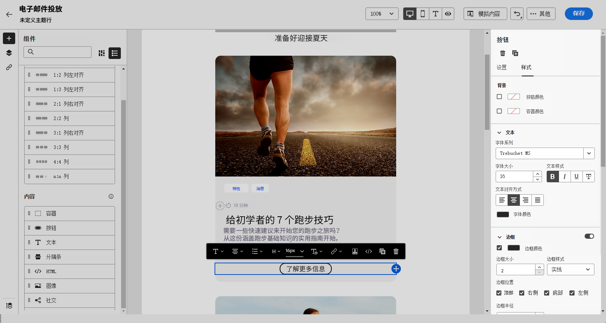
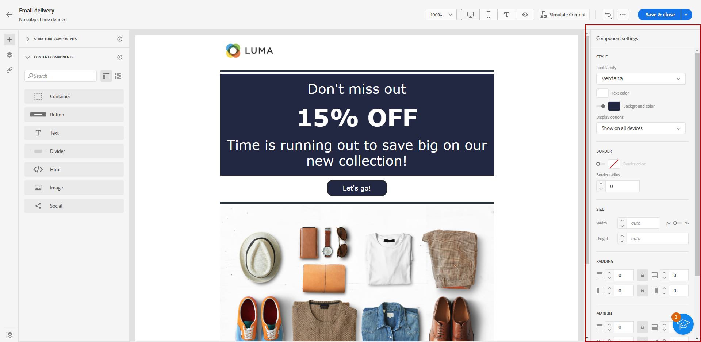

# 使用电子邮件设计器内容 {#content-components}

>[!CONTEXTUALHELP]
>id="ac_content_components_email"
>title="关于内容"
>abstract="内容组件是空的内容占位符，可用于创建电子邮件的布局。"

>[!CONTEXTUALHELP]
>id="ac_content_components_landing_page"
>title="关于内容"
>abstract="内容组件是空的内容占位符，您可用它来创建登陆页面的版面。"

>[!CONTEXTUALHELP]
>id="ac_content_components_fragment"
>title="关于内容"
>abstract="内容组件是空的内容占位符，您可用它来创建片段的版面。"

>[!CONTEXTUALHELP]
>id="ac_content_components_template"
>title="关于内容"
>abstract="内容组件是空的内容占位符，您可用它来创建模板的版面。"

创建电子邮件内容时， **[!UICONTROL 内容]** 组件允许您使用原始空组件进一步个性化电子邮件，这些组件一经放入电子邮件中即可使用。

您可以添加任意数量的 **[!UICONTROL 目录]** 您需要在内部 **[!UICONTROL 结构]**，定义电子邮件的布局。

## 添加内容组件 {#add-content-components}

要将内容组件添加到您的电子邮件中，并根据您的需要调整这些内容组件，请执行以下步骤。

1. 在Email Designer中使用 [现有内容](existing-content.md) 或拖放 **[!UICONTROL 结构]** 空内容，以定义电子邮件的布局。 [了解如何操作](create-email-content.md)

1. 拖放 **[!UICONTROL 内容]** 在相关结构中进行选择。

   

   >[!NOTE]
   >
   >可以将多个元件添加到单个结构中，并添加到结构的每一列中。

1. 使用上下文调整每个组件的选项 **[!UICONTROL 设置]** 选项卡。 例如，您可以选择仅在桌面设备或移动设备上显示，或者同时在这两种设备上显示。 您还可以从此选项卡管理链接选项。 [了解有关管理链接的更多信息](message-tracking.md)

1. 使用调整每个组件的样式属性 **[!UICONTROL 样式]** 选项卡。 例如，您可以更改每个组件的文本样式、内边距或边距。[了解有关对齐方式和内边距的更多信息](alignment-and-padding.md)

   

1. 从的高级菜单中 **[!UICONTROL 内容]** 在右侧窗格中，您可以根据需要轻松删除或复制任何内容组件。

## 容器 {#container}

可以添加一个简单容器，并在其中添加另一个内容组件。这样一来，您可以将特定样式应用于该容器，这与内部使用的组件不同。

例如，添加一个&#x200B;**[!UICONTROL 容器]**&#x200B;组件，然后在该容器中添加一个[按钮](#button)组件。可以为该容器使用一个特定背景，并为按钮使用另一个背景。

## 按钮 {#buttons}

使用&#x200B;**[!UICONTROL 按钮]**&#x200B;组件可将一个或多个按钮插入电子邮件中，并将电子邮件受众重定向到另一个页面。

1. 从&#x200B;**[!UICONTROL 内容]**&#x200B;列表中，将&#x200B;**[!UICONTROL 按钮]**&#x200B;组件拖放到&#x200B;**[!UICONTROL 结构]**&#x200B;组件中。

   

1. 单击新添加的按钮以使文本个性化并有权访问&#x200B;**[!UICONTROL 设置]**&#x200B;和&#x200B;**[!UICONTROL 样式]**&#x200B;选项卡。

   

1. 从&#x200B;**[!UICONTROL 设置]**&#x200B;选项卡的 **[!UICONTROL URL]** 字段中，添加在单击按钮时要重定向到的 URL。

1. 使用&#x200B;**[!UICONTROL 目标]**&#x200B;下拉列表选择内容的显示方式：

   * **[!UICONTROL 无]**：单击时在同一框架中打开链接（默认）。
   * **[!UICONTROL 空白]**：在新窗口或标签页中打开链接。
   * **[!UICONTROL 自身]**：单击时在同一框架中打开链接。
   * **[!UICONTROL 父]**：在父框架中打开链接。
   * **[!UICONTROL 顶部]**：在窗口的整个正文中打开链接。

   

1. 您可以通过从以下位置更改样式属性（例如&#x200B;**[!UICONTROL 边框]**、**[!UICONTROL 大小]**、**[!UICONTROL 边距]**&#x200B;等）来进一步个性化您的按钮：从 **[!UICONTROL 样式]** 选项卡。

## 文本 {#text}

使用&#x200B;**[!UICONTROL 文本]**&#x200B;组件将文本插入电子邮件中，并使用&#x200B;**[!UICONTROL 设置]**&#x200B;和&#x200B;**[!UICONTROL 样式]**&#x200B;选项卡。

1. 从 **[!UICONTROL 目录]** 菜单，拖放 **[!UICONTROL 文本]** 转换为 **[!UICONTROL 结构]** 组件。

   

1. 单击新添加的组件以个性化文本，并访问&#x200B;**[!UICONTROL 设置]**&#x200B;和&#x200B;**[!UICONTROL 样式]**&#x200B;选项卡。

1. 使用上下文工具栏中的以下选项更改您的文本：

   

   * **[!UICONTROL 更改文本样式]**：对文本应用粗体、斜体、下划线或删除线。
   * **更改对齐方式**：为文本选择左对齐、右对齐、居中对齐或两端对齐。
   * **[!UICONTROL 创建列表]**：将项目符号或编号列表添加到文本中。
   * **[!UICONTROL 设置标题]**：向文本添加最多六个标题级别。
   * **字体大小**：选择文本的字体大小（以像素为单位）。
   * **[!UICONTROL 编辑图像]**：将图像或资产添加到文本组件。
   * **[!UICONTROL 显示源代码]**：显示文本的源代码。不能修改。
   * **[!UICONTROL 复制]**：添加文本组件的副本。
   * **[!UICONTROL 删除]**：从电子邮件中删除选定的文本组件。
   * **[!UICONTROL 添加个性化]**：添加个性化字段以自定义配置文件数据中的内容。
   * **[!UICONTROL 启用条件内容]**：添加条件内容以使组件内容适应目标配置文件。

1. 从以下位置调整其他样式属性，例如文本颜色、字体系列、边框、内边距、边距等：从 **[!UICONTROL 样式]** 选项卡。

   

## 分隔条 {#divider}

使用&#x200B;**[!UICONTROL 分隔条]**&#x200B;组件可插入分隔线来整理电子邮件的版面和内容。

您可以从以下位置调整样式属性，例如线条的颜色、样式和高度 **[!UICONTROL 样式]** 选项卡。

## HTML {#HTML}

使用 **[!UICONTROL HTML]** 组件可复制并粘贴现有 HTML 的不同部分。这使您能够创建免费的模块化 HTML 组件以重用某些外部内容。

1. 从&#x200B;**[!UICONTROL 组件]**&#x200B;中，将 **[!UICONTROL HTML]** 组件拖放到&#x200B;**[!UICONTROL 结构]**&#x200B;组件中。

   

1. 单击新添加的组件，然后从上下文工具栏中选择&#x200B;**[!UICONTROL 显示源代码]**&#x200B;以添加 HTML。

   

>[!NOTE]
>
>为了仅使外部内容符合Email Designer，Adobe建议 [从头开始创建消息](create-email-content.md) 并将现有电子邮件中的内容复制到组件中。

## 图像 {#image}

使用&#x200B;**[!UICONTROL 图像]**&#x200B;组件可在电子邮件中插入计算机中的图像文件。

1. 从&#x200B;**[!UICONTROL 内容]**&#x200B;菜单中，将&#x200B;**[!UICONTROL 图像]**&#x200B;拖放到&#x200B;**[!UICONTROL 结构]**&#x200B;组件中。

   

1. 单击&#x200B;**[!UICONTROL 浏览]**&#x200B;以从您的资源中选择图像文件。

1. 单击新添加的组件，然后使用设置图像属性 **[!UICONTROL 设置]** 选项卡：

   * 使用&#x200B;**[!UICONTROL 图像标题]**&#x200B;可以定义图像的标题。
   * 使用&#x200B;**[!UICONTROL 替代文字]**&#x200B;可以定义链接到图像的题注。这对应于 alt HTML 属性。

   

1. 您可以添加链接以将受众重定向到其他内容。 [了解详情](message-tracking.md)

1. 调整其他样式属性（例如边距、边框等）使用 **[!UICONTROL 样式]** 选项卡。

## 社交 {#social}

使用&#x200B;**[!UICONTROL 社交]**&#x200B;组件可将指向社交媒体页面的链接插入到电子邮件内容中。

1. 从&#x200B;**[!UICONTROL 组件]**&#x200B;菜单中，将&#x200B;**[!UICONTROL 社交]**&#x200B;组件拖放到&#x200B;**[!UICONTROL 结构]**&#x200B;组件中。

1. 单击新添加的组件。

1. 在&#x200B;**[!UICONTROL 设置]**&#x200B;选项卡的&#x200B;**[!UICONTROL 社交]**&#x200B;字段中，选择要添加或删除的社交媒体。

   

1. 在&#x200B;**[!UICONTROL 图像大小]**&#x200B;字段中选择图标的大小。

1. 单击每个社交媒体图标以配置将受众重定向到的 **[!UICONTROL URL]**。

   

1. 如果需要，您还可以在 **[!UICONTROL 来源]** 字段。

1. 从以下位置调整其他样式属性（例如样式、边距、边框等）：从 **[!UICONTROL 样式]** 选项卡。
