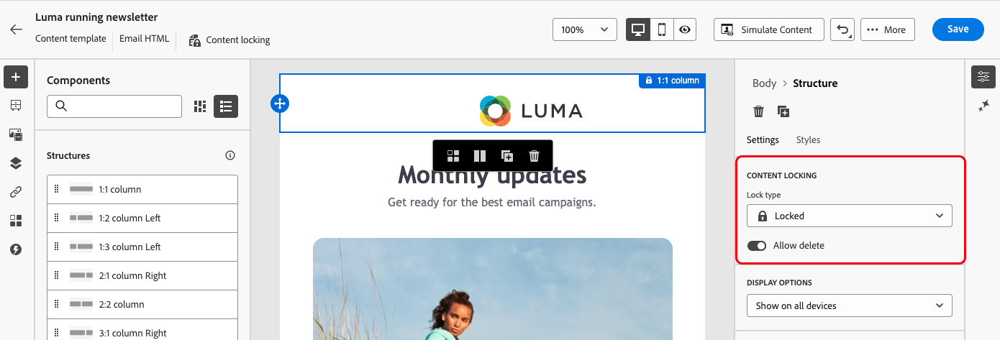

# 锁定电子邮件模板中的内容 {#lock-content-email-templates}

>[!CONTEXTUALHELP]
>id="ajo_locking_governance"
>title="监管"
>abstract="切换监管以锁定模板中的内容，可以锁定整个模板或特定结构和组件。这样可防止无意中编辑或删除内容，让您更好地控制模板自定义，并提高电子邮件营销活动的效率和可靠性。"

>[!CONTEXTUALHELP]
>id="ajo_locking_mode"
>title="模式"
>abstract="选择模板所需的锁定模式。**内容锁定**&#x200B;允许您锁定模板内的特定内容部分。**只读**&#x200B;可让您锁定模板的全部内容，防止任何修改。"

>[!CONTEXTUALHELP]
>id="ajo_locking_content_addition"
>title="启用内容添加"
>abstract="切换此选项可进一步定义用户与模板的交互方式。选择&#x200B;**允许添加结构和内容**，允许用户在现有结构之间添加结构，并在可编辑结构中添加内容组件或片段。**仅允许添加内容**&#x200B;允许用户在可编辑结构中添加内容组件或片段，但不能添加或复制结构。"

>[!CONTEXTUALHELP]
>id="ajo_email_locking_activated"
>title="启用监管"
>abstract="内容锁定已启用，禁止进行修改。"

>[!CONTEXTUALHELP]
>id="ajo_email_locking_read_only"
>title="只读"
>abstract="此内容处于只读模式，不能被修改。"

Adobe Campaign允许您通过锁定整个模板或特定结构和组件来锁定电子邮件模板中的内容。 这样可防止意外编辑或删除，让您更好地控制模板自定义，并提高电子邮件营销活动的效率和可靠性。
<!--
>[!IMPORTANT]
>
>Content locking is an editor-level feature for authors and does not guarantee the content will remain unedited when imported or created through API.-->

可在&#x200B;**结构**&#x200B;级别或&#x200B;**组件**&#x200B;级别应用内容锁定。 以下是锁定模板中的内容时在结构和组件级别应用的主要原则：

* 锁定结构时：

   * 默认情况下，该结构中的所有内容也会被锁定。
   * 无法向结构添加任何内容。
   * 默认情况下，无法删除结构。 您可以通过启用“允许删除”选项来覆盖此限制。
   * 可以将锁定结构中的各个内容组件设置为可编辑。

* 当结构可编辑（结构未锁定）时：

   * 可以将各个内容组件锁定在该结构内。
   * 默认情况下，如果组件已锁定，或者选择了“仅可编辑的内容锁定”，则无法删除组件。 您可以通过启用“允许删除”选项来覆盖此限制。

>[!AVAILABILITY]
>
>具有创建内容模板权限的用户可以启用内容锁定。

<!--
➡️ [Discover this feature in video](#video)-->

## 锁定电子邮件模板 {#define}

### 启用内容锁定 {#enable}

无论您是要创建新模板还是要编辑现有模板，都可以直接在Email Designer中为电子邮件模板启用内容锁定。 执行以下步骤：

1. 打开或创建电子邮件模板，并访问[电子邮件Designer](../email/get-started-email-designer.md)中的内容编辑屏幕。

1. 在右侧的&#x200B;**[!UICONTROL 正文]**&#x200B;窗格中，打开&#x200B;**[!UICONTROL 管理]**&#x200B;选项。

1. 从&#x200B;**[!UICONTROL 模式]**&#x200B;下拉列表中，为模板选择所需的锁定模式：

   * **[!UICONTROL 内容锁定]**：锁定模板中内容的特定部分。 默认情况下，所有结构和组件都变为可编辑状态。 然后，您可以选择性地锁定各个元素。
   * **[!UICONTROL 只读]**：锁定模板的整个内容，以防止任何修改。

   

1. 如果您选择了&#x200B;**[!UICONTROL 内容锁定]**&#x200B;模式，则可以进一步定义用户与模板的交互方式。 打开&#x200B;**[!UICONTROL 启用内容添加]**&#x200B;选项并选择以下选项之一：

   * **[!UICONTROL 允许结构和内容添加]**：用户可以在现有结构之间添加结构，并在可编辑的结构中添加内容组件或片段。

   * **[!UICONTROL 仅允许添加内容]**：用户可以在可编辑的结构中添加内容组件或片段，但无法添加或复制结构。

1. 选择锁定模式后，您可以定义在选择了&#x200B;**[!UICONTROL 内容锁定]**&#x200B;模式时要锁定的结构和/或组件：

   * [了解如何锁定结构](#lock-structures)
   * [了解如何锁定组件](#lock-components)

   如果您选择&#x200B;**[!UICONTROL 只读]**&#x200B;模式，请照常完成并保存模板。

通过选择模板正文，您可以在设计模板时随时调整&#x200B;**[!UICONTROL 管理]**&#x200B;设置。 为此，请单击位于右侧窗格顶部的导航边栏中的&#x200B;**[!UICONTROL 正文]**&#x200B;链接。

### 锁定结构 {#lock-structures}

>[!CONTEXTUALHELP]
>id="ajo_locking_structure"
>title="结构中的内容锁定"
>abstract="要锁定模板中的结构，请从&#x200B;**锁定类型**&#x200B;下拉列表中选择&#x200B;**已锁定** 。默认情况下，用户不能删除已锁定的结构。您可以通过启用&#x200B;**[!UICONTROL 允许删除]**&#x200B;选项来覆盖此限制。"

要在模板中锁定结构，请执行以下操作：

1. 选择要锁定的结构。

1. 在&#x200B;**[!UICONTROL 锁定类型]**&#x200B;下拉列表中，选择&#x200B;**[!UICONTROL 锁定]**。

   

   >[!NOTE]
   >
   >默认情况下，用户不能删除已锁定的结构。您可以通过启用&#x200B;**[!UICONTROL 允许删除]**&#x200B;选项来覆盖此限制。

锁定结构后，无法再复制内容组件或片段或将其添加到其中。 缺省情况下，锁定结构内的所有元件也被锁定。 要使组件在锁定的结构中可编辑，请执行以下操作：

1. 选择要解锁的组件。

1. 打开&#x200B;**[!UICONTROL 使用特定锁定]**&#x200B;选项。

1. 在&#x200B;**[!UICONTROL 锁定类型]**&#x200B;下拉列表中，选择&#x200B;**[!UICONTROL 可编辑]**。 要在锁定样式时允许编辑内容，请选择&#x200B;**[!UICONTROL 仅可编辑的内容]**。 [了解如何锁定组件](#lock-components)

   

### 锁定组件 {#lock-components}

>[!CONTEXTUALHELP]
>id="ajo_locking_component"
>title="在组件中使用特定锁定"
>abstract="要锁定模板中的组件，请切换至&#x200B;**使用特定锁定**&#x200B;选项。从&#x200B;**[!UICONTROL 锁定类型]**&#x200B;下拉列表中，选择您喜欢的锁定选项：**仅可编辑内容锁定**&#x200B;只锁定组件的样式但允许编辑内容，而&#x200B;**已锁定**&#x200B;则将组件的内容和样式完全锁定。"

要在结构内锁定特定组件，请执行以下操作：

1. 选择该组件并在右窗格中启用&#x200B;**[!UICONTROL 使用特定锁定]**&#x200B;选项。

1. 从&#x200B;**[!UICONTROL 锁定类型]**&#x200B;下拉列表中选择首选锁定选项：

   

   * **[!UICONTROL 仅可编辑内容]**：锁定组件的样式，但允许编辑内容。
   * **[!UICONTROL 已锁定]**：已完全锁定组件的内容和样式。

   >[!NOTE]
   >
   >**[!UICONTROL 可编辑的]**&#x200B;锁定类型允许用户编辑组件，即使是在锁定的结构内也是如此。 [了解如何锁定结构](#lock-structures)

1. 默认情况下，用户无法删除锁定的组件。 您可以通过激活&#x200B;**[!UICONTROL 允许删除]**&#x200B;选项来启用删除。

### 识别锁定的内容 {#identify}

要轻松识别模板中锁定的结构和组件，请使用左侧菜单中的&#x200B;**[!UICONTROL 导航树]**。 此菜单提供了所有模板元素的可视化概述，其中以锁图标突出显示锁定的项目，以铅笔图标突出显示可编辑的项目。

在以下示例中，为模板正文启用了管理。 *结构2*&#x200B;已锁定，并且&#x200B;*组件1*&#x200B;可编辑，而&#x200B;*结构3*&#x200B;已完全锁定。

## 使用具有已锁定内容的模板 {#use}

>[!CONTEXTUALHELP]
>id="ajo_email_editable_areas"
>title="突出可编辑区域"
>abstract="根据应用于模板的锁定类型，您可以对模板的结构和组件执行不同的操作。要快速识别模板内的所有可编辑区域，请切换&#x200B;**[!UICONTROL 突出可编辑区域]**&#x200B;选项。"

使用包含锁定内容的模板时，右侧窗格中显示一条消息。

根据应用于模板的锁定类型，您可以对模板的结构和组件执行不同的操作。要快速识别模板内的所有可编辑区域，请切换&#x200B;**[!UICONTROL 突出可编辑区域]**&#x200B;选项。

例如，在下面的模板中，除了已锁定的顶部图像之外，所有区域都可以编辑，这意味着您无法编辑或删除它。

有关可应用的不同锁定类型的详细信息，请参阅以下部分：

* [锁定结构](#lock-structures)
* [锁定组件](#lock-components)

以下是已设置的电子邮件版本和相关内容锁定配置的一些示例：

| 内容锁定类型 | 模板配置 | 电子邮件编辑 |
| ------- | ------- | ------- |
| 只读内容模板 | {zoomable="yes"} | {zoomable="yes"} |
| 完整内容可编辑，但用户无法添加任何结构或组件 | {zoomable="yes"} | {zoomable="yes"} |
| 无法删除的锁定结构 | {zoomable="yes"} | {zoomable="yes"} |
| 具有锁定样式的组件。 用户只能修改内容。 | {zoomable="yes"} | {zoomable="yes"} |
| 锁定结构中的可编辑组件。 | {zoomable="yes"} | {zoomable="yes"} |

<!--
TO REPLACE WITH VIDEO FOR CAMPAIGN IF/WHEN CREATED

## How-to video {#video}

Learn how to lock content in email templates.

>[!VIDEO](https://video.tv.adobe.com/v/3451591?quality=12)-->
