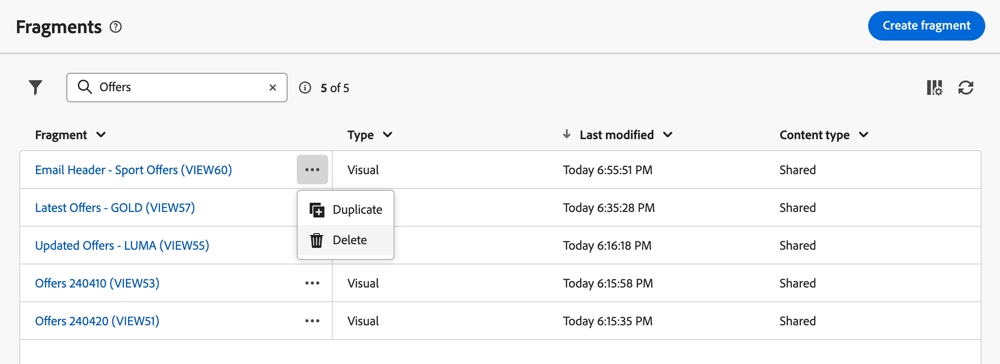
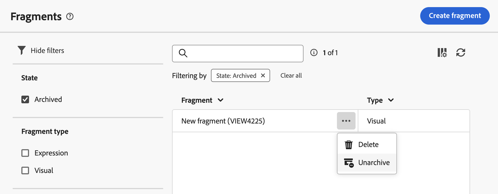

# 创建内容片段 {#fragments}

>[!CONTEXTUALHELP]
>id="acw_fragments_create"
>title="定义您自己的内容片段"
>abstract="定义片段属性和您想要创建的片段类型。然后，您可以使用电子邮件设计器或表达式编辑器来配置片段的内容。"

<!-- pas vu dans l'UI-->

>[!CONTEXTUALHELP]
>id="acw_fragments_properties"
>title="片段属性"
>abstract="输入片段的标签。如果需要，您可以定义其他选项，例如片段内部名称、其文件夹和描述。"

>[!CONTEXTUALHELP]
>id="acw_fragments_type"
>title="内容片段类型"
>abstract="选择您要创建的片段类型。**视觉片段** 是预定义的视觉块，您可以在多个电子邮件传递或内容模板中重复使用。**表达式片段** 是预定义表达式，可从表达式编辑器中的专用条目中获取。"

您可以通过两种方式创建内容片段：

* 使用&#x200B;**[!UICONTROL 片段]**&#x200B;专用菜单从头开始创建片段。 [了解如何操作](#create-from-scratch)
* 设计内容时，将部分内容另存为片段。 [了解如何操作](#save-as-fragment)

  >[!NOTE]
  >
  >此功能仅适用于可视化片段。 表达式片段是专门从&#x200B;**片段**&#x200B;菜单创建的。

保存后，您的内容片段即可用于任何投放或内容模板。

## 从头开始创建内容片段 {#create-from-scratch}

要从头开始创建内容片段，请执行以下步骤。

1. [通过&#x200B;**[!UICONTROL 内容管理]** > **[!UICONTROL 片段]**&#x200B;左侧菜单访问片段列表](#access-manage-fragments)并选择&#x200B;**[!UICONTROL 创建片段]**。

   

1. 输入片段的标签。如果需要，您可以定义其他选项，例如片段内部名称、其文件夹和描述。

1. 选择要创建的片段类型： **可视化片段**&#x200B;或&#x200B;**表达式片段**。 [了解可视片段和表达式片段之间的差异](fragments.md)

   

   >[!AVAILABILITY]
   >
   >可视片段在有限可用性(LA)中。 这些功能仅限于从 **Adobe Campaign Standard 迁移至 Adobe Campaign v8** 的客户使用，并且不能部署在任何其他环境中。

1. 单击&#x200B;**创建**&#x200B;按钮。

   * 对于&#x200B;**可视化片段**，将显示[电子邮件Designer](../email/get-started-email-designer.md)。 根据需要编辑您的内容，就像处理营销活动中的任何电子邮件一样，然后单击&#x200B;**保存并关闭**&#x200B;按钮。 您可以添加图像、链接、个性化字段和动态内容。

     

   * 对于&#x200B;**表达式片段**，表达式编辑器将打开。 利用其个性化和创作功能构建您的内容，然后单击&#x200B;**确认**。 [了解如何使用表达式编辑器](../personalization/personalize.md)

     

1. 内容准备就绪后，单击&#x200B;**保存**。

现在，在Campaign中构建任何投放或[内容模板](../email/use-email-templates.md)时，即可使用该内容片段。 请参阅以下部分以了解如何使用可视和表达式片段：
* [将可视片段添加到电子邮件](use-visual-fragments.md)
* [将表达式片段添加到表达式编辑器](use-expression-fragments.md)

## 将内容保存为视觉片段 {#save-as-fragment}

>[!CONTEXTUALHELP]
>id="acw_fragments_save"
>title="另存为片段"
>abstract="要将内容保存为可视片段，请选择要包含到片段中的元素，包括个性化字段和动态内容。您只能选择彼此相邻的部分。您不能选择空结构或其他内容片段。该内容将成为一个独立片段，添加到片段列表中，并可从专用菜单访问。在营销活动中构建任何电子邮件或内容模板时可以使用此片段。"

<!--pas vu dans l'UI-->

任何电子邮件内容都可以另存为可视化片段以供将来重用。 在设计[内容模板](../email/use-email-templates.md)或[电子邮件](../email/get-started-email-designer.md)投放时，您可以将部分内容另存为可视片段。 为此请执行以下操作步骤：

1. 在[电子邮件Designer](../email/get-started-email-designer.md)中，单击屏幕右上角的&#x200B;**更多**&#x200B;按钮。

1. 从下拉菜单中选择&#x200B;**[!UICONTROL 另存为片段]**。

   

1. 将显示&#x200B;**[!UICONTROL 另存为片段]**&#x200B;屏幕。 其中选择要包含在片段中的元素，包括个性化字段和动态内容。

   >[!CAUTION]
   >
   >您只能选择彼此相邻的部分。您无法选择空的结构或其他内容片段。

   

1. 单击&#x200B;**[!UICONTROL 创建]**。填写片段名称并保存。

   

   此内容现在是独立的片段，添加到[片段列表](#manage-fragments)中，可从专用菜单访问。 现在，在Campaign中构建任何[电子邮件](../email/get-started-email-designer.md)或[内容模板](../email/use-email-templates.md)时，可以使用此片段。 [了解如何操作](../content/use-visual-fragments.md)

>[!NOTE]
>
>对该新片段所做的任何更改都不会传播到它来自的电子邮件或模板。 同样，在该电子邮件或模板中编辑原始内容时，不会修改新片段。—>

## 管理您的内容片段 {#manage-fragments}

您可以从片段列表中编辑、更新、复制或删除内容片段。

### 编辑和更新内容片段 {#edit-fragments}

要编辑内容片段，请执行以下步骤。

1. 从&#x200B;**[!UICONTROL 片段]**&#x200B;列表中单击要编辑的片段的名称。
1. 单击&#x200B;**编辑内容**&#x200B;按钮以打开此片段的内容。

   

1. 进行必要的更改并保存修改。

>[!CAUTION]
>
>对片段所做的任何更改都会传播到使用该片段的投放或模板中。

### 删除内容片段 {#delete-fragments}

要删除内容片段，请执行以下步骤：

1. 浏览到片段列表，然后单击要删除的片段旁边的&#x200B;**[!UICONTROL 更多操作]**&#x200B;按钮。
1. 单击&#x200B;**删除**&#x200B;并确认。

   

>[!CAUTION]
>
>删除片段时，会更新使用它的投放和模板：片段会从内容中删除，但仍会引用。 要将片段内容保留在这些投放和模板中，必须在删除片段之前中断继承，[如本节](use-visual-fragments.md#break-inheritance)所述。

### 存档内容片段 {#archive}

您可以从不再与您的品牌相关的片段中清除片段列表。 为此，请单击所需片段旁边的&#x200B;**[!UICONTROL 更多操作]**&#x200B;按钮，然后选择&#x200B;**[!UICONTROL 存档]**。 片段将从片段列表中删除，这会阻止用户在未来电子邮件或模板中使用它。

要访问已存档的片段，请使用筛选窗格显示它们。 要取消存档片段，请单击&#x200B;**[!UICONTROL 更多操作]**&#x200B;按钮，然后选择&#x200B;**[!UICONTROL 取消存档]**。

>[!NOTE]
>
>如果存档内容中使用的片段，则该内容不会受到影响。

### 复制内容片段 {#duplicate-fragments}

您可以轻松复制内容片段以创建新内容片段。 要复制现有片段，请执行以下步骤：

1. 浏览到片段列表，然后单击要复制的片段旁边的&#x200B;**[!UICONTROL 更多操作]**&#x200B;按钮。
1. 单击&#x200B;**复制**&#x200B;并确认。
1. 输入新片段的标签并保存更改。

   片段将添加到内容片段的列表。 您可以根据需要对其进行编辑和配置。
