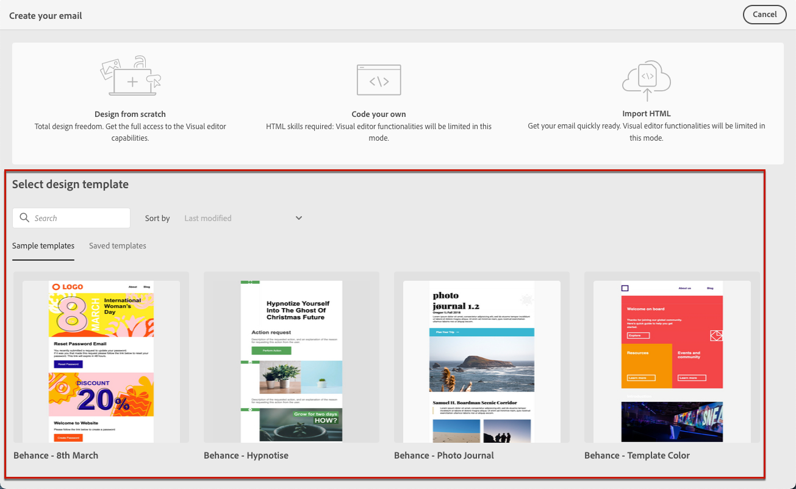

# 使用电子邮件模板 {#email-content-templates}

时间 [创建电子邮件](#create-email)，使用 **[!UICONTROL 选择设计模板]** 部分 **[!UICONTROL 创建电子邮件]** 界面，以开始从模板构建内容。

您可以从以下内容中进行选择：

* **示例模板**. Campaign提供了一组内置模板，您可以从中选择这些模板。

* **已保存模板**. 您还可以使用从现有内容另存为模板的自定义模板。

在以下部分了解如何使用模板以及如何将电子邮件内容另存为模板。

## 使用模板 {#use-templates}

要开始使用示例模板或保存的模板之一构建内容，请执行以下步骤。

1. 打开[电子邮件设计器](create-email-content.md)。

1. 在&#x200B;**[!UICONTROL 创建您的电子邮件]**&#x200B;屏幕上，**[!UICONTROL 示例模板]**&#x200B;选项卡默认为选中状态。

1. 要使用现有的自定义模板，请浏览到 **[!UICONTROL 已保存模板]** 选项卡。

   

1. 将显示所有[保存的模板](#save-as-template)的列表。您可以按&#x200B;**[!UICONTROL 名称]**、**[!UICONTROL 上次修改日期]**&#x200B;和&#x200B;**[!UICONTROL 上次创建日期]**&#x200B;对它们进行排序。

   

1. 从列表中选择模板以显示其内容。

1. 使用向右和向左箭头在模板之间导航（根据您的选择选择是示例还是已保存）。

   

1. 单击 **[!UICONTROL 使用此模板]** 屏幕右上角。

1. 使用电子邮件设计器根据需要编辑您的内容。[了解详情](create-email-content.md)

## 将电子邮件内容另存为模板 {#save-as-template}

一旦您 [设计了一封电子邮件](create-email-content.md)，您可以将此内容另存为模板以供将来重用。 保存的模板可供 Adobe Campaign 环境的所有用户使用。

要将电子邮件内容另存为模板，请执行以下步骤：

1. 在email designer中，单击屏幕右上方的省略号。

1. 选择 **[!UICONTROL 另存为内容模板]** 下拉菜单中。

   

1. 输入此模板的名称并保存.

   

您现在可以[使用此模板](#use-templates)构建新内容：可通过电子邮件设计器的“保存的模板”选项卡使用它。****

