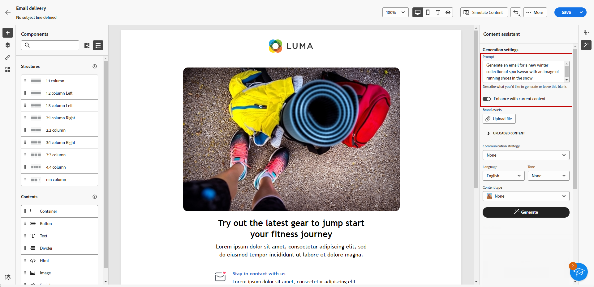

# 使用内容助手生成电子邮件 {#generative-email}

内容助手通过自动生成完整的电子邮件内容、节省您的时间并确保一致的质量，增强了您通信的影响。 使用创作AI，您可以轻松制作引人入胜的电子邮件，引起受众的共鸣，从而使沟通更加高效和高效。

>[!NOTE]
>
>在开始使用此功能之前，请阅读相关内容 [护栏和限制](generative-gs.md#guardrails-and-limitations).

要使用内容助手生成电子邮件内容，请执行以下步骤。 您还可以使用内容助手来改进现有内容，如中所述 [此页面](generative-content.md).

1. 创建和配置电子邮件投放后，单击 **[!UICONTROL 创建内容]**.

   有关如何配置电子邮件投放的更多信息，请参阅 [此页面](../content/create-email-content.md).

1. 填写 **[!UICONTROL 基本详细信息]** 用于您的投放。 完成后，单击 **[!UICONTROL 编辑电子邮件正文]**.

1. 选择内容助手用于生成电子邮件的设计模板。

   也可以导入HTML文件。

1. 从右侧菜单中，选择 **[!UICONTROL 体验生成]**.

   

1. 通过描述要生成的内容来优化内容。

   下面是一些提示示例：

   * 新闻稿：每月生成新闻稿，其中应包含旅游文章、目的地亮点和独家订阅者优惠。
   * 对于反馈和调查：创建一封电子邮件，邀请客户就其最近的软件体验提供反馈并参与产品改进调查。
   * 对于周年或生日电子邮件：生成生日电子邮件，庆祝客户的特殊日子并为他们提供生日折扣。

   

1. 选择 **[!UICONTROL 上传文件]** 如果要添加任何品牌资产，并且资产中包含可以提供其他上下文的内容，请转至“内容助手”。

   您还可以单击 **[!UICONTROL 上传的内容]** 以查找以前更新的文件。 请注意，上传的内容仅供当前用户重复使用。

1. 选择 **[!UICONTROL 沟通策略]** 最符合你的需要。 这将影响所生成电子邮件的语调和样式。

1. 选择 **[!UICONTROL 语言]** 和 **[!UICONTROL 色调]** 您希望生成的文本包含。 这将确保文本适合您的受众和用途。

   

1. 自定义 **[!UICONTROL 内容类型]** 资源设置以匹配所需的资源特性。

1. 提示就绪后，单击 **[!UICONTROL 生成]**.

1. 浏览 **[!UICONTROL 变量建议]** 以查找所需的电子邮件。 单击 **[!UICONTROL 预览]** 以查看所选变体的全屏版本。

   

1. 单击 **[!UICONTROL 选择]** 找到相应的内容后。

   

1. 插入个性化字段，以根据用户档案数据自定义电子邮件内容，或在需要时进一步个性化您的内容。 [详细了解内容个性化](../personalization/personalize.md)

1. 定义电子邮件内容后，单击 **[!UICONTROL 模拟内容]** 按钮来控制渲染，并使用测试用户档案检查个性化设置。  [了解详情](../preview-test/preview-content.md)

   

1. 定义内容、受众和计划后，便可以准备电子邮件投放。 [了解详情](../monitor/prepare-send.md)

